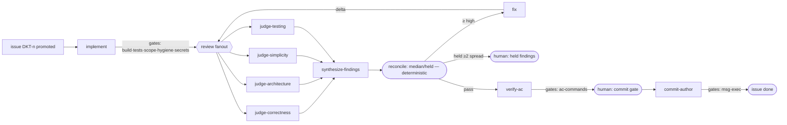

# 05 — Pipelines and policy

Status: approved — 2026-08-02. Pipelines are the deterministic half of the two-level graph (02 §2): the
versioned process definitions the engine expands per issue. Policy is the versioned
routing/budget table. Together they replace the fleet's orchestration prose.

## 1. Definition format

TOML in Docket's generic workflow grammar, registered (`docket workflow register`) and
version-pinned per run at activation (06 §1–§2; normative grammar and wire shapes:
06 §11). `executor` values below are my node names — opaque strings core never
interprets.
Closed vocabulary (02 §4, defined field-by-field in 06 §11.1): `[match]`, `[limits]`,
and `[[step]]` with `executor | action | type | fanout`, `class`, `after`, `inputs`, `gates`, `threshold` (predicates per 06 §11.2),
`on_fail`, `loop` / `after_loop` / `max_fix_loops`, `max_attempts`, `expected_cost`,
`params` (action arguments), `min_siblings`, `when`, `metadata` (where my model/effort
hints ride). No expressions beyond threshold
predicates, no scripting, no model calls.

Provenance (T9): every file in `.docket/config/` — these workflows, the schemas,
policy — is machine-authored: the bootstrap skill drafts them by mining the repo
(build system, test commands, git history, conventions), the retro pipeline evolves
them from run evidence, and the human approves in conversation. Auto-registered at
activation (06 §2); git-versioned; never hand-maintained.

```toml
# pipelines/standard-change.toml
[pipeline]
name    = "standard-change"
version = 1

[match]                      # binding rule, evaluated at run activation (02 §1.2)
kind   = ["task", "feature", "bug", "chore"]
unless_labels = ["security-load-bearing", "ui", "docs-only", "investigation"]

[[step]]
name = "implement"
executor = "implement"
class = "write"
emits = "change-summary"
expected_cost = 1.50
gates = ["build", "tests", "scope", "self-hygiene", "secret-scan"]
max_attempts = 2
on_fail = "waiting-human"

[[step]]
name = "review"
after = ["implement"]
fanout = ["judge-correctness", "judge-architecture", "judge-simplicity", "judge-testing"]
emits = "findings"
expected_cost = 0.60                 # per expanded sibling
inputs = ["implement.change-summary", "issue.diff"]

[[step]]
name = "synthesize"
after = ["review"]
executor = "synthesize-findings"
emits = "findings"
expected_cost = 0.40
inputs = ["review.*"]

[[step]]                     # deterministic: no node
name = "reconcile"
after = ["synthesize"]
action = "aggregate"                 # builtin (06 §2); held clusters materialize a
params = { field = "severity", method = "median", hold_spread = 2, output = "findings" }
                                     #   human:held-findings step — my reconciliation
                                     #   is parameters, not code
inputs = ["synthesize.findings"]     # the clusters the builtin reduces (DKT-28)
payload = "findings@1"               # severity's declared order (V29 — DKT-25/DKT-27)
threshold = { "fix-loop" = "any(severity >= high)" }   # no match -> pass (06 §11.2)
max_fix_loops = 2                    # loops exhausted -> waiting-human (06 §11.3)

[[step]]
name = "fix"
executor = "fix"
class = "write"
emits = "change-summary"
expected_cost = 1.00
loop = true                          # instantiated per fix-loop entry
inputs = ["reconcile.findings", "implement.change-summary"]
gates = ["build", "tests", "scope", "secret-scan"]
after_loop = "review"                # re-review delta; engine re-enters at review

[[step]]
name = "verify"
after = ["reconcile"]
executor = "verify-ac"
emits = "ac-report"
expected_cost = 0.50
gates = [{ name = "ac-commands", pre = true }]   # pre-gate: runs at claim, results
                                     #   land in the context bundle (02 §6; 06 §11.1)
inputs = ["issue.body", "issue.diff", "implement.change-summary"]
threshold = { "fix-loop" = "any(status == unmet)", "waiting-human" = "any(status == unverifiable)" }

[[step]]
name = "commit-gate"
after = ["verify"]
type = "human"                       # human:commit-authorized (03 §5, §6)
on_fail = "fix-loop"                 # reject routes to rework; explicit on_fail is
                                     #   required on human steps (06 §11.1, amended
                                     #   2026-08-03 — waiting-human invalid here)

[[step]]
name = "commit"
after = ["commit-gate"]
executor = "commit-author"
emits = "commit-message"  # was commit-record; aligned to 04 s2 r116 (M2b batch 4, 2026-08-05)
expected_cost = 0.10
gates = ["commit-msg", "commit-exec"]
```

Semantics supplied by the engine, not restated per pipeline: step readiness (02 §5),
lease/attempt handling, artifact recording, brief assembly, event logging. A pipeline
author writes topology and thresholds only. A step's `executor` may also be a
label-keyed resolution table — how `implement` becomes `test-infra` on
`test-infra`-labeled issues, and how `spec-doc`'s author step resolves to
`prd-author`/`tdd-author`/`tdd-author-security`/`adr-author`/`ux-spec-author` by doc
type and security label. `issue.diff` is an engine-provided virtual
artifact: the tree diff snapshot for the issue's scope, fingerprinted (freeze semantics —
review always binds to an exact tree state, replacing the prose freeze protocol).

## 2. The standard set

Nine pipelines (standard-change above plus eight variants) cover today's fleet behavior.
Deltas from `standard-change`:

**`security-load-bearing`** — label-matched. Prepends `threat-model` (before implement,
its artifact feeds the implement brief); review fanout adds `judge-security`; adds gates
`vuln-scan` (govulncheck), stricter `secret-scan`, and `sdet-abuse` (Q4 closure); threshold: any security finding
≥ medium ⇒ fix-loop, any `high`+ *security* finding entering `pass` requires a
**vote gate** (§4) instead of silent acceptance; commit gate requires the vote reference.
Policy pins security nodes' allowed models (02 §7).

**`ui-change`** — label-matched. Requires an accepted `ux-spec` artifact as input
(missing ⇒ activation error, planner must include a `ux-spec-author` issue); review
fanout adds `judge-design`; appends `design-qa` step after verify with gates
`render-verify` and `copy-verify` (copy literals greppable per the copy-discipline
fragment).

**`docs-only`** — kind/label-matched, `scope = docs/**`. implement → single
`judge-correctness` review → verify; gates: `doc-validate` (per doc type),
`citation-check`. No fix-loop (attempts suffice), no commit vote.

**`spec-doc`** — for issues that *produce* a PRD/TDD/ADR/ux-spec. Author node by doc
type → `doc-validate` + `tdd-preflight` gates → review fanout (architecture + security
when security-relevant + design for ux-specs) → reconcile → **acceptance**: TDD and ADR
acceptance is a vote gate (matching today's panels); PRD acceptance is a human gate
(operator). Accepted docs are recorded as Docket docs (DOC-N) and the referencing issues
carry their ACs verbatim (distillation rule: issues must remain self-sufficient — the
one prose-era rule kept verbatim, now checked by an activation lint: issue bodies may
not cite TDD sections as their AC source).

**`investigation`** — kind-matched. `investigate` node (scope `[]`, read-only) →
optional `research` fanout → report artifact → human gate (operator reads). No gates
beyond report recording; explicitly cheap.

**`spec-project`** — the init-specs replacement: seven parallel `spec-author` steps (one
per spec file) → `doc-validate` gates → single review fanout → human acceptance.

**`release`** — the commit/PR tail as its own pipeline for multi-issue runs: aggregate
verify (run-level verify-ac over the union diff) → human commit gate → `commit-author`
→ optional `pr-comment-author` + posting gates. Keeps per-issue commits available
(standard-change) while giving runs a one-commit option; which applies is a plan-time
choice recorded on the run.

**`retro`** — §6.

**Registration-proven amendments (M2b workflows batch, 2026-08-05).** Three deltas
between this section as prose and the engine as shipped, found when the nine TOMLs
first registered, are recorded as DKT-56/57/58 and reflected in the authoritative
TOMLs at `src/user/claude-code-graph/config/workflows/`: (1) issue `kind` is a
closed engine set — the five variants this section matched on invented kinds bind
on `labels_any` instead, and exactly-one-match therefore requires the baseline to
exclude all eight variant labels (total precedence: retro > release > spec-project
> spec-doc > investigation > docs-only > security > ui > standard-change); (2) a
declared no-fix-loop pipeline still needs a legal V13/V13a human-gate `on_fail` —
docs-only, investigation, and retro take `skip`, release takes `abandon-issue`;
(3) `when` has one connective (`and`), so spec-doc's grouped TDD/ADR acceptance
vote is three steps (two label-gated votes plus the human complement), not one
disjunction.

## 3. Gates registry

Gates are named argv templates held in the operator's user-level trust file
(`~/.config/docket/trust.toml`, managed by `docket trust` — never repo-shipped; 06 §4), with declared inputs
(diff, artifact paths), timeout, and flake policy; pipelines reference gate names only. Initial registry, absorbing the
current script corpus (07 maps each):

| Gate | Command heritage |
|---|---|
| `build`, `tests` | project build/test (go_verify, config_verify, cargo …) |
| `scope` | phase_diff.sh logic: diff ⊆ declared scope |
| `self-hygiene` | self_review_scan.sh (debug artifacts, TODOs, conflict markers) |
| `secret-scan` | secret_scan.sh |
| `vuln-scan` | govulncheck.sh |
| `sdet-abuse` | gate_check.sh --gates sdet-abuse (Q4 closure: named abuse cases from the threat model actually executed; security pipeline) |
| `ac-commands` | ac_check.sh (execute the literal ```` ```ac ````-fenced commands from issue bodies, 02 §6) |
| `red-green` | red_green_verify.sh (fail-first proof, on tdd-labeled issues) |
| `doc-validate` | doc_validate.py per type; next_doc_number allocation |
| `reserved-name-check` | doc filenames vs the seven reserved engineering-spec names (`contracts/spec-author.md` §"The reserved seven" is the authority — moved there when the init-specs skill was retired into bootstrap §0); spec-author claims them, prd-author refuses them (shared docs/spec/ output dir) |
| `citation-check` | check_citations.py / xref_check.py |
| `tdd-preflight` | tdd_preflight.sh |
| `render-verify`, `copy-verify` | render_verify.sh, copy_verify.sh |
| `commit-msg` | commit_msg_check.sh |
| `commit-exec` | commit_execute.sh (runs only behind the human gate + commit-guard hook) |
| `regression-diff`, `flaky-confirm` | regression_diff.sh, flaky_confirm.sh (fix-loop and flake policy support) |

The remaining survivors from 07 §3.5's gate bucket register under the same families
(doc_preflight, doc_stage_validate, slug, spec_verify, g5_check, fixture_shape_check,
audit_snapshot, go_get_offline, config_render_diff, rc_pr_setup, gh_inline_comment) — the registry above
shows the load-bearing rows, not the exhaustive list.

Gate results are recorded facts (02 §1.5). Flake policy: gates declared flaky re-run N
times and record all exits; disagreement ⇒ `waiting-human` (03 §8) — flakiness is
surfaced, never averaged away.

## 4. Vote gates

`type = "vote"` steps use Docket's existing proposal machinery as a gate: the engine
creates the proposal (criticality → required voters/threshold from policy), fan-outs the
configured judge nodes as voters (each casts via CLI with findings attached), computes
the outcome exactly as Docket already does (weighted score vs threshold), and routes
pass/fail per the pipeline. Voters are nodes; tallying is arithmetic; nobody "runs a vote
protocol" in prose. Votes are T5's one sanctioned verdict surface (01 §2): kept precisely
where per-voter accountability is the point — a waiver or acceptance should have names
attached — while ordinary review stays verdict-free. Where the fleet voted, pipelines vote: TDD/ADR acceptance,
security-finding acceptance (waivers), destructive/irreversible actions, and anything the
operator flags at plan time.

## 5. Policy

`policy.toml`, versioned, pinned per run as an opaque file pin (02 §7; core never reads
it — wave.js does). Contents: executor-hint → {model, effort} routing plus `never`
lists with reasons — wave-side spawn data only, delivered as step `metadata` on `next`
rows (the workflow script reads no files). Everything engine-enforced lives
core-side (06 §11.1): budget cap, attempt defaults, lease TTLs, and context-size caps
via `docket config`/run flags and `[limits]`; gate timeout and flake policy in trust
entries (06 §4). Starting values ship in 06 §8 marked provisional;
08's measurement plan replaces them with ledger-derived numbers. The current fleet's
four-tier ladder, dispatch tables, census exemptions, and effort workarounds all collapse
into this one file.

## 6. The retro pipeline (evolve-* replacement)

Self-improvement becomes an ordinary run over this repo, scheduled or operator-invoked:

`retro-analyst` reads the run ledger and event log across recent runs (attempt spikes,
gate-failure clusters, held-finding rates, cost outliers, model requested-vs-resolved
drift) → emits a proposals artifact → planner turns accepted proposals into issues
(contract edits, fragment edits, pipeline/policy changes, gate additions) → those issues
flow through `standard-change`/`spec-doc` pipelines like any change — reviewed, gated,
versioned.

The retro's proposal surface covers the whole config layer — workflows, schemas,
policy, contracts, fragments, trust suggestions — with the bootstrap skill as its
day-0 sibling (03 §1). What this deletes: the five-skill evolve-* suite (shipped at
harness level alongside the 17 repo skills), its 60KB template pack, transcript-mining scripts, findings-ledger machinery, drift operators,
symmetry/coherence/coupling checkers, and the changelog-normalization apparatus. The telemetry those tools mined from prose and
transcripts is now emitted natively by the engine (T8); the improvement loop is the same
review machinery the system applies to any other change. One system, pointed at itself.

## 7. Worked example (topology for one standard issue)



Rounded nodes are engine/human — no model involved. Everything a model touches is a
rectangle with a contract from 04.
