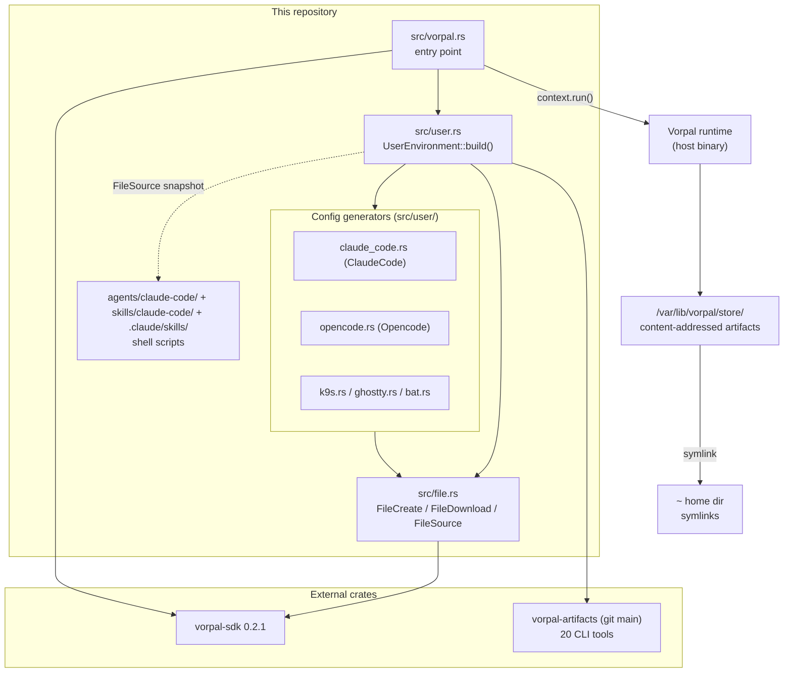
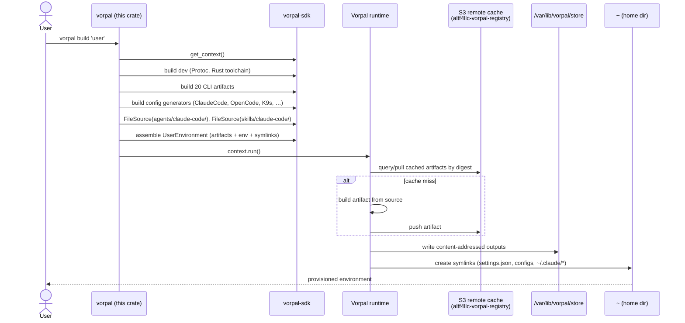

# Architecture

## Overview

`dotfiles.vorpal` is a **declarative dotfiles manager implemented as a Rust program** that targets the [Vorpal](https://github.com/ALT-F4-LLC/vorpal) build system. The Rust binary is not the dotfiles tool itself — it is a *build-graph generator*. When run, it constructs a directed acyclic graph of Vorpal artifacts (CLI tools, generated config files, downloaded themes, source-directory snapshots) and registers them with a `ConfigContext`; the Vorpal runtime then materializes that graph into the content-addressed store at `/var/lib/vorpal/store/` and projects symlinks into the user's home directory.

The crate also ships a **second, orthogonal payload**: a Claude Code agent-team configuration (`agents/claude-code/`, `skills/claude-code/`, `.claude/skills/`) that is packaged as Vorpal artifacts and symlinked into `~/.claude/`. These two concerns — environment provisioning and AI agent-team definition — share the same delivery mechanism (Vorpal artifacts) but are otherwise independent.

Key architectural facts established by reading the source:

- The crate is named `dotfiles` (`Cargo.toml:3`) and produces a single binary `vorpal` (`src/vorpal.rs`).
- Two top-level artifacts are emitted: **`dev`** (a `DevelopmentEnvironment` with Protoc + Rust toolchain) and **`user`** (the full `UserEnvironment`). See `src/vorpal.rs:33-46`.
- All heavy lifting (tool fetching, store layout, symlinking, content addressing) is delegated to the external `vorpal-sdk` (v0.2.1) and `vorpal-artifacts` (git `main`) crates. This repo contributes the *composition* and the *config generators*, not the build engine.
- Target platform is broadly declared as four systems (`SYSTEMS` in `src/lib.rs:9`: aarch64/x86_64 × darwin/linux), but the symlink targets and README make clear the **de-facto supported platform is aarch64-darwin (Apple Silicon macOS)** — many symlink paths are macOS-specific (`~/Library/Application Support/...`).

## Components

The system decomposes into four layers. The first three live in this repo; the fourth is the runtime that consumes their output.

### 1. Entry point & top-level artifacts (`src/vorpal.rs`)

The `#[tokio::main]` async entry point acquires a Vorpal `ConfigContext` via `get_context()`, builds the `dev` development environment (Protoc + Rust toolchain, wired with `RUSTUP_HOME`/`PATH` env vars), then builds the `user` environment, and finally calls `context.run()` to hand the assembled graph to the Vorpal runtime. This file owns the `dev` artifact definition inline; the `user` artifact is delegated to `UserEnvironment`.

### 2. User environment composition (`src/user.rs`)

`UserEnvironment::build()` is the architectural center of gravity (~510 lines). It:

- Instantiates **20 CLI-tool artifacts** from `vorpal-artifacts` (`awscli2`, `bat`, `direnv`, `doppler`, `fd`, `fzf`, `gh`, `git`, `gopls`, `gum`, `jj`, `jq`, `k9s`, `kubectl`, `lazygit`, `nnn`, `ripgrep`, `sesh`, `tmux`, `zoxide`). *Note:* the README claims "16 CLI tools" — the code defines 20. This is a documentation drift (see Gaps & Risks).
- Invokes the **config generators** (layer 3) to produce config-file artifacts for bat, Claude Code, Ghostty, K9s, OpenCode, a Neovim markdown ftplugin, a statusline script, and a TeammateIdle hook.
- Snapshots the `agents/claude-code/` and `skills/claude-code/` source directories into artifacts via `FileSource`.
- Assembles everything into the SDK's `artifact::UserEnvironment`, attaching environment variables (`EDITOR`, `GOPATH`, `PATH`) and a list of **symlink (store-path → home-path) pairs**.

This function is a long imperative builder. It is readable but monolithic — every tool, config, env var, and symlink is hardcoded in one method (see Gaps & Risks).

### 3. File primitives & config generators (`src/file.rs`, `src/user/*.rs`)

**`src/file.rs`** provides three reusable artifact primitives that all higher-level generators build on:

| Primitive | Purpose | Mechanism |
|---|---|---|
| `FileCreate` | Emit a file with literal content (optionally executable) | Heredoc `cat` into `$VORPAL_OUTPUT` + `chmod` |
| `FileDownload` | Fetch a remote file into an artifact | `ArtifactSource` from a URL, copy into output |
| `FileSource` | Snapshot a local directory subtree into an artifact | `ArtifactSource` from `.` with an include filter |

**`src/user/*.rs`** holds the per-tool **config generators**, each a builder struct with a fluent `with_*` API that serializes to the tool's native config format:

| Module | Struct | Output format | Size |
|---|---|---|---|
| `bat.rs` | `BatConfig` | plain-text (`--theme=…`) | ~1 KB |
| `ghostty.rs` | `GhosttyConfig` | key-value config | ~2 KB |
| `k9s.rs` | `K9sSkin` | YAML skin (TokyoNight palette) | ~23 KB |
| `claude_code.rs` | `ClaudeCode` | JSON `settings.json` (permissions, hooks, MCP, plugins, sandbox, OTEL) | ~55 KB |
| `opencode.rs` | `Opencode` | JSON (`opencode.json`: keybinds, LSP, agents, themes) | ~79 KB |

The `claude_code.rs` and `opencode.rs` generators are by far the largest and most security-relevant modules — `ClaudeCode` encodes the entire permission allow/ask/deny matrix, sandbox policy, and OTEL telemetry endpoints that govern how the deployed AI agents may act on the host. `claude_code.rs` uses `serde` with `BTreeMap` for deterministic key ordering, which matters for content-addressed reproducibility.

### 4. Agent-team & skills payload (`agents/claude-code/`, `skills/claude-code/`, `.claude/skills/`)

A non-code payload consumed by Claude Code at runtime, not by the Rust build:

- `agents/claude-code/*.md` — seven agent personas (team-lead, staff-engineer, senior-engineer, project-manager, security-engineer, sdet, ux-designer).
- `skills/claude-code/*` — project skills (adr, code-review-verdict, prd, tdd, ux-spec, verify-ac, vote, design-*, simplify-scout, init-specs).
- `.claude/skills/*` — meta/evolution skills (evolve-agents, evolve-skills, evolve-coherence).
- `src/user/statusline.sh`, `src/user/teammate-idle-hook.sh` — shell scripts embedded into artifacts via `include_str!`.

This payload is delivered by being snapshotted (`FileSource`) and symlinked into `~/.claude/`. The Rust build treats these as opaque directory contents — it does not parse or validate them. The only validation that exists is `tests/teammate-idle-hook.test.sh`, run in CI.

## Component Diagram

## Build & Deploy Data Flow

The lifecycle has two phases: **graph generation** (Rust) and **materialization** (Vorpal runtime).

Content addressing is the linchpin: each artifact's store path is `/var/lib/vorpal/store/artifact/output/{namespace}/{digest}` (`src/lib.rs:11-13`). Because the digest is derived from inputs, rebuilds are reproducible and the S3-backed cache (`altf4llc-vorpal-registry`) can short-circuit unchanged artifacts. The `dev` artifact must be built before `user` in CI because `user` depends on the toolchain the `dev` environment establishes (`.github/workflows/vorpal.yaml`, `build` job `needs: build-dev`).

## Module Boundaries & Dependencies

- **Inward dependency rule (observed, not enforced):** config generators (`src/user/*.rs`) depend on `src/file.rs` primitives; `src/user.rs` depends on both; `src/vorpal.rs` depends on `src/user.rs`. The dependency graph is acyclic and flows toward `file.rs`/`lib.rs`. There is no trait abstraction unifying the generators — each is a standalone builder, so the "boundary" is convention, not a compiler-checked interface.
- **External boundary:** the SDK boundary (`vorpal-sdk`, `vorpal-artifacts`) is where this crate hands off to the build engine. All artifact construction returns a `String` digest that this crate threads into store-path formatting. The crate is tightly coupled to SDK v0.2.1 semantics and the `vorpal-artifacts` git `main` branch (an unpinned moving target — see Gaps & Risks).
- **Payload boundary:** `agents/claude-code/` and `skills/claude-code/` are data, not code. They cross into the system only via `FileSource` snapshots and are otherwise untyped and unvalidated by the Rust build.

## Key Architectural Decisions

1. **Dotfiles-as-a-program over scripts/symlink-managers.** The environment is a typed Rust composition rather than shell scripts or a tool like GNU Stow. Benefit: type-checked, reproducible, content-addressed. Cost: every config change requires a Rust recompile and a Vorpal rebuild; contributors must know Rust and Vorpal.
2. **Builder-struct config generators.** Each tool config is a fluent builder serializing to the tool's native format. Benefit: type-safe config with defaults and IDE discoverability. Cost: a large hand-written generator per tool (`opencode.rs` is ~79 KB), and no shared abstraction across generators.
3. **Content-addressed store + S3 remote cache.** Reproducibility and cross-machine cache reuse. Cost: requires AWS credentials for cache access and a running Vorpal runtime on the host.
4. **Two payloads, one delivery mechanism.** The AI agent-team config rides the same Vorpal artifact pipeline as the dotfiles. Benefit: single `vorpal build 'user'` provisions both shell tooling and the Claude Code team. Cost: coupling — the agent-team definitions are versioned and deployed in lockstep with dotfiles even though they are conceptually separate products.
5. **Security policy encoded in `claude_code.rs`.** The Claude Code permission matrix (allow/ask/deny), sandbox configuration, filesystem deny-read list, and network allow-list are all defined declaratively in Rust and shipped as `settings.json`. This makes the host-level guardrails for the AI agents a *first-class, reviewable, version-controlled artifact* rather than ad-hoc local config. (Detailed posture is owned by `security.md`.)

## Gaps & Risks

- **Unpinned upstream dependency.** `vorpal-artifacts` is pulled from `git` branch `main` (`Cargo.toml:16`), not a tagged release. Although `Vorpal.lock`/`Cargo.lock` exist, a branch dependency is an inherently moving target that can break reproducibility or introduce upstream changes outside this repo's review. Recommend pinning to a tag or rev.
- **Documentation drift between README and code.** The README states "16 CLI tools" and lists a different set than the 20 tools actually instantiated in `src/user.rs:45-64` (code includes `fzf`, `gum`, `sesh`, `zoxide` not in the README table; the README's "16" count is stale). This undermines the README as a source of truth.
- **Monolithic `UserEnvironment::build()`.** A single ~510-line method hardcodes every tool, config, env var, and symlink. There is no registry/iteration abstraction, so adding or removing a tool is a multi-point edit. This is maintainable at current scale but will not scale gracefully.
- **No generator abstraction / no unit tests on generators.** The config generators (`bat`, `ghostty`, `k9s`, `claude_code`, `opencode`) emit security- and correctness-critical files (notably the Claude Code permission matrix), yet there is **no Rust test coverage** for any of them. The only automated test is `tests/teammate-idle-hook.test.sh` (a shell-script test for one hook). A malformed `settings.json` from a generator bug would ship unvalidated. (Test posture is owned by `testing.md`.)
- **Platform breadth claimed but not delivered.** `SYSTEMS` declares four platforms, but symlink targets (`~/Library/Application Support/...`) and the README ("macOS on Apple Silicon — the primary supported platform") make this effectively aarch64-darwin-only. The Linux/x86_64 declarations are aspirational and untested in CI (CI builds run on `macos-latest` only).
- **Hard-coded host paths.** `src/user.rs:536` symlinks a Vorpal binary from a fully-qualified developer-specific path (`$HOME/Development/repository/github.com/ALT-F4-LLC/vorpal.git/main/target/debug/vorpal`). This couples the build to one contributor's checkout layout and will fail for anyone else.
- **Untyped agent/skill payload.** The `agents/claude-code/` and `skills/claude-code/` markdown payload is shipped verbatim with no schema validation in the Rust build. Errors in agent/skill definitions are only caught at Claude Code runtime, not at build time.
- **Telemetry endpoints hard-coded to private infrastructure.** OTEL log/metric endpoints point at `*.bulbasaur.altf4.domains` (`src/user.rs:107-124`). For a public dotfiles repo this both leaks internal infrastructure naming and would send telemetry to an inaccessible host for any external user. (Privacy/exfiltration implications owned by `security.md`.)
