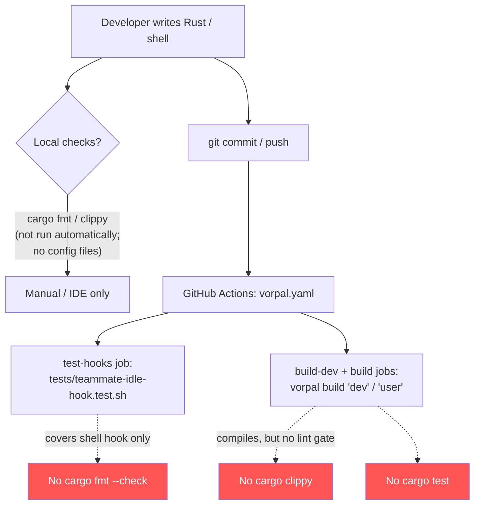

# Code Quality

This spec documents the style, idiom, and consistency conventions that the `dotfiles.vorpal` codebase actually follows, and the gaps in how those conventions are enforced. It is descriptive first: every rule below is grounded in code that exists today. Architecture-shape questions (module boundaries, artifact graph) belong in `architecture.md`; test-pattern questions belong in `testing.md`. The focus here is *how the code reads and stays consistent*.

The codebase is small and homogeneous: a single Rust binary crate (`vorpal`, edition 2021) under `src/`, plus two Bash scripts (`statusline.sh`, `teammate-idle-hook.sh`) that ship as build artifacts and are exercised by one shell test. Every Rust source file is a configuration generator — there is no business logic, no data layer, no async fan-out beyond awaiting Vorpal `build()` calls. That uniformity is the codebase's biggest quality asset and the lens for every convention below.

## Established Conventions

These are the patterns the code consistently uses. New code should match them.

### Rust idiom

- **Builder pattern with chained setters.** Every config generator (`FileCreate`, `GhosttyConfig`, `ClaudeCode`, `K9sSkin`, `Opencode`, `BatConfig`, `UserEnvironment`) follows the same shape: a struct holding owned fields, a `new(...) -> Self` constructor that seeds defaults, a series of `with_*(mut self, ...) -> Self` setters that mutate and return `self`, and a terminal `async fn build(self, context: &mut ConfigContext) -> Result<String>`. Consumers fluent-chain the setters (see `src/user.rs:91-299` for the `ClaudeCode` chain). New config types must adopt this exact shape.
- **Owned fields, `&str` parameters.** Setters and constructors take `&str` / borrowed slices and immediately `.to_string()` into owned `String` fields (`src/file.rs:23-30`, `src/user/ghostty.rs:18-25`). Struct fields are owned (`String`, `Vec<T>`); references are not stored.
- **`anyhow::Result` everywhere.** Every fallible function returns `anyhow::Result<T>` (imported as `use anyhow::Result;`). Errors propagate with `?`. There are no custom error enums, no `thiserror`, no `panic!`/`unwrap()` in the build paths — the program is a build script, so `?`-to-`main` is the whole error strategy. Match this; do not introduce a bespoke error type for a single config generator.
- **`indoc::formatdoc!` for embedded templates.** Shell-script and config-file templates embedded in Rust use `formatdoc!` with named interpolation (`src/file.rs:40-53`, `:75-81`, `:112-120`). Raw-string form (`r#"..."#`) is used when the template itself contains `#`/quotes (`src/file.rs:112`). Named args (`name = self.name`) are preferred over positional.
- **Alphabetized everything.** Struct fields, `new()` initializers, `with_*` setters, `use` imports, and dependency lists are all kept in alphabetical order. This is consistent enough across files (`src/user.rs:45-64` dependency block, `src/user/claude_code.rs:132-195` permission allow-list) to be treated as a rule, not a coincidence. It makes diffs and merges in the large flat config chains tractable. New entries go in alphabetical position.
- **`Self` in constructors, named struct in some.** Most `new()` bodies return `Self { ... }` (`src/file.rs:24`, `src/user/ghostty.rs:19`); `UserEnvironment::new` returns the named struct `UserEnvironment { ... }` (`src/user.rs:36`). `Self` is the dominant form; prefer it.
- **Derive sets on serde types.** Serialized config structs derive `#[derive(Debug, Clone, Serialize, Deserialize, Default)]` and use `#[serde(rename_all = "camelCase")]` plus `#[serde(skip_serializing_if = "...")]` for optional/empty fields (`src/user/claude_code.rs:12-58`). This keeps emitted JSON clean. `Option<T>` fields skip on `None`; `Vec<T>` fields skip on empty via `skip_serializing_if = "Vec::is_empty"` with `default`.
- **`#[allow(dead_code)]` for unused-but-intentional fields.** Config structs carry fields that are not yet wired to a setter; these are annotated `#[allow(dead_code)]` (10+ occurrences in `src/user/claude_code.rs`). This is a machine-required directive (see No-Code-Comments below) and is the sanctioned way to retain a field ahead of its setter.

### Constants and naming

- **`SCREAMING_SNAKE_CASE` consts at module top** (`SYSTEMS` in `src/lib.rs:9`).
- **`snake_case` functions and locals**, **`PascalCase` types**, standard Rust naming — no deviations observed.
- **Color/value palettes as named `let` bindings** rather than magic literals: the TokyoNight palette is declared once as named locals (`src/user.rs:355-366`) and referenced by name throughout the K9s skin chain. Repeat this pattern for any repeated literal.

### Shell-script idiom

- **`set -euo pipefail`** (statusline) / **`set -uo pipefail`** (idle hook — deliberately omits `-e` because it handles failures explicitly via `|| emit_empty`). Strict mode is the norm; deviations are deliberate and localized.
- **Defensive JSON parsing.** Both scripts read JSON on stdin and parse with `jq -r`, always supplying `// default` fallbacks (`src/user/statusline.sh:13-35`) or guarding `command -v jq` (`src/user/teammate-idle-hook.sh:12-14`). Scripts degrade gracefully (`emit_empty`) rather than crashing.
- **Section dividers as `# -- Label --` comments.** The statusline script organizes itself with `# -- ... --` banners. Note: these are prose comments and conflict with the team-wide policy below — see Gaps & Risks.

## No-Code-Comments Policy (team-wide)

The agent team enforces a **no-prose-comments policy** defined in `agents/team-lead.md` Rule 9 (line 359): production code must be readable on its own — no `//`, `#`, `/* */`, JSDoc, or docstring narration. The writer refactors (better names, smaller functions, expressive types) until a comment is unnecessary. **Allowed:** machine-required directives only — shebangs, load-bearing compiler/linter directives (`#[allow(dead_code)]`, `// @ts-expect-error`, Go build tags), and SPDX/license headers. Enforcement runs at the reviewer pass: `@staff-engineer` (general review) and `@security-engineer` (security review) flag any prose comment as a Blocker / Critical finding. Overrides route to a Docket issue comment, never an inline `// OVERRIDE` marker.

This policy is **aspirational for the existing codebase, not yet met.** A grep of `src/**/*.rs` finds **216 lines** beginning with a prose `//` comment across five files (`vorpal.rs`, `user.rs`, `user/claude_code.rs`, `user/k9s.rs`, `user/opencode.rs`), plus prose `#` comments in both shell scripts. Examples: the banner comments in `src/user/claude_code.rs:8-10` (`// ====...`), the inline section comments (`// Dependencies`, `// Configuration files`, `// Authentication`), and the `# -- Read JSON from stdin --` dividers in `statusline.sh`. The `#[allow(dead_code)]` attributes are *allowed* (machine-required) and are not counted against the policy.

The practical rule for *new* code: write none of these. Section comments like `// Dependencies` should become whitespace-separated blocks or extracted helper functions; banner comments should be deleted. Existing comments are pre-existing debt — see Gaps & Risks for the remediation stance.

## Enforcement & Tooling

This is where the codebase is weakest, and the findings here are the load-bearing part of this spec.

**What exists:**
- The Rust **toolchain compiles** the project as part of `vorpal build 'user'` in CI (`.github/workflows/vorpal.yaml`), so type errors and compile-breaking changes are caught.
- One CI job (`test-hooks`) runs the single shell test on `ubuntu-latest`.
- `cargo fmt`, `cargo clippy`, and `cargo test` permissions are **pre-allowed** for agents in the Claude Code config (`src/user.rs:135-141`), so the tools are available locally.

**What is missing (grounded):**
- **No formatting config and no fmt gate.** There is no `rustfmt.toml` / `.rustfmt.toml`. Running `cargo fmt --check` against the current tree **fails** — there is at least one real diff at `src/user/claude_code.rs:295` (a `#[serde(...)]` attribute that rustfmt would collapse to one line). Because CI runs no `cargo fmt --check`, this drift shipped undetected. Formatting today relies on toolchain defaults applied inconsistently by whoever last touched a file.
- **No clippy gate.** No `clippy.toml`, no `cargo clippy` step in CI. Lint regressions are invisible.
- **No Rust test gate.** No `cargo test` in CI (and no Rust tests exist to run — see `testing.md`). The only automated test is the shell hook test.
- **No pinned toolchain.** There is no `rust-toolchain.toml`. The Rust version is whatever `vorpal_sdk::artifact::rust_toolchain::version()` resolves to (currently 1.93.1, `src/vorpal.rs:20`). The version is therefore controlled transitively by the SDK dependency, not declared in this repo — a reproducibility seam worth being aware of.
- **No `.editorconfig`** to normalize indentation/line-endings across editors.

**Dependency hygiene (a quality bright spot):** Renovate (`renovate.json`) manages dependency updates with auto-merge for minor/patch on stable crates, which keeps the small dependency surface current without manual toil.

## Security Posture (code-quality dimension)

The operator flagged security as the emphasis for this bootstrap; the goal-bearing artifact is the sibling `docs/spec/security.md`, which owns the full threat model. This section covers only the *code-quality-adjacent* security observations — defer trust-boundary and secret-handling depth to that file.

- **No secrets in source.** Grepping the tree finds no hardcoded credentials; AWS access is injected via CI secrets (`.github/workflows/vorpal.yaml`), and the OTEL/Loki endpoints in `src/user/claude_code.rs:108-120` are non-secret infra URLs.
- **The most security-relevant code is the generated Claude Code permission policy** (`src/user.rs:132-295`): a large, hand-maintained allow/ask/deny permission matrix plus sandbox filesystem/network rules. From a *code-quality* standpoint the risk is **maintainability of a long flat list**: 60+ `with_permission_*` calls and parallel deny-lists across Read/Write/Edit that must stay in sync by hand. The four commented-out `// .with_permission_deny(...)` lines (`src/user.rs:218, 221, 239, 256`) are dead code that also reads as an ambiguous security signal — were those denies intentionally dropped, or temporarily disabled? Dead security-relevant code should be deleted, not commented out, so the policy is unambiguous. This belongs to `security.md` for the trust-boundary verdict; flagged here as a consistency/clarity defect.
- **Shell scripts ship as executable artifacts** with strict mode and graceful degradation, which limits blast radius if invoked with malformed input. They take untrusted-ish JSON on stdin and never `eval` it.

## Gaps & Risks

- **GAP — Existing code violates the team's own no-comments policy at scale.** 216 prose-comment lines in Rust plus comments throughout both shell scripts. The policy is enforced only at review time on *new* changes, so this is pre-existing debt that will keep surfacing as Blocker findings whenever those files are touched. **Recommendation:** either (a) accept a one-time cleanup PR to strip prose comments and refactor section markers into whitespace/helpers, or (b) record an explicit, time-boxed override for the legacy files via a Docket issue comment so reviewers stop re-flagging it. Do not leave the contradiction undocumented.
- **GAP — `cargo fmt --check` currently fails and nothing catches it.** Confirmed diff at `src/user/claude_code.rs:295`. Without a CI fmt gate, formatting drifts silently. **Recommendation:** add a `cargo fmt --check` (and ideally `cargo clippy -- -D warnings`) job to `.github/workflows/vorpal.yaml`, then a one-time `cargo fmt` normalization commit. This is the single highest-leverage quality fix available.
- **GAP — No lint or Rust-test gate in CI.** Compilation is the only Rust-side guard. Clippy regressions and (future) unit-test failures would not block a merge.
- **GAP — No pinned toolchain / no `rust-toolchain.toml`.** The Rust version is sourced transitively from `vorpal-sdk`. A SDK bump could silently change the compiler version and the rustfmt/clippy behavior, making "what does fmt produce" non-deterministic across contributors. **Recommendation:** consider pinning, or at minimum document that the SDK is the toolchain authority (cross-ref `architecture.md`).
- **GAP — No `.editorconfig`.** Minor, but with no fmt gate it is the only other line-ending/indent guard, and it is absent.
- **RISK — Hand-synchronized permission matrix.** The Claude Code deny-lists for Read/Write/Edit (`src/user.rs`) must be kept parallel by hand; a path denied for Read but forgotten for Write is a silent hole. Owned by `security.md`, but the *code shape* (long flat duplicated lists) is what makes the error class possible. A future refactor could derive the three lists from one source. Commented-out deny lines compound the ambiguity.
- **RISK — Single-platform assumptions.** `SYSTEMS` declares four targets but the README states macOS/aarch64-darwin is the only supported platform; some symlink paths are macOS-specific (`~/Library/Application Support/...`). Not a style defect, but a consistency-of-intent gap worth noting for reviewers. Defer the architectural verdict to `architecture.md`.
