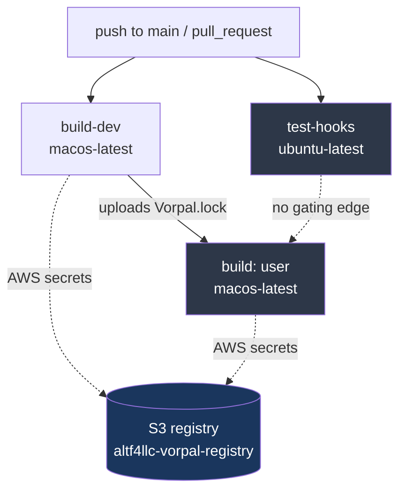

# Operations

This spec documents how `dotfiles.vorpal` is built, deployed to a host, observed, and recovered — and where those operational capabilities are absent. The project is a Rust program that emits content-addressed [Vorpal](https://github.com/ALT-F4-LLC/vorpal) artifacts: a `dev` toolchain and a `user` environment of 20 CLI tools plus generated config files (Claude Code, OpenCode, Ghostty, K9s, bat, Neovim). Deployment is `vorpal build 'user'` writing into `/var/lib/vorpal/store/` and symlinking into the home directory.

A defining operational characteristic: **the riskiest operational surface is not the build but the generated artifact.** The build itself is a deterministic, sandboxed, single-target macOS compile. The generated `~/.claude/settings.json` configures sandboxing, permission gating, telemetry export, and host-executed hook/statusline scripts that run with full user privileges every session. Operational posture is therefore evaluated in two layers: the build/release pipeline, and the runtime behavior of what it deploys.

## Build & Release Pipeline

### Local build

The documented build sequence is two ordered commands (`README.md`):

```bash
vorpal build 'dev'    # Protoc + Rust toolchain — builds the project itself
vorpal build 'user'   # 20 CLI tools + generated configs + home-dir symlinks
```

`dev` must build first: `.envrc` activates the `dev` environment via direnv (`source "$(vorpal build --path "dev")/bin/activate"`), and `dev` provides the Rust toolchain that compiles `src/vorpal.rs`. The `dev` artifact pins the Rust toolchain and Protoc versions (`src/vorpal.rs`); the `user` artifact pins 20 tool versions plus the bat theme tag (`src/user.rs`).

### Reproducibility & caching

Builds are content-addressed and reproducible. `Vorpal.lock` pins every upstream source by SHA-256 digest and platform (e.g. `awscli2` → `AWSCLIV2-2.33.1.pkg` digest `7debfa…`). The lockfile is the operational source of truth for "what exactly gets installed"; a digest mismatch fails the build rather than silently substituting. Remote caching is S3-backed (`altf4llc-vorpal-registry`); AWS credentials gate cache read/write.

### CI/CD

A single GitHub Actions workflow (`.github/workflows/vorpal.yaml`) runs on every `push` to `main` and on every `pull_request`. Three jobs:

| Job | Runner | Purpose | Depends on |
|---|---|---|---|
| `test-hooks` | `ubuntu-latest` | Runs `tests/teammate-idle-hook.test.sh` (the only automated test) | — |
| `build-dev` | `macos-latest` | Builds `dev`, uploads `Vorpal.lock` as an artifact | — |
| `build` | `macos-latest` | Builds the `user` artifact (matrix: `user`) | `build-dev` |

Both build jobs use [`setup-vorpal-action`](https://github.com/ALT-F4-LLC/setup-vorpal-action) with `registry-backend: s3` and consume three AWS values: `AWS_ACCESS_KEY_ID` (secret), `AWS_SECRET_ACCESS_KEY` (secret), `AWS_DEFAULT_REGION` (var). `test-hooks` and the build jobs are independent — there is no gate making `build` wait on `test-hooks`, so a failing hook test does not block the build path (it fails the overall workflow run, but the jobs run in parallel).



### Dependency operations

[Renovate](https://docs.renovatebot.com/) (`renovate.json`) manages updates:

- Minor/patch Cargo updates on **stable** crates (`!/^0/`) auto-merge. Major updates require manual review.
- The serde ecosystem (`serde`, `serde_json`) is grouped into one PR.
- A custom regex manager tracks the `tokyonight.nvim` bat theme tag in `src/user.rs`.

Operationally significant: `vorpal-sdk` is pinned (`0.2.1`) but `vorpal-artifacts` tracks `branch = "main"` (`Cargo.toml`), so that dependency can move without a version bump — its current resolution lives only in `Cargo.lock`.

## Deployment Model

Deployment is not a service rollout; it is a host-mutation step. `vorpal build 'user'` produces artifacts in `/var/lib/vorpal/store/artifact/output/<namespace>/<digest>` (`src/lib.rs`, `get_output_path`) and creates symlinks from the home directory into the store (`src/user.rs`, `.with_symlinks(...)`). The managed symlink set (12 links) includes:

| Symlink target | Operational sensitivity |
|---|---|
| `~/.claude/settings.json` | Governs agent sandbox, permissions, telemetry — highest blast radius |
| `~/.claude/agents`, `~/.claude/skills` | Agent + skill definitions (sourced from repo `agents/`, `skills/`) |
| `~/.claude/statusline.sh`, `~/.claude/teammate-idle-hook.sh` | **Host-executed shell scripts**, deployed `755`, run every session |
| `~/.vorpal/bin/vorpal` | Points at `~/Development/.../vorpal.git/main/target/debug/vorpal` — a **debug build in a hardcoded developer path**, not a store artifact |
| `~/.config/*`, `~/Library/Application Support/*` | Tool configs (bat, ghostty, k9s, opencode, nvim) |

Two deployment facts carry operational risk and are surfaced here rather than softened:

1. **The `vorpal` binary symlink targets a hardcoded absolute path** (`$HOME/Development/repository/github.com/ALT-F4-LLC/vorpal.git/main/target/debug/vorpal`). This is environment-specific to the author's machine and a `debug` build. On any host where that checkout does not exist at that path, the symlink dangles.
2. **Platform support is narrow.** `README.md` states macOS on Apple Silicon (aarch64-darwin) as the primary supported platform. `SYSTEMS` in `src/lib.rs` declares four targets (aarch64/x86_64 × darwin/linux), but CI only builds on `macos-latest`, so the non-darwin targets are declared-but-unexercised.

### Generated runtime configuration (deployed posture)

The `user` build bakes an opinionated security/operational posture into `~/.claude/settings.json` (`src/user.rs`, lines ~91–299). This is the operationally load-bearing output:

- **Sandbox enabled** with `fail_if_unavailable: true` (build/agent refuses to run unsandboxed), `auto_allow_bash_if_sandboxed`, and a network allowlist of four domains (`crates.io`, `static.crates.io`, `github.com`, `api.github.com`). Filesystem read-deny covers credential stores (`~/.ssh`, `~/.gnupg`, `~/.aws`, `~/.netrc`, `~/.talos`, `.env*`, etc.).
- **Permission gating** with `default_mode: acceptEdits` and `disable_bypass_permissions_mode: disable`. An extensive `allow`/`ask`/`deny` matrix gates Bash, Edit, Read, Write, and WebFetch. Notably `git commit`/`git push`/`rm`/`chown` are `ask`; `git checkout`/`git reset` are `deny`; credential and system paths are `deny` for Read/Write/Edit.
- **Sandbox-excluded commands** (`aws`, `docker`, `gh`, `git`, `kubectl`) run outside the sandbox — an intentional escape hatch for tools that need real network/socket access.

These settings are the deployment's actual operational contract with the host. Their correctness is a security concern (see `security.md`); their *delivery mechanism* (a generated JSON file symlinked into place) is the operations concern: there is no validation step confirming the deployed `settings.json` parses or that Claude Code accepts it before the symlink is swapped.

## Observability

### Agent runtime telemetry

The generated Claude Code config enables OpenTelemetry export (`src/user.rs`):

- `CLAUDE_CODE_ENABLE_TELEMETRY=1`
- Logs → `https://loki.bulbasaur.altf4.domains/otlp/v1/logs` (OTLP `http/protobuf`, 15 s interval)
- Metrics → `https://mimir.bulbasaur.altf4.domains/otlp/v1/metrics` (OTLP `http/protobuf`, cumulative, 15 s interval)

This means the **deployed agent environment is observable** — agent sessions emit logs to Loki and metrics to Mimir on the `altf4.domains` infrastructure. The status line script (`~/.claude/statusline.sh`) additionally surfaces per-session model, git state, context-window usage, cost, duration, and lines changed directly in the terminal. These two endpoints are hardcoded into the build; they are an external operational dependency of the *deployed* environment, not of the build itself.

### Build & CI observability

The **build and CI pipeline have no dedicated observability**. CI surfaces are limited to GitHub Actions' built-in job logs and the uploaded `Vorpal.lock` artifact. There is no build-time metrics export, no cache hit/miss reporting surfaced operationally, and no alerting on build failure beyond GitHub's native PR/commit status.

## Operational Runbooks & Recovery

This is the project's weakest operational dimension and is reported without softening.

- **No rollback procedure exists.** Content-addressed artifacts make rollback *theoretically* trivial (re-symlink to a prior digest), but no documented or scripted mechanism does this. Recovery from a bad `settings.json` is a manual `vorpal build` of a prior commit or manual symlink repair.
- **No release process.** Version is `0.1.0` (`Cargo.toml`) and has not been incremented; there are no tags, no changelog for the artifact (the `docs/changelog/` tree documents *agent/skill definitions*, not releases), and no notion of a "released" vs "dev" user environment beyond the `dev`/`user` artifact split.
- **No environment management beyond the single host model.** There is no staging/production distinction; the build deploys directly to the invoking user's home directory.
- **The only automated test** (`tests/teammate-idle-hook.test.sh`, 160 lines) validates the `TeammateIdle` hook's JSON contract. The Rust config-generation code has no test coverage (cross-reference `testing.md`), so a malformed generated config would not be caught before deployment.

### Active operational work

`docket plan --json` reports one backlog issue, **DKT-241** (priority low, `chore`): adopt `docket doc` co-edit conventions when any role first uses that subtree. It is operationally relevant to the agent-team workflow (concurrent doc editing race conditions) but does not bear on the build/deploy pipeline. No other active plan exists.

## Gaps & Risks

| # | Gap / Risk | Severity | Evidence |
|---|---|---|---|
| 1 | **No rollback automation.** Bad `settings.json` or config requires manual rebuild/symlink repair. Content-addressing makes this *possible* but nothing implements it. | High | No rollback script or doc; `src/user.rs` symlink swap is unguarded |
| 2 | **No validation gate before deploy.** Generated `settings.json` is symlinked into `~/.claude/` with no parse/accept check. A serialization regression deploys a broken agent config. | High | `src/user.rs` build flow; no validation step; config code has no tests |
| 3 | **Hardcoded developer-specific `vorpal` binary path.** Symlink targets `$HOME/Development/.../vorpal.git/main/target/debug/vorpal` — a debug build at one author's path. Dangles on any other host. | High | `src/user.rs:536` |
| 4 | **Declared but unbuilt platform targets.** `SYSTEMS` declares 4 targets; CI builds only `macos-latest`. Linux/x86 darwin paths are untested and may silently break. | Medium | `src/lib.rs` `SYSTEMS`; `.github/workflows/vorpal.yaml` runners |
| 5 | **CI test does not gate the build.** `test-hooks` runs in parallel with `build`; no `needs:` edge. A failing hook contract test does not stop artifact production within the run. | Medium | `.github/workflows/vorpal.yaml` job graph |
| 6 | **External observability endpoints are hardcoded single points of dependency.** Loki/Mimir at `*.bulbasaur.altf4.domains` are baked into every deployed config; if that infra is down or renamed, every agent session attempts (and fails) telemetry export with no fallback. | Medium | `src/user.rs` OTEL env vars |
| 7 | **`vorpal-artifacts` tracks `branch = "main"`.** A transitive artifact dependency can move without a version bump; reproducibility depends entirely on `Cargo.lock` being committed and respected. | Medium | `Cargo.toml:16` |
| 8 | **No release versioning or changelog for the artifact.** Stuck at `0.1.0`; no way to identify "which environment is deployed" beyond a git SHA. | Low | `Cargo.toml`; absence of tags/release notes |
| 9 | **Host-executed scripts run with full user privilege every session.** `statusline.sh` and `teammate-idle-hook.sh` are deployed `755` and executed by Claude Code each session/idle event. Operationally robust (both fail-soft to empty output), but they are an unsandboxed execution surface — see `security.md` for the trust-boundary analysis. | Low | `src/user.rs` `with_executable(true)`; script bodies |
