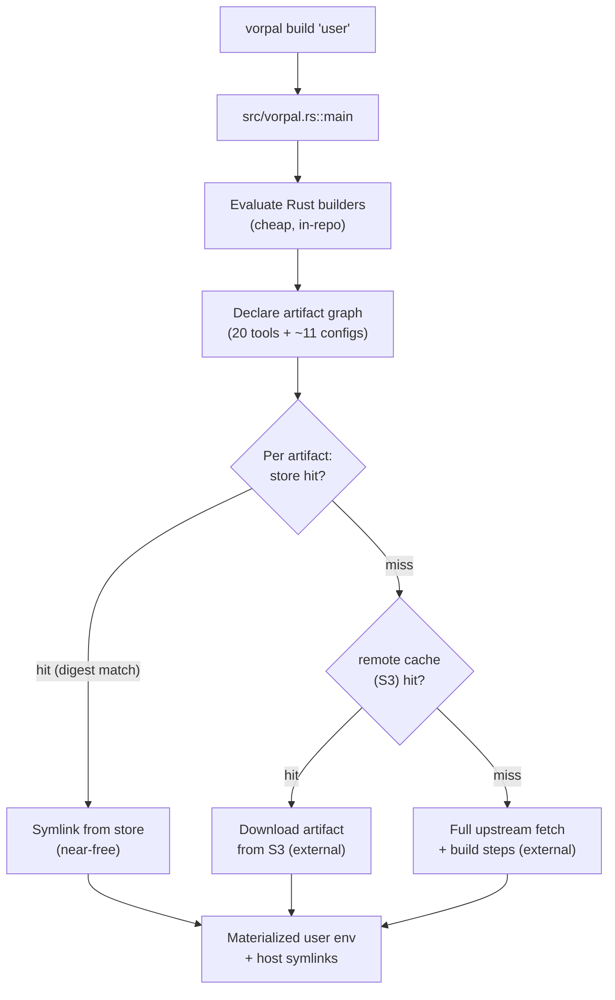

# Performance

## Scope & Honest Framing

This repository is **not a runtime service**. It is a Rust program (`vorpal` binary, `src/vorpal.rs`) that runs once per build invocation, declares a set of content-addressed artifacts, and hands them to the Vorpal build system to materialize. There is no request/response loop, no database, no connection pool, and no long-lived process whose latency or throughput a user observes interactively. "Performance" here means **build wall-clock time** and **incremental rebuild cost**, not query latency or QPS.

Because of this, the performance-critical behavior is dominated by systems **outside this repository**: the Vorpal daemon, its content-addressed store (`/var/lib/vorpal/store/`), the S3-backed remote cache (`altf4llc-vorpal-registry`), and the network fetches for upstream artifact sources. This repo's own code is a thin declarative layer. The sections below state plainly what this repo controls versus what it merely triggers.

The dominant performance levers are content-addressed caching (store hit vs. miss) and the sequencing of artifact builds. Both are partly controlled here and partly by the SDK/daemon. Where a lever lives outside this repo, it is labeled **(external)** and not claimed as in-repo behavior.

## Build Pipeline & Cost Model

A build is driven by `src/vorpal.rs::main`, which:

1. Acquires a `ConfigContext` (`get_context().await`).
2. Builds toolchain dependencies (`Protoc`, `RustToolchain`).
3. Builds the `dev` `DevelopmentEnvironment` and the `user` `UserEnvironment`.
4. Calls `context.run().await` to execute the declared graph.

The `user` environment (`src/user.rs::UserEnvironment::build`) declares **20 CLI-tool artifacts** plus ~11 configuration artifacts, each via a `.build(context).await?` call. The cost of any single build is therefore the sum of:

- **Config-evaluation cost (in-repo):** running the Rust builder structs to produce config strings. This is cheap — pure string formatting via `indoc`/`serde_json`. The two largest modules, `opencode.rs` (2207 LOC) and `claude_code.rs` (1630 LOC), are large by line count but generate static config; their cost is compile-time, not build-execution-time.
- **Artifact materialization cost (external):** for each artifact, the Vorpal daemon checks the content-addressed store. A **store hit** is near-free (a digest lookup + symlink); a **miss** triggers a fetch from the S3 remote cache or a full upstream download/build. This is the dominant variable cost and is **external** to this repo.

The single most important performance property is that **content-addressing makes warm rebuilds cheap**: if no inputs changed, every artifact is a store hit and the build collapses to digest lookups and symlink creation. The cost spikes only on cache misses — a new tool, a bumped version, or a cold machine.

## Concurrency & Sequencing

Within this repo's code, artifact builds are written **sequentially**: `src/user.rs` issues 20+ `let x = Foo::new().build(context).await?;` statements one after another, each `await`ed before the next begins. There is no `tokio::join!`, `futures::join_all`, `FuturesUnordered`, or other fan-out in this repository — the `await`s serialize at the source level.

Whether these serialized declarations translate into serialized *work* depends on the **Vorpal SDK and daemon (external)**: `context.run()` is what actually executes the graph, and the daemon may parallelize independent artifacts regardless of declaration order. This repo does not control that scheduling and does not assert it. What can be stated from the code: the in-repo authoring style is sequential, and there is no in-repo mechanism that would parallelize independent artifact declarations.

The process uses a **multi-threaded Tokio runtime** (`tokio = { features = ["rt-multi-thread"] }`, `#[tokio::main]`), so the runtime is capable of concurrent execution if the SDK schedules it; the runtime is not the limiting factor.

**Caching, connection pooling, pagination, batching, and lazy loading** are not implemented in this repo's code and are not applicable to a declarative config generator. Any such behavior (e.g., S3 connection reuse, parallel artifact downloads) lives in the Vorpal daemon and is **external**.

## Compile-Time Cost

Because the deliverable is a Rust binary rebuilt by CI and locally, **Rust compile time** is a real, in-repo-controllable performance dimension — arguably the most user-visible one for a contributor editing config.

- `Cargo.toml` defines **no `[profile.*]` sections**. There is no `[profile.release]` tuning (no `lto`, `opt-level`, `codegen-units`, or `strip` overrides) and no `[profile.dev]` tuning. Builds use Cargo defaults.
- The dependency tree is non-trivial: `Cargo.lock` is ~65 KB and the transitive graph pulls in `tokio`, `reqwest`, `hyper`, `h2`, `rustls`, `ring`, `tonic`, `prost`, `axum`, `tower-http`, and the ICU/`zerovec` family (visible in `target/debug/deps`). These are heavy compile-time dependencies inherited largely via `vorpal-sdk` and `vorpal-artifacts`.
- The two large builder modules (`opencode.rs`, `claude_code.rs`) are long but flat (chained builder calls), so their incremental compile cost is modest relative to the dependency graph.

The practical consequence: a **cold `cargo build` is dependency-bound**, not first-party-code-bound. Incremental rebuilds after editing a builder module are fast because only the `dotfiles` crate recompiles.

## Benchmarking & Observability

There are **no performance benchmarks, no `criterion` harness, no `cargo bench` targets, and no profiling instrumentation** in this repository. Build timing is whatever the Vorpal daemon and CI report; there is no in-repo measurement of build duration, cache-hit ratio, or artifact-fetch latency.

The CI pipeline (`.github/workflows/vorpal.yaml`) provides the only repeatable timing signal: a `test-hooks` job (fast, Ubuntu) plus `build-dev` and `build` jobs on `macos-latest`. These rely on the S3 remote cache for speed; a cache miss on a runner means a cold build. CI does not assert any timing budget or fail on regression.

Runtime telemetry that *is* configured (`OTEL_EXPORTER_OTLP_*` endpoints in `claude_code.rs`) targets **Claude Code agent sessions**, not this build pipeline — it measures agent behavior on the developer's machine, not `vorpal build` performance. It is not a performance signal for this repo's artifact.

## Gaps & Risks

- **No performance measurement of any kind.** There is no benchmark, no build-timing capture, and no cache-hit-ratio visibility in-repo. Regressions (e.g., a dependency bump that slows cold builds, or a change that defeats store caching) would be invisible until a human notices a slow build. *Risk: medium — silent degradation.*
- **No release profile tuning.** `Cargo.toml` omits `[profile.release]`; if the produced binary's runtime ever matters (it currently runs briefly and exits), there is no `lto`/`opt-level` configuration. *Risk: low — the binary is short-lived, but the omission is a latent gap if usage changes.*
- **Performance is dominated by external systems.** The S3 remote cache, Vorpal daemon scheduling, and upstream artifact availability determine real build time, and none are controlled or monitored here. A slow or unavailable S3 registry, or an upstream source change forcing a rebuild, degrades builds with no in-repo mitigation or alerting. This intersects security posture: cache integrity and provenance of fetched artifacts (see `security.md`) are the same external surface that governs build speed — a compromised or poisoned cache is both a security and a performance event. *Risk: medium — external dependency with no fallback documented here.*
- **Sequential artifact declaration is a potential ceiling.** If the Vorpal daemon does *not* parallelize independent artifacts, the 20+ serial `await`s in `src/user.rs` bound cold-build latency at the sum of all artifact build times. This is unverified from this repo (the scheduler is external); it should be confirmed before assuming warm-cache performance generalizes to cold builds. *Risk: low-to-medium — unverified assumption.*
- **Heavy transitive dependency graph inflates cold compile time.** The `tokio`/`reqwest`/`tonic`/`axum`/ICU stack inherited via the Vorpal crates makes a from-scratch `cargo build` expensive. There is no in-repo lever (feature trimming, etc.) to reduce this, since the weight comes from upstream crates. *Risk: low — affects contributor cold-start, not end-user builds.*
