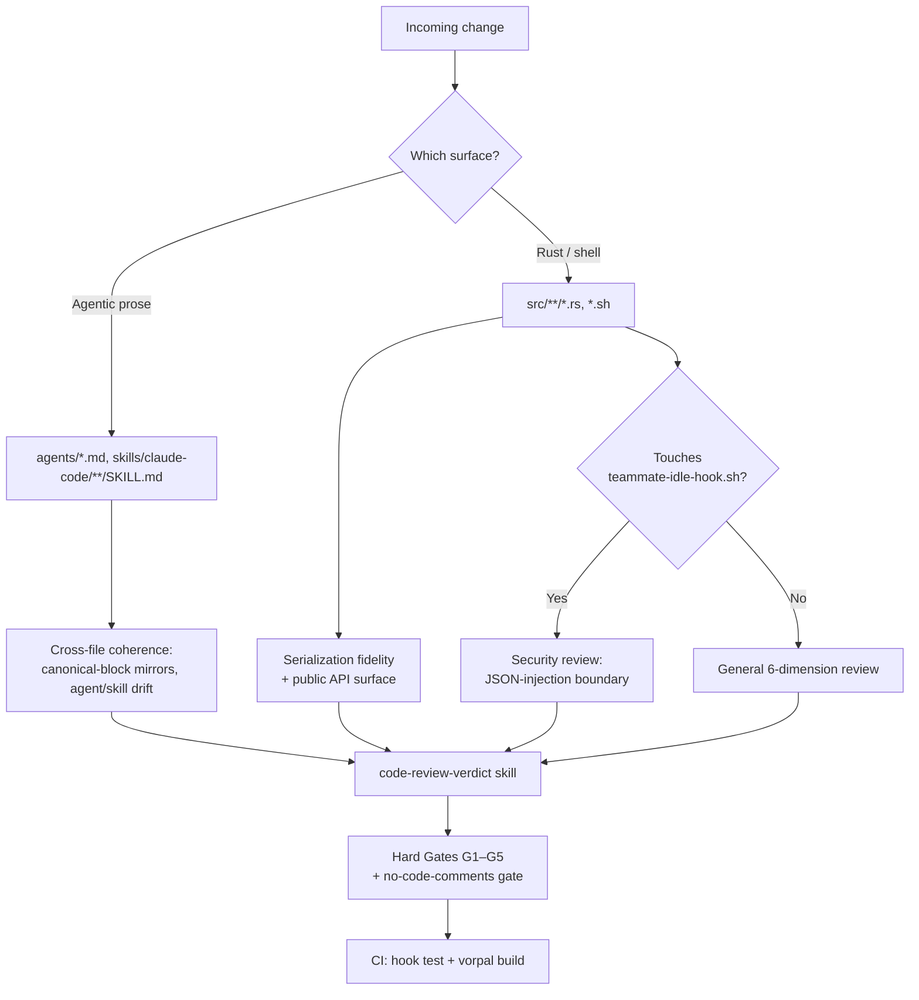

# Review Strategy

This document describes how changes to `dotfiles.vorpal` are reviewed. It is rigorously descriptive: it records the review machinery that exists in the repo today, the risk surfaces that machinery is meant to catch, and — explicitly — the gaps where review depends on agent discipline rather than an enforced gate.

## Repository Review Surfaces

The repo contains two materially different bodies of work, and they demand different review attention. Naming them is the first job of any review because the dominant risk is mis-weighting effort toward the smaller surface.

| Surface | What it is | Size / churn (verified 2026-06-09) | Primary risk |
|---|---|---|---|
| Agentic prose layer | `agents/*.md` (7 files, 2276 lines) and `skills/claude-code/**/SKILL.md` (13 project skills, 3239 lines) — the role definitions and skill contracts that drive this team | Highest churn in the repo by a wide margin: `agents/team-lead.md` 50 commits, `sdet.md` 49, `staff-engineer.md` 48, `senior-engineer.md` 48 in the last 100 commits | Cross-file incoherence — a rule changed in one agent file that contradicts a canonical block mirrored in another, or a skill contract that drifts from the agent that invokes it |
| Rust / Vorpal SDK code | `src/**/*.rs` (~3265 lines across 9 files) plus two shell scripts — config-builders that serialize dotfiles settings via the Vorpal SDK | Lower churn: `feat(user)` / `feat(claude)` prefixes appear 4 times in the last 50 commits | Serialization correctness, security of the one shell hook that parses untrusted JSON, supply-chain exposure from git-sourced dependencies |

The Rust code is almost entirely a **builder + serde-serialization** layer: `src/user/claude_code.rs` (1630 lines) is a long sequence of `with_*` builder methods over `Option<T>` fields, terminating in `serde_json::to_string_pretty` + `FileCreate`. There is no concurrency, no network request handling, and no runtime daemon in the reviewed source. This shapes review: the Rust dimensions that matter are **serialization fidelity** (does the emitted JSON match the upstream tool's schema?), **API surface discipline** (every `with_*` is public API), and **the one genuine trust boundary** — `src/user/teammate-idle-hook.sh`, which parses attacker-influenceable JSON.

## Review Machinery That Exists

The repo carries its own review apparatus as first-class artifacts; this is unusual and is the strongest review asset the project has.

- **`skills/claude-code/code-review-verdict/SKILL.md`** is the format authority for every code review. It defines a 6-dimension general playbook (`@staff-engineer`) and a 9-dimension security playbook (`@security-engineer`), a severity ladder per role, a structured output contract, and a `Validation Before Emit` checklist. Reviews route through this skill rather than ad-hoc prose.
- **Five mechanical Hard Gates (G1–G5)** are Blocker-class regardless of feature correctness: G1 swallowed error, G2 unguarded shared mutation, G3 unparsed boundary input, G4 surface-not-invariant patch, G5 unexecuted AC regex. Each has a documented `OVERRIDE: code-philosophy/<id>` escape that must be *surfaced* (listed in the verdict) rather than silently honored.
- **The no-code-comments gate** (team-lead.md Rule 9, enforced in `@staff-engineer` reviews) is Blocker-class: prose comments in production code, tests, or scripts are rejected; only machine-required directives (shebangs, `#[allow(...)]`, `// eslint-disable-next-line`, SPDX headers, etc.) are permitted. The current Rust source already complies — the comments present are section banners and a small number of doc-comments on deprecated/legacy fields, which a review would need to evaluate against this gate.
- **Reviewer roles**: `@staff-engineer` is the designated general reviewer; `@security-engineer` owns the security dimension. Under `@team-lead` orchestration a single reviewer (persistent `advisor`) is the default, opting up to a doubled or 4-way parallel panel for security-sensitive surfaces, diffs ≥500 LOC, or TDD secondary review (team-lead.md Rule 8).
- **Coherence auditing**: `Skill(evolve-coherence)` audits agent↔skill cross-references and is report-and-route only. For the prose layer this is the closest thing to a review gate, but it is invoked on demand, not on every change.

## Risk-Weighted Review Priorities

Where review attention should concentrate, highest-risk first:

1. **`src/user/teammate-idle-hook.sh` — the one real trust boundary.** It reads JSON from stdin (`.agent_type`) that originates from teammate-controlled data and echoes it into a `systemMessage`. The existing `tests/teammate-idle-hook.test.sh` already pins the critical invariants: fail-open on malformed/empty stdin, valid-JSON output, and — most importantly — `case_injection_safety`, which asserts a `$(touch ...)` payload is JSON-escaped and never executed. Any change here is a security review (G3 / shell-injection) and must keep the injection test green. This is the highest-value review target per line of code in the repo.
2. **Agentic prose coherence.** Because `agents/*.md` are the highest-churn files and carry mirrored canonical blocks (e.g. `CANONICAL:DOCS-PATHS-LOCAL`, `CANONICAL:PITFALLS`, `CANONICAL:BANNER`), the dominant defect class is a canonical block edited in one file but not its mirrors, or an agent rule that contradicts a skill contract it depends on. Review of prose changes should grep for the canonical markers and confirm mirror consistency, not just read the diff in isolation.
3. **Serialization fidelity in the Rust builders.** The `with_*` methods and serde attributes (`rename_all = "camelCase"`, `skip_serializing_if`, explicit `rename`) must match the schema the downstream tool (Claude Code, k9s, ghostty, opencode, bat) actually consumes. A wrong `rename` or a missing `skip_serializing_if` produces config the tool rejects or misreads — a class of bug no test in the repo currently catches (see Gaps & Risks).
4. **Public API surface of the builders.** Every `with_*` is public and `#[allow(dead_code)]`, meaning the compiler will not flag an unused or misnamed method. Review is the only line of defense against API drift, dead builders, and naming inconsistency across the config structs.
5. **Supply-chain posture.** `Cargo.toml` pulls `vorpal-artifacts` and the SDK; `vorpal-artifacts` is a `git` dependency pinned to `branch = "main"` (a moving target, not a tag or commit SHA). Renovate is configured (`renovate.json`) for dependency PRs. Any dependency change warrants a supply-chain pass (provenance, transitive surface, pinning discipline).

## Review Dimensions, Weighted for This Repo

The `code-review-verdict` 6 dimensions, mapped to what they actually mean here:

| Dimension | Weight here | Why |
|---|---|---|
| Architecture | Medium | Builder pattern is uniform; the live architectural question is the two-surface split and canonical-block coherence in the prose layer |
| Security | High (narrow) | Concentrated almost entirely in `teammate-idle-hook.sh`; the Rust code has no auth/crypto/network surface, but the shell hook is a genuine injection boundary |
| Operations | Low | No deploy/rollback/runtime story in the reviewed source; output is generated config files |
| Performance | Low | No hot paths; serialization runs once at config-build time |
| Code Quality | High | The 12 code-philosophy principles + no-code-comments gate are the most frequently load-bearing dimension given builder repetition and prose density |
| Testing | High (by gap) | High *because* coverage is thin — see Gaps & Risks; reviewers must reason about what is untested, not just what is asserted |

## CI Quality Gates

`.github/workflows/vorpal.yaml` is the only enforced gate, and it is deliberately narrow:

- **`test-hooks`** (ubuntu): runs `tests/teammate-idle-hook.test.sh` — the single automated test in the repo. It is the only CI step that fails on a logic regression.
- **`build-dev` / `build`** (macos): runs `vorpal build 'dev'` and `vorpal build 'user'` against an S3 registry backend, gated on AWS secrets. These confirm the config builds compile and serialize, but assert nothing about output correctness.

There is **no** `cargo clippy`, `cargo fmt --check`, `cargo test`, or `cargo audit` step in CI (verified: no such invocation exists anywhere in the repo). There is no PR template, no `CODEOWNERS`, no pre-commit config, and no contribution guideline. The review burden therefore falls almost entirely on the agentic review machinery and human judgment, not on automated CI gates.

## Gaps & Risks

- **No automated test coverage for the Rust code.** The only test in the repo (`tests/teammate-idle-hook.test.sh`) covers the shell hook. Every Rust builder — including all of `src/user/claude_code.rs` (1630 lines) — has zero test coverage. Serialization fidelity (correct `rename`, `camelCase`, `skip_serializing_if` behavior) is unverified by any gate; a regression would ship silently and only surface when the downstream tool rejects the generated config. This is the single largest review-strategy gap: reviewers cannot lean on tests and must manually verify serde behavior on every builder change.
- **No `cargo clippy` / `fmt` / `audit` in CI.** Lint, format, and known-vulnerability checks are absent from the pipeline. Findings a linter would normally catch fall to human/agent review, which is lower-recall and inconsistent. `cargo audit` absence is notable given the git-sourced dependency.
- **Moving-target dependency pin.** `vorpal-artifacts` is pinned to `branch = "main"` rather than a tag or commit SHA, so the dependency surface can change without any change to this repo and without review. Supply-chain review of *this* repo cannot fully bound what ships.
- **Prose-layer coherence is enforced only on demand.** Canonical-block mirroring across `agents/*.md` and agent↔skill contract consistency are checked by `Skill(evolve-coherence)`, which is invoked deliberately, not on every prose change. Given that the prose files are the highest-churn surface, an incoherence introduced between coherence audits can persist undetected. There is no CI gate that greps canonical markers for mirror drift.
- **No enforced review entry point.** There is no PR template, `CODEOWNERS`, or branch protection observed in the repo, so the routing of a change to the correct reviewer (general vs. security) depends on orchestration discipline rather than a structural gate. A security-sensitive change to the hook could in principle be reviewed only by the general track if mis-triaged.
- **`#[allow(dead_code)]` on the entire builder API suppresses the compiler's unused-code signal.** This is a reasonable choice for a public builder library, but it means dead or misnamed builders will not be flagged by the toolchain — review is the sole detector, and an overworked review will miss it.
