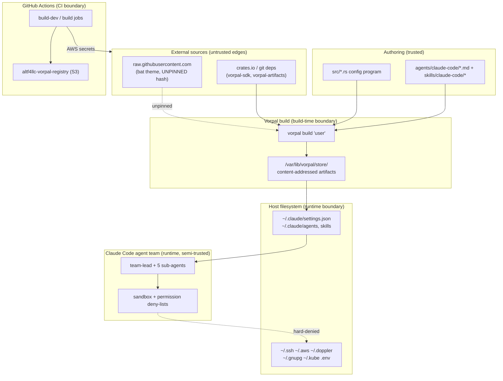
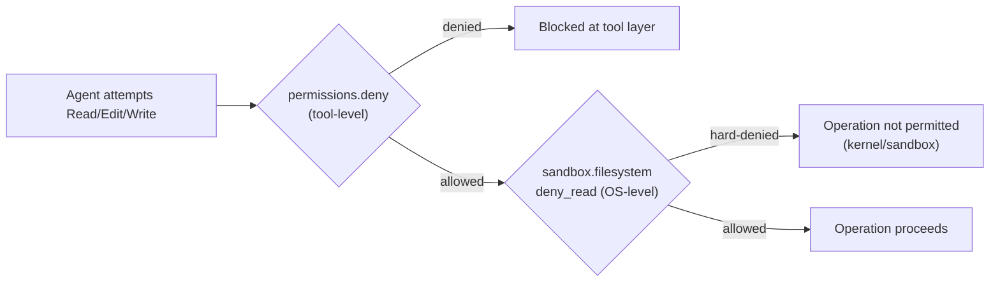
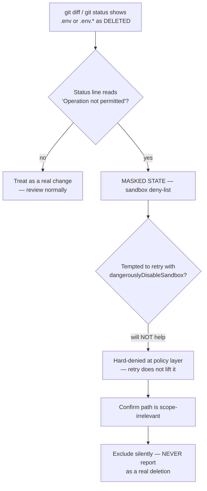

# Security

This spec documents the *current, observed* security posture of `dotfiles.vorpal`. It is descriptive, not aspirational: every control below is grounded in source under `src/`, the CI workflow, or the agent definitions under `agents/claude-code/`. Gaps and weaknesses are called out explicitly in [Gaps & Risks](#gaps--risks).

`dotfiles.vorpal` is a Rust program (`src/vorpal.rs` → `src/user.rs`) that compiles a declarative description of a developer environment into content-addressed [Vorpal](https://github.com/ALT-F4-LLC/vorpal) artifacts, then symlinks those artifacts into the user's home directory. Critically, one of the artifacts it produces is the **Claude Code `settings.json`** (`src/user/claude_code.rs`, configured in `src/user.rs`) that governs an autonomous multi-agent development team. The security surface is therefore two-layered:

1. **Build-time** — what the Rust build trusts, downloads, and serializes.
2. **Runtime** — what the generated Claude Code configuration permits the agent team to read, write, and execute on the host.

## Trust Boundaries

The system crosses several trust boundaries between authoring source and a running agent on a developer machine. The build is reproducible and content-addressed, which means the integrity story is strong *for inputs that are pinned*; the weak edges are the unpinned external fetch and the secrets handed to CI.

| Boundary | What crosses it | Integrity / control | Assessment |
|---|---|---|---|
| Authoring → Build | Rust config program, agent/skill markdown | `Cargo.lock` + `Vorpal.lock` pin crate and artifact hashes | Strong (pinned) |
| External → Build | `vorpal-sdk` (crates.io, pinned `0.2.1`), `vorpal-artifacts` (git `branch = "main"`, **unpinned ref**) | Renovate auto-merges minor/patch (`renovate.json`) | Mixed — git `branch = main` is a floating ref |
| External → Build | bat theme via `FileDownload` from `raw.githubusercontent.com` (`src/user.rs`) | URL pins a git **tag** (`v4.14.1`) but no content hash is verified in source | Weak — see Gaps |
| Build → Host | Content-addressed artifacts symlinked into `~` | Vorpal store is content-addressed; symlinks are deterministic | Strong |
| Host → Agent | Generated `settings.json` governs agent capabilities | Layered deny-lists + sandbox (below) | Primary runtime control |
| CI → S3 | `AWS_ACCESS_KEY_ID` / `AWS_SECRET_ACCESS_KEY` GitHub secrets | Long-lived static AWS keys in repo secrets | Weak — see Gaps |

## Secret Management

The design philosophy is **externalize and deny**: secrets never live in the repo or the generated config; instead they live in dedicated tools and directories, and the agent runtime is explicitly forbidden from reading those locations.

- **No secrets in source.** A scan of `src/` for literal credential patterns (`sk-`, `ghp_`, `AKIA`, PEM headers, inline `password=`/`secret=`) returns nothing. The `api_key` / `client_secret` fields in `src/user/opencode.rs` are *struct field definitions* for serializing user-provided config, not embedded values.
- **Dedicated secret tooling is provisioned but externalized.** The user environment installs `doppler` (secrets management) and `awscli2` (`src/user.rs`), but their credential stores (`~/.doppler`, `~/.aws`) are deny-listed from agent access (below).
- **`.env` files are git-ignored at the directory level only.** `.gitignore` ignores `.docket/` and `target/`. It does **not** list `.env`; protection of `.env` content is enforced at the *agent-runtime* layer (deny-list), not at the VCS layer. The only env file present in-repo is `.envrc`, which contains a direnv `use vorpal` shim and no secrets.
- **Subprocess env scrubbing is enabled.** `CLAUDE_CODE_SUBPROCESS_ENV_SCRUB=1` (`src/user.rs`) instructs Claude Code to strip sensitive environment variables before spawning subprocesses.
- **Telemetry endpoints are non-secret.** OTEL exporters point at `loki.bulbasaur.altf4.domains` / `mimir.bulbasaur.altf4.domains` over HTTP/protobuf; no bearer token or secret is embedded in the config (`src/user.rs`).

### CI secrets

The GitHub Actions workflow (`.github/workflows/vorpal.yaml`) injects `AWS_ACCESS_KEY_ID` and `AWS_SECRET_ACCESS_KEY` from repository secrets into the `setup-vorpal-action` for S3-backed cache access. These are **long-lived static keys**, not short-lived OIDC-federated credentials — flagged in Gaps & Risks.

## Runtime Controls: Layered Deny-Lists

The generated Claude Code config (`src/user.rs`) applies **defense in depth** — the same sensitive paths are protected at *two independent layers*, so a bypass of one does not expose the data.

**Layer 1 — `permissions.deny` (tool-level).** Read / Edit / Write rules block agent tools from touching credential stores and sensitive system paths: `~/.ssh`, `~/.aws`, `~/.gnupg`, `~/.kube`, `~/.doppler`, `~/.gemini`, `~/.codex`, `~/.opencode`, `~/.talos`, `~/.vorpal`, `~/.netrc`, `~/.claude.json`, `/System`, `/Library`, `/Applications`, plus `Read(.env)` and `Read(.env.*)`.

**Layer 2 — `sandbox.filesystem.deny_read` (OS/sandbox-level).** A subset of the same paths — including `.env` and `.env.*` — is *also* hard-denied at the sandbox policy layer (`with_sandbox_filesystem_deny_read`, `src/user.rs`). This is the layer that produces the phantom-deletion behavior documented below.

**Other runtime hardening observed in `src/user.rs`:**

| Control | Value | Effect |
|---|---|---|
| `sandbox.enabled` | `true` | Sandbox active |
| `sandbox.failIfUnavailable` | `true` | Fail closed if sandbox cannot start |
| `sandbox.network.allowedDomains` | `crates.io`, `static.crates.io`, `github.com`, `api.github.com` | Network egress allow-list |
| `sandbox.network.allowLocalBinding` | `false` | No local socket binding |
| `permissions.defaultMode` | `acceptEdits` | Edits auto-accepted (writes are sandbox-bounded) |
| `permissions.disableBypassPermissionsMode` | `disable` | Bypass-permissions mode is disabled |
| `permissions.ask` | `git commit`, `git push`, `rm`, `chown` | Destructive/outward ops require confirmation |
| `permissions.deny` | `git checkout`, `git reset` | History-destroying git ops blocked outright |
| Git instruction guardrail | agent specs forbid commit/push unless explicitly instructed | Defense-in-depth against unintended VCS mutation |

Note the deliberate tension: `sandbox.allowUnsandboxedCommands(true)` and `sandbox.autoAllowBashIfSandboxed(true)` are set, and `aws`/`docker`/`gh`/`git`/`kubectl` are listed in `excludedCommands` (run outside the sandbox). This is an intentional usability trade-off — those tools need real network/credential access — but it widens the runtime surface and is flagged in Gaps & Risks.

## Sandbox Deny-List: `.env` Phantom-Deletion (MASKED STATE)

This section documents an **operator-verified runtime behavior** that reviewers and agents must understand to avoid misreading masked state as real changes. It is consistent with `agents/claude-code/team-lead.md` step 13 (phantom-deletion sub-case), which this spec cross-references and must stay aligned with.

**The behavior.** The paths `.env` and `.env.*` are hard-denied at the sandbox policy layer (`sandbox.filesystem.deny_read`, `src/user.rs`). When git inspects the working tree, the sandbox refuses the read, and the tooling surfaces those paths as **phantom-DELETED** in `git diff` / `git status` output — the status line reads **`Operation not permitted`** — *even though the files are untouched on disk*. The deletion is an artifact of the read denial, not a real filesystem change.

**`dangerouslyDisableSandbox` does NOT lift this.** These reads are **hard-denied at the sandbox policy layer**, not soft-masked. Retrying with `dangerouslyDisableSandbox=true` (the standard escape hatch for *allowlist*-masked paths outside operator scope) does **not** reveal `.env`/`.env.*`. Do not interpret a failed `dangerouslyDisableSandbox` retry as evidence that the file was actually deleted — the denial is by design.

**Prescribed handling — treat as MASKED STATE:**

1. **Recognize the signature.** A `.env` / `.env.*` path showing as deleted with an `Operation not permitted` status line is masked state, not a real deletion.
2. **Confirm scope-irrelevance.** Verify the masked path is *not* part of the change under review. Deny-listed env files are never legitimate review targets in this project.
3. **Never surface it as a real deletion.** Do not report it as a change, do not include it in a diff summary, do not raise it as a finding, and do not attempt to "restore" it. Silently exclude it from the reviewed change set.

> Authority note: This behavior is also encoded in `agents/claude-code/team-lead.md` step 13 (phantom-deletion sub-case). If that text and this section ever diverge, reconcile them — they describe one and the same control.

## Gaps & Risks

The following are real weaknesses in the *current* implementation, documented without softening.

- **Unpinned external download (build integrity).** The bat theme is fetched at build time from `raw.githubusercontent.com/folke/tokyonight.nvim/.../v4.14.1/...` via `FileDownload` (`src/user.rs`). The URL pins a git *tag*, but the source verifies no content hash — a force-pushed or retagged upstream could alter the downloaded bytes. Tags are mutable. **Mitigation:** pin and verify a content hash, or vendor the theme. Renovate's custom manager tracks the tag for updates but does not provide integrity verification.
- **Floating git dependency.** `vorpal-artifacts` is declared as `git = "...", branch = "main"` (`Cargo.toml`) — an unpinned branch ref. `Cargo.lock` pins a specific commit at lock time, but `cargo update` will silently advance it. **Mitigation:** pin to a tag/rev, or treat `Vorpal.lock`/`Cargo.lock` churn as a review trigger.
- **Long-lived static AWS keys in CI.** `.github/workflows/vorpal.yaml` uses `AWS_ACCESS_KEY_ID` / `AWS_SECRET_ACCESS_KEY` repository secrets rather than GitHub OIDC federation. Static keys do not auto-rotate and are higher-value if leaked. **Mitigation:** migrate to OIDC role assumption (`aws-actions/configure-aws-credentials` with `role-to-assume`).
- **Widened runtime surface from unsandboxed commands.** `allowUnsandboxedCommands(true)` + `autoAllowBashIfSandboxed(true)`, combined with `excludedCommands = [aws, docker, gh, git, kubectl]`, means those tools run *outside* the sandbox with full host network and credential access. This is a deliberate usability trade-off, but it is the largest hole in the runtime containment story — an agent invoking `aws`/`kubectl`/`gh` is bounded only by the `permissions.ask`/`deny` rules and the externalized credentials, not by the sandbox.
- **`.env` protected only at runtime, not in VCS.** `.gitignore` does not list `.env` / `.env.*`. If a developer ever creates a real `.env` with secrets, nothing prevents `git add .` from staging it (the agent's `git add` is allowed). The deny-list protects *agent reads*, not *accidental commits*. **Mitigation:** add `.env`, `.env.*` to `.gitignore`.
- **`acceptEdits` default mode.** `permissions.defaultMode = acceptEdits` auto-accepts file edits. Writes are sandbox-bounded and the destructive-git ops are denied, so blast radius is constrained, but there is no human-in-the-loop gate on routine edits by design.
- **Deny-list drift between the two layers.** `permissions.deny` and `sandbox.filesystem.deny_read` overlap but are not identical (e.g., `permissions.deny` covers `~/.kube`, `~/.vorpal`, several `Edit`/`Write` targets that the sandbox `deny_read` list does not). The two lists are maintained by hand in `src/user.rs`; drift is possible. **Mitigation:** derive both layers from a single shared source list, or add a test asserting the sandbox `deny_read` set is a superset of the credential paths.
- **No automated secret-scanning in CI.** The workflow builds artifacts but runs no secret scanner (e.g., gitleaks/trufflehog) on the tree. Protection against committed secrets relies entirely on `.gitignore` discipline and the (incomplete) ignore list above.
