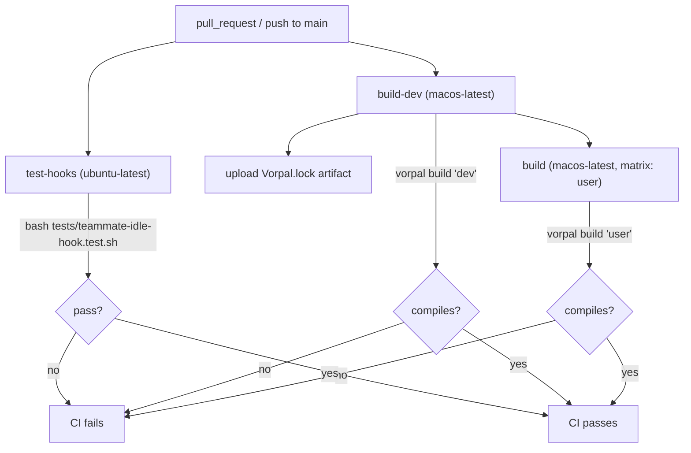

# Testing

This document describes the testing posture of `dotfiles.vorpal` **as it exists today**, not an aspirational target. The repository now has a small but real automated test surface: one shell integration test for the Claude Code idle hook, a Codex config serialization smoke test in `src/user/codex.rs`, and a Rust integration test that validates the Codex agent/skill payload. Build success is still the only broad signal that most generated configs are correct.

## Test Inventory

The automated test surface is small and focused.

| Test | Type | Target | Runner | Cases |
|---|---|---|---|---|
| `tests/teammate-idle-hook.test.sh` | Shell integration | `src/user/teammate-idle-hook.sh` | `bash` + `jq` | 5 |
| `src/user/codex.rs::tests::serializes_current_config_shape` | Rust unit | Codex TOML serialization smoke test | `cargo test` | 1 |
| `tests/codex_payload.rs` | Rust integration | `agents/codex/*.toml`, `skills/codex/*/SKILL.md`, Codex role registration in `src/user.rs` | `cargo test` | 3 |

There is still no coverage tooling (`tarpaulin`, `llvm-cov`, `grcov`), no test fixtures directory, and no mocking framework.

### What the shell test covers

`tests/teammate-idle-hook.test.sh` is a self-contained, dependency-light bash harness (it requires only `bash` and `jq`). It exercises the `TeammateIdle` hook script through five cases:

- `case_agent_type_present` — valid JSON with an `agent_type`, asserts exit 0, valid JSON output, and that the agent type appears in the emitted `systemMessage`.
- `case_no_agent_type` — empty JSON object, asserts a generic reminder is still emitted.
- `case_malformed_stdin` — non-JSON input, asserts fail-open behavior (exit 0, empty `{}`, no `systemMessage`).
- `case_empty_stdin` — empty input, asserts the generic reminder path.
- `case_injection_safety` — feeds a `$(touch <sentinel>)` payload in the `agent_type` field and asserts the payload is JSON-escaped into the message and **never executed** (the sentinel file must not appear).

This is a genuinely good test for what it targets: it covers the happy path, two empty/degenerate inputs, malformed input, and a security-relevant injection case. The harness reports a `N passed, M failed` tally and exits non-zero on any failure, which is correct for CI gating.

### What the Codex payload tests cover

`tests/codex_payload.rs` validates the new Codex-native surface:

- Every expected `agents/codex/*.toml` file exists and parses as TOML.
- Each Codex agent has `name`, `description`, and non-empty `developer_instructions`.
- Codex agent TOML omits Claude-only fields such as `color`, `permissionMode`, `tools`, `memory`, `skills`, and explicit `model`.
- `src/user.rs` registers every Codex role with `config_file = "./agents/<role>.toml"` and snapshots/symlinks `agents/codex`.
- Every expected `skills/codex/*/SKILL.md` exists with required `name` and `description` frontmatter.
- Codex agent and skill files reject active Claude runtime syntax such as `SendMessage`, `TeamCreate`, `TeamDelete`, `Agent(`, `TaskCreate`, and `Skill(`.

### What is untested

Major surfaces still untested:

- **Most Rust artifact-definition code** (`src/lib.rs`, `src/vorpal.rs`, `src/file.rs`, `src/user.rs`, and most `src/user/*.rs` modules — bat, claude_code, ghostty, k9s, opencode). This includes `FileCreate`/`FileDownload`/`FileSource` builders, most of the `UserEnvironment` assembly, and pure functions like `get_output_path`.
- **The two other shipped shell scripts**: `src/user/statusline.sh` and the build-embedded copy of the hook (the hook is also `include_str!`-embedded into the Rust build and copied to `~/.claude/teammate-idle-hook.sh` at install time — only the source-tree copy is tested).
- **Most generated config payloads** (Ghostty, k9s skin, opencode permissions, Claude Code settings) — there is no assertion that the strings these builders emit are valid for their consuming tools. Codex has a serialization smoke test and payload shape checks, not a runtime acceptance test.
- **The end-to-end Vorpal build/install** — there is no test that the produced artifacts install correctly or that symlinks resolve.

## Test Pyramid

Calling this a "pyramid" still overstates it. The breakdown by automated test count:

| Layer | Count | Proportion | Notes |
|---|---|---|---|
| Unit | 1 | 20% | One Codex TOML serialization smoke test |
| Integration | 4 | 80% | One shell hook harness plus three Codex payload integration tests |
| End-to-end | 0 | 0% | The `vorpal build` jobs validate compilation, not installed behavior |

The practical shape is still narrow: targeted payload/schema checks and one shell-script integration test, with no end-to-end install validation.

## CI Verification

CI is defined in `.github/workflows/vorpal.yaml` and runs on `pull_request` and on `push` to `main`. Three jobs:

- **`test-hooks`** (ubuntu-latest) — runs `bash tests/teammate-idle-hook.test.sh`.
- **`build-dev`** (macos-latest) — runs `vorpal build 'dev'` and uploads the resulting `Vorpal.lock`. This validates that the dev-environment artifact graph compiles and resolves, which transitively compiles the Rust program. It does not run any test.
- **`build`** (macos-latest, depends on `build-dev`, matrix over the `user` artifact) — runs `vorpal build 'user'`, validating the user-environment artifact builds. Also no tests.

Local `cargo test` now exercises the Codex serialization and payload tests, but the current CI description above does not show a separate `cargo test` job. The build jobs are a meaningful safety net for the Rust code in one narrow sense: a non-compiling change or an unresolvable artifact reference fails CI. But "it compiles" is a weak correctness signal for code whose output is shell scripts and config strings interpolated via `formatdoc!` — a builder can compile and emit a syntactically broken config.

## Test Conventions & Tooling

The conventions that exist are entirely within the one shell test, and they are sound enough to be worth codifying for any future shell tests:

- `set -uo pipefail` at the top (note: not `-e`, deliberately, so the harness can capture non-zero exits from the hook and assert on them).
- Named `assert_*` helpers (`assert_exit_zero`, `assert_valid_json`, `assert_system_message_contains`, `assert_empty_object`, etc.) with a `PASS`/`FAIL` counter and a final tally.
- Preconditions checked up front (`jq` present, hook file exists) with a distinct fatal exit code (`2`) separate from test-failure exit (`1`).
- `mktemp -d` scratch directories for side-effect assertions (the injection sentinel), cleaned up afterward.

For Rust, the new convention is plain `#[cfg(test)] mod tests` for local serialization smoke tests and `tests/*.rs` integration tests for repo-level payload validation. Future generator tests should continue this pattern, with snapshot-style assertions (e.g., `insta`) as a good fit for `formatdoc!`-generated config payloads.

## Gaps & Risks

- **Sparse Rust test coverage (highest risk).** Most Rust code that defines the dotfiles environment remains untested. The `formatdoc!` string interpolation in `src/file.rs` and the config builders in `src/user/*.rs` are exactly the kind of code where a typo produces a silently-broken config that still compiles and still builds. The new Codex tests improve one payload surface but do not solve the broader generator risk.
- **Security-relevant code is largely untested.** Only the idle hook's injection safety is tested. The `FileCreate::build` path writes attacker-influenceable-in-principle content into shell heredocs (`cat << 'EOF'`), and `statusline.sh` is shipped untested. The single injection test is good but isolated; there is no systematic input-safety coverage of the config-generation paths. (Coordinate with `security.md`, the goal-bearing sibling spec, on whether these paths warrant a threat-model entry.)
- **Source tests and shipped artifacts can diverge.** The hook test targets the source-tree `src/user/teammate-idle-hook.sh`, but the build embeds it via `include_str!` and installs it to `~/.claude/`. The Codex payload test checks source files and registration strings, not the materialized Vorpal store output. Nothing asserts the install/symlink step succeeds.
- **"Build passes" masquerades as "tested."** Two of three CI jobs only confirm compilation. A reader skimming the green checkmarks could reasonably but wrongly conclude the Rust code is verified. The distinction (compiles vs. behaves correctly) should be explicit to anyone relying on CI.
- **No coverage measurement.** With no coverage tooling, there is no objective signal of how much of either the shell or (nonexistent) Rust test surface is exercised — coverage is effectively unknowable beyond manual inspection.
- **Single-tool dependency in the test.** The shell test hard-requires `jq` and fatally exits if it is absent. CI provides `jq` on ubuntu-latest, so this is low-risk today, but it is an undeclared environmental dependency.
