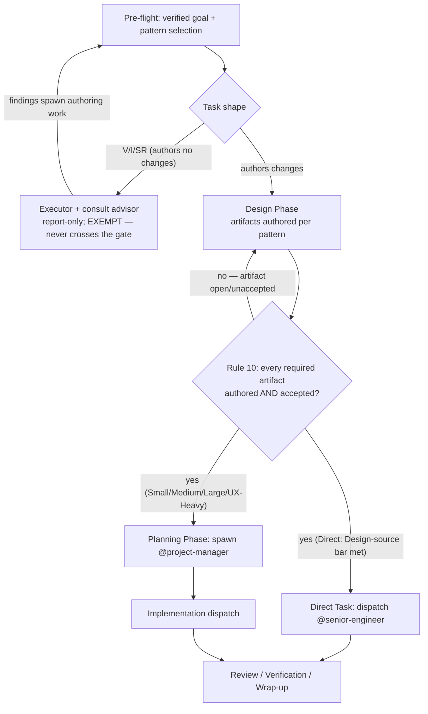

# Design-Complete Gate Before Planning

## Problem Statement

**What.** `src/user/claude-code/agents/team-lead.md` sequences Design before Planning by convention (pattern diagrams `advisor → @project-manager → …`), but nothing HARD-blocks the Planning Phase (step 7, spawning @project-manager / creating Docket issues) or implementation dispatch on the acceptance of the cycle's design artifacts. Nothing prevents team-lead from spawning the PM while a TDD sits in secondary review, and the Direct Task pattern is explicitly "no plan, no review" with no documentation bar at all. This TDD adds a hard-blocking **Design-Complete Gate**: for EVERY pattern — including Direct and Small — team-lead may not enter Planning or dispatch implementation until all research and documentation the cycle requires (TDD, ADR, security TDD, UX spec, or the Direct/Small equivalent defined here) is both authored AND accepted.

**Why now.** Work is routinely handed off to implementation-only coding harnesses and models (Codex, OpenCode, etc.). A dispatch that carries open research or design questions forces those harnesses to do non-implementation work — un-reviewed, outside the team's design/acceptance machinery. The gate guarantees every implementation dispatch is design-frozen: zero open research/design questions at handoff.

**Who is affected.** team-lead (the only file whose doctrine changes); downstream implementers (receive design-frozen briefs only); the operator (Direct-Task dispatches gain a small documentation bar).

**Constraints (operator-confirmed, closed this cycle — not re-litigated here).**
1. Gate scope = ALL patterns, including Direct Task.
2. Completion bar = authored AND accepted (existing secondary-review + vote machinery — no parallel acceptance mechanism invented).
3. Enforcement = hard blocker: skipping it is a named rule violation of the same class as the CLOSED-set (Rule 7) / no-engineering-decisions rules.
4. Byte budget: team-lead.md is measured at **95,658 B** this session (`wc -c`, 2026-07-05; DKT-35's recorded 95,114 B is stale by +544 B) against the 80,000 B agent budget (TRIM mode). This design MUST NOT net-increase team-lead.md; it lands at a projected **−289 B** (§4, Byte accounting).

**Acceptance criteria (cycle-level).**
- team-lead.md contains a numbered hard-blocker rule (Rule 10) locking Planning and implementation dispatch on design acceptance, plus enforcement hooks at the Design→Planning boundary and in the Direct/Small templates.
- A per-pattern artifact/acceptance master exists at `src/user/claude-code/skills/team-doctrine/references/design-gate.md`, indexed in the team-doctrine SKILL.md table.
- `wc -c src/user/claude-code/agents/team-lead.md` post-implementation ≤ 95,658 (the live pre-implementation baseline; re-measure at implementation time — see §7 sequencing with DKT-35).
- Direct Task defines a concrete "documentation complete" bar (Design-source line, §4/§6).
- Verification/Investigation/Standalone-Review shape is explicitly exempt with its rationale recorded.

## Context & Prior Art

**In-repo conventions this design reuses (all verified this session):**
- **Master + `CANONICAL:*-LOCAL` pointer relocation.** team-lead.md already carries relocated families with compact LOCAL copies or pointers: Shutdown Protocol (lines 413–417), Runtime Discipline (lines 454–462), code-comments Rule 9 pointer (line 442), plus pointer-only relocations for Docs-Path Taxonomy, TFD, vorpal tools, and team-conventions. Masters live under `src/user/claude-code/skills/team-doctrine/references/` and are indexed in that skill's SKILL.md table (9 rows today; `grep -c '^| \`references/' SKILL.md` = 9).
- **Acceptance machinery (reused, not reinvented).** TDD acceptance = author recusal + two fresh ephemeral @staff-engineer secondary reviewers (team-lead.md step 6, Rule 8(a)) + vote-commit per Consensus Integration criticality ("TDD approval" is an enumerated vote trigger). UX-spec review = `Skill(design-review)` with `design-review-{N}` ephemerals per the Per-Role Dispatch Table. Direct Task already mandates a fully-Closed brief (exact file, old string, new string, done-state — team-lead.md line 150) and Brief-Authoring Discipline already forbids an uncited Closed dimension ("A Closed dimension with NO citable delegated source is FORBIDDEN"). The gate composes these; it adds no new review body.
- **Named-violation rule precedent.** Rule 7 (CLOSED persistent set: "Any persistent name outside the CLOSED set is a rule violation") is the strength class the operator specified for enforcement.
- **ADR precedent.** ADR-0001/0002 record canonical-family and policy additions to team-lead.md. ADR numbering note (verified): `docs/tdd/adr/` contains 0001 and 0002 only, but **0003 is a taken number with a missing file** — `docs/tdd/adr/0003-centralized-vs-in-repo-pitfalls-memory-split.md` is cited by `references/pitfalls.md:15` and 7 agent files. The companion ADR for this decision is therefore numbered **0004**.
- **DKT-35 (in flight, related-not-blocking).** Tracks the ≥15,114 B TRIM mandate for team-lead.md, deferred to the next evolve-agents cycle. It carries ADR-0002's constraint: the trim must compact prose and must NOT relocate the TFD master. This design touches neither TFD nor the trim itself; its −289 B net slightly reduces the remaining burden (§7).

**External prior art.** Stage-gate ("phase-gate") process discipline: work may not cross a phase boundary until the prior phase's deliverables pass a defined gate. This design is a minimal stage-gate applied to exactly one boundary (Design→Planning/dispatch), with per-pattern gate criteria scaled to pattern weight — deliberately NOT a general phase-gate framework.

## Alternatives Considered

### Alternative A — Amend Pre-flight / Pattern Decision Tree only (no new Rule)

Fold the gate into Pre-flight step 4 or the decision-tree preamble as a self-check bullet ("do not proceed to Planning until docs accepted").

- **Strengths:** smallest diff; no rule renumbering; sits where pattern selection happens.
- **Weaknesses:** Pre-flight runs BEFORE the pattern (and therefore the required-artifact set) is known, so the check has nothing concrete to verify there; a self-check bullet is soft guidance — the operator explicitly required a named hard violation comparable to Rule 7 (closed dimension 3); Rules are where evolve-agents cycles audit for drift.
- **Verdict:** rejected — wrong placement (too early) and wrong strength (fails closed dimension 3).

### Alternative B — New numbered Rule 10 + choke-point hooks + relocated master (CHOSEN)

A new Rule 10 ("Design-Complete Gate") names the violation and defines acceptance-by-existing-machinery; four thin hooks land where team-lead acts (Design Phase step 6 tail, Planning Phase step 7 head, Direct template, Small template); the per-pattern artifact/acceptance table, Design-source grammar, and rationale live in a new `team-doctrine/references/design-gate.md` master. Byte cost is paid by relocating two existing bulk blocks (Fable-distilled completeness heuristics; Monitor-for-Orchestration watch patterns) to references masters per the file's own convention.

- **Strengths:** named hard violation (Rule 7 strength class); enforcement text at the exact moments of action; bulk prose off the budget; reuses the established relocation mechanism verbatim; net −289 B.
- **Weaknesses:** two collateral relocations (churn beyond the gate itself); Rules grow to 10.
- **Verdict:** chosen.

### Alternative C — Gate as a new standalone canonical family (LOCAL copies in all 8 files)

Model on TFD: a `CANONICAL:DESIGN-GATE-LOCAL` block in every agent file so workers also refuse pre-acceptance dispatches.

- **Strengths:** defense in depth — a worker could reject a gate-violating brief.
- **Weaknesses:** the gate binds ONE actor (team-lead is the only agent that spawns the PM or dispatches implementation); 7 worker LOCAL copies would be dead weight in their contexts and a 7-file byte cost for zero behavioral delta; violates the brief's out-of-scope boundary (other agent files not edited this cycle).
- **Verdict:** rejected — enforcement belongs solely to the actor with the authority being gated.

## Architecture & System Design

### The gate, stated

> **Design-Complete Gate (Rule 10).** Planning and implementation are LOCKED until every design/research artifact the cycle requires is authored AND accepted via its EXISTING acceptance machinery. Spawning @project-manager/`planner*` or dispatching ANY implementation ephemeral (including the Direct-Task @senior-engineer) before the gate passes is a rule violation of the same class as Rule 7.



### Per-pattern required artifacts and acceptance (normative table — master copy lands in design-gate.md)

| Pattern | Required before Planning / dispatch | "Accepted" means (existing machinery only) |
|---|---|---|
| Direct | The dispatch brief IS the artifact: fully Closed (exact file, old string, new string, done-state — already mandated) + a `Design-source:` line (§6 grammar) | Operator-verified goal (Pre-flight step 1) + zero Open dimensions + every embodied decision cites its settling source. No review body. Evaluated by team-lead at brief-authoring time as a FORM check (line present, citations resolve) — never a merits judgment; the no-engineering-decisions boundary is unchanged. |
| Small | Design-source inventory: every decision KNOWN at pre-flight cites its settling source (accepted TDD/ADR, logged advisor consult, verbatim operator instruction) | Citable sources exist for all known decisions; an unsettled known decision → `advisor` consult first (logged as a Docket comment when issues exist, else carried verbatim in the plan brief) or graduate to Medium. |
| Medium | TDD (plus security TDD / co-authored security sections when flagged) | Secondary review per Rule 8(a) (author recuses, two fresh ephemeral @staff-engineer reviewers) + vote-commit per Consensus Integration criticality; security sections cross-reviewed before vote (existing Security Track text). |
| Large | ALL TDDs (lead + every parallel `tdd-author-` sibling); PRD first when product-defined | Each TDD as Medium; PRD accepted by operator approval. Planning may not start until EVERY sibling is accepted (strict — see Consequences in ADR 0004). |
| UX-Heavy | UX spec + TDD | Spec: `Skill(design-review)` by a non-author reviewer (when `ux-advisor` authored it, the reviewer is a `design-review-{N}` ephemeral — the existing author-recusal principle applied); TDD as Medium. |
| V/I/SR | EXEMPT | Deliverable IS research (report/verdict); the shape never spawns a PM or an impl ephemeral, so it never crosses the gated boundary. Findings that spawn authoring work start a successor cycle, which re-enters Pre-flight and meets the gate there. |

### Mid-cycle interaction (governs ENTRY, not a mid-cycle re-lock)

The gate governs crossing INTO Planning/implementation. Decisions that genuinely surface mid-implementation keep their existing paths (advisor consults, `Discovered:` comments, step 13 re-plan). A step-13 re-plan that requires NEW design artifacts re-enters the gate for those artifacts before the revised plan dispatches. The gate never retro-blocks in-flight work.

### Edit map for team-lead.md (all snippets drafted and byte-measured this session)

| # | Location | Edit | Measured bytes |
|---|---|---|---|
| E1 | Rules section, after Rule 9 (line 442) | Insert Rule 10 — pointer-only, NO `CANONICAL` marker: Rule 10 is not a LOCAL copy of design-gate.md content, so a marker would register a false drift pair (reviewer-confirmed; full text in §6) | +1,192 |
| E2 | Planning Phase step 7 (line 290), leading sentence | Fresh-planning-only gate hook with resume-path clarification (full text in §6) | +290 |
| E3 | Design Phase step 6 (line 286), tail | "**Acceptance closes the Design Phase:** secondary-review verdicts + vote-commit (per Consensus Integration criticality) must land before Planning — Rule 10." | +160 |
| E4 | Direct Task write-boundary paragraph (line 150), append | Design-source bar sentence (full text in §6) | +370 |
| E5 | Small Task template (after line 161), append | Known-decision source bar (full text in §6) | +316 |
| R1 | Alignment & Optimization, lines 132–136 (2,659 B) | Relocate Fable-distilled completeness heuristics to `references/fable-completeness-heuristics.md` (verbatim master); replace with a 963 B marker-wrapped LOCAL (`CANONICAL:FABLE-COMPLETENESS-HEURISTICS-LOCAL`, full text in §6) retaining the four rule-heads + the negative-claim citation audit | −1,696 |
| R2 | Monitor for Orchestration, lines 303–312 (1,722 B; header + blank = 31 B kept) | Relocate the four watch patterns to `references/monitor-orchestration.md`; replace body with a 770 B marker-wrapped LOCAL (`CANONICAL:MONITOR-ORCHESTRATION-LOCAL`, full text in §6; header `### Monitor for Orchestration` kept outside the markers so step 12's `§Monitor for Orchestration` cross-reference stays valid) | −921 |

**Byte accounting (all `wc -c`, this session):** baseline 95,658 B; gross adds E1–E5 = 2,328 B; savings R1+R2 = 2,617 B; **projected net −289 B → 95,369 B.** Contingency if implementation-time re-measure lands net-positive (e.g., DKT-35's trim already restructured R1/R2): compress the Rule 10 text's rationale clause into the master, and/or reduce the R1 LOCAL toward a bare pointer (~500 B additional headroom) — the invariant is post-implementation `wc -c` ≤ pre-implementation `wc -c`, measured in the same tree.

**Relocation-safety checks (verified):** the only `§Monitor for Orchestration` cross-reference is step 12 (line 301) — preserved by keeping the header; the Fable-heuristics cross-reference at line 201 names the section and restates its three key demands inline — preserved by keeping a titled LOCAL block in Alignment & Optimization. ADR-0002's "do not relocate the TFD master" constraint is untouched (TFD not modified).

### New files

1. `src/user/claude-code/skills/team-doctrine/references/design-gate.md` — gate master: the invariant, the per-pattern table above, Design-source grammar (§6), mid-cycle interaction, V/I/SR exemption rationale, handoff-readiness motivation (implementation-only harnesses), and EXPLICIT Direct-Task acceptance semantics — "accepted" for Direct = the operator's Pre-flight step-1 verified-goal confirmation covering the edit, plus the §6 gate-pass predicate evaluated by team-lead at brief-authoring time as a FORM check (Design-source line present, zero Open dimensions, citations resolve); never a merits judgment (no-engineering-decisions boundary unchanged). Two composition clauses the master MUST also carry: (a) **Security Track composition** — the Q7 security flag binds ORTHOGONALLY to the gate arm: Rule 10's "no new review body" refers to the gate's acceptance side only and never waives the Security Track — Small + security-sensitive keeps the non-negotiable `security-advisor` review, and a Direct task whose edit touches an enumerated security surface graduates per the Direct template's existing surfacing-decision trigger (a security-touching one-liner cannot ride the Design-source bar past the security consult); (b) **`mechanical` arm inheritance** — classifying an edit as `mechanical — no decision embodied` inherits the pattern-selection boundary and is a FORM classification, not a fresh merits call: any doubt about whether a decision is embodied graduates (or routes to `advisor`), it is never resolved by team-lead's own engineering judgment. The mid-cycle-interaction section MUST state the step-13 sub-case explicitly: a re-plan requiring NEW design artifacts re-enters the gate for those artifacts (the E2 hook's "never retro-blocks a resume" is not the complete statement). No byte budget applies (reference home).
2. `src/user/claude-code/skills/team-doctrine/references/fable-completeness-heuristics.md` — verbatim relocation of team-lead.md lines 132–136 under a one-line master header (provenance, honest scope, four full bullet bodies).
3. `src/user/claude-code/skills/team-doctrine/references/monitor-orchestration.md` — verbatim relocation of the four watch-pattern bullets + closing guidance from lines 305–312.
4. `docs/tdd/adr/0004-design-complete-gate-as-orchestration-doctrine.md` — companion ADR recording the doctrine decision (authored with this TDD).

`team-doctrine/SKILL.md` (2,997 B today) gains three index rows and two description-line tokens; masters are read-on-demand, so this adds no per-turn context cost to any agent.

The two RELOCATED blocks are wrapped in `CANONICAL:*-LOCAL:BEGIN/END` markers — `FABLE-COMPLETENESS-HEURISTICS-LOCAL` and `MONITOR-ORCHESTRATION-LOCAL` (names match their master filenames, per the SHUTDOWN-PROTOCOL-LOCAL ↔ shutdown-protocol.md convention) — registering them with the existing LOCAL-vs-master drift audits. Rule 10 stays pointer-only with NO marker: it is a binding rule that CITES design-gate.md, not a LOCAL copy of its content, so a `DESIGN-GATE-LOCAL` marker would register a false drift pair (same shape as the unmarked Rule 9 / docs-paths / TFD pointers).

SKILL.md index rows to add (Master for / Cited by): `references/design-gate.md` → "Design-Complete Gate (per-pattern artifact/acceptance table, Design-source grammar, mid-cycle interaction)" / "`team-lead.md` only (Rule 10 + choke-point hooks — pointer-only, no LOCAL copy)"; `references/fable-completeness-heuristics.md` → "Fable-distilled completeness heuristics (provenance, honest scope, full bullet bodies)" / "`team-lead.md` (compact LOCAL copy)"; `references/monitor-orchestration.md` → "Monitor-for-Orchestration watch patterns" / "`team-lead.md` (compact LOCAL copy)".

## Data Models & Storage

N/A. Markdown doctrine and reference files only — no data plane, schema, or persistence.

## API Contracts

The gate's interchange contract is the **Design-source line** carried in Direct-Task dispatch briefs (and, for Small, per known decision in the planning brief):

```
Design-source: <exactly one of>
  - accepted TDD/ADR citation      e.g. "docs/tdd/foo.md §4 (accepted, vote V-12)"
  - verbatim operator instruction  e.g. "operator, this cycle: 'rename X to Y everywhere'"
  - mechanical — no decision embodied   (typo/dep-bump/log-tweak class)
```

**Gate-pass predicate (Direct):** brief fully Closed AND `Design-source:` present AND no Open dimension AND no embodied decision left uncited. Any failure → run the design work first (advisor consult / TDD / ADR per size) or graduate the pattern. The `mechanical` arm is what keeps the bar proportionate for trivial edits: a typo fix pays one literal line, not a review cycle.

**E1 — Rule 10 text (normative, pointer-only — no marker; 1,192 B as measured). The UX-spec clause cites the design-review skill + author-recusal, deliberately NOT Rule 8 (Rule 8 is code/TDD-review-specific, and its single-reviewer default would be the spec's own author `ux-advisor`). The Direct/Small clause states the acceptance half inline so the rule read in isolation cannot be misread as Direct skipping acceptance:**

```
10. **Design-Complete Gate (HARD blocker — every pattern, incl. Direct/Small).** Planning and implementation are LOCKED until every design/research artifact the cycle requires is authored AND accepted via its EXISTING acceptance machinery (TDD/security TDD: secondary review + vote-commit per Consensus Integration; ADR: vote; UX spec: `Skill(design-review)` by a non-author — author-recusal; PRD: operator approval; Direct/Small: the Design-source bar in their templates — the operator-verified goal IS the acceptance; no new review body). Spawning @project-manager/`planner*` or dispatching ANY impl ephemeral (incl. the Direct-Task @senior-engineer) before the gate passes is a rule violation of the same class as Rule 7. Why: dispatches must carry ZERO open design questions — downstream implementers are routinely implementation-only harnesses. V/I/SR tasks are exempt (never cross the gated boundary; findings that spawn authoring work re-enter Pre-flight). Master (artifact/acceptance table, Design-source grammar, mid-cycle interaction): `~/.claude/skills/team-doctrine/references/design-gate.md` (repo: `src/user/claude-code/skills/team-doctrine/references/design-gate.md`).
```

**E2 text (Planning step 7 leading sentence, 290 B incl. trailing separator space). The fresh-planning-only clause keeps the hook from being misread as retro-blocking the step-7 Guard's resume path (existing issues = already past the gated boundary). Isolation caveat: the hook's exemption covers RESUMING already-planned work only — the step-13 re-plan-requiring-new-artifacts sub-case re-enters the gate per §4 Mid-cycle interaction and the design-gate.md master; the hook is deliberately not the complete statement:**

```
**Rule 10 gate precedes this step (fresh planning only):** confirm every required design artifact is authored AND accepted before any PM spawn or issue creation; the Guard's resume path below re-enters already-planned work past the gated boundary — the gate never retro-blocks a resume.
```

**E4 text (Direct Task append, 370 B):**

```
 That brief doubles as the Rule 10 design artifact: it must be fully Closed AND carry a `Design-source:` line citing what settles any decision the edit embodies (accepted TDD/ADR section, verbatim operator instruction, or `mechanical — no decision embodied`); any Open dimension or uncited embodied decision fails the gate → route the design work first or graduate.
```

**E5 text (Small Task append, 316 B):**

```
**Rule 10 bar:** before the PM spawns, every decision KNOWN at pre-flight must cite its settling source (accepted TDD/ADR, logged advisor consult, verbatim operator instruction); an unsettled known decision → consult `advisor` first or graduate to Medium. Genuinely mid-flow surprises keep the consult path above.
```

**R1 LOCAL replacement (Alignment & Optimization, replaces current lines 132–136; 963 B as measured):**

```
<!-- CANONICAL:FABLE-COMPLETENESS-HEURISTICS-LOCAL:BEGIN -->
**Fable-distilled completeness heuristics** — relocated. Master (provenance, honest scope, full bodies): `~/.claude/skills/team-doctrine/references/fable-completeness-heuristics.md` (repo: `src/user/claude-code/skills/team-doctrine/references/fable-completeness-heuristics.md`). Applied as brief DEMANDS and return-AUDIT form checks, never self-derived answers (no-engineering-decisions holds): hunt the default and the NEGATIVE case (happy-path-only returns route BACK); label documented-vs-inference — a returned negative claim ("not found", "no callers") must cite the searches run + coverage limits or routes BACK (form check only; adequacy stays with the worker); never conflate near-synonym categories (conflation routes back to its author); surface adjacent decision-changing facts (forward: give the reason, not only the request).
<!-- CANONICAL:FABLE-COMPLETENESS-HEURISTICS-LOCAL:END -->
```

**R2 LOCAL replacement (body under the kept `### Monitor for Orchestration` header, replaces current lines 305–312; 770 B as measured):**

```
<!-- CANONICAL:MONITOR-ORCHESTRATION-LOCAL:BEGIN -->
**Monitor for Orchestration** — relocated. Master (four watch patterns: phase completion, stall/zombie sweep, CI/PR checks, Discovered comments): `~/.claude/skills/team-doctrine/references/monitor-orchestration.md` (repo: `src/user/claude-code/skills/team-doctrine/references/monitor-orchestration.md`). Binding rule: default to Monitor instead of polling whenever a wait exceeds ~30s or a probe repeats more than twice — one selective event-stream per occurrence; filters stay selective and cover failure signatures alongside the happy path; `Bash(run_in_background=true)` for one-shot waits; TaskUpdate at every state transition so the operator sees progress.
<!-- CANONICAL:MONITOR-ORCHESTRATION-LOCAL:END -->
```

## Migration & Rollout

**Current state.** Design→Planning ordering is conventional, unenforced; Direct Task carries no documentation bar; Fable heuristics and Monitor patterns live inline in team-lead.md.

**Target state.** Rule 10 + four hooks in team-lead.md; three new reference masters + ADR 0004; SKILL.md index updated; team-lead.md at ≤ its pre-implementation byte count (projected 95,369 B).

**Sequencing (two phases, §11):** masters land BEFORE the team-lead.md edits so no pointer ever dangles. Both phases are single-cycle; no flag, no staged rollout — doctrine binds from the edit forward and never retro-blocks in-flight cycles (§4, Mid-cycle interaction). Between Phase 1 and Phase 2 the Fable-heuristics/Monitor content transiently exists in BOTH the new masters and inline team-lead.md — harmless, but note it if the phases land as separate commits.

**Same-file serialization constraint (DKT-35 — hard, not discretionary PM ordering):** Phase 2 and the future DKT-35 trim both edit team-lead.md to cut bytes; they MUST NOT run concurrently. This design lands first; DKT-35's evolve-agents trim re-baselines against the post-Phase-2 file (the §9/Phase-2 byte AC is relative — post ≤ pre-edit measure — for exactly this reason).

**Backward compatibility.** Existing accepted TDDs/specs/issues are unaffected; resumed cycles (step 7 Guard path) already have issues and are past the boundary the gate controls. No other agent file changes: the gate binds only the actor holding spawn authority (Alternative C rationale).

**Rollback.** `git revert` of the doctrine commit(s); no state migration. The two relocations are content-preserving (masters are verbatim), so rollback restores inline text losslessly.

## Risks & Open Questions

| Risk | Likelihood | Impact | Mitigation |
|---|---|---|---|
| Overhead creep on trivial edits (gate read as demanding design docs for typos) | Medium | Medium | `mechanical — no decision embodied` arm; Direct bar reuses the already-mandatory fully-Closed brief; decision-tree "lightest pattern" preamble unchanged. |
| DKT-35 trim lands first and restructures R1/R2, breaking the byte plan | Low | Low | Implementation re-measures baseline via `wc -c` at execution time; contingency compressions named in §4; invariant is relative (post ≤ pre), not the absolute 95,369 figure. |
| LOCAL-vs-master drift on the two relocated blocks | Medium | Low | Same exposure as the 9 existing reference-home families; evolve-* drift audits already own this class. |
| Gate misapplied to V/I/SR flows (blocking report-only work) | Low | Medium | Explicit exemption in Rule 10 text itself, not only the master. |
| Heuristics compression loses operative nuance | Low | Medium | LOCAL retains all four rule-heads + the negative-claim citation audit; line 201 independently restates the investigator-brief demands; master keeps full text verbatim. |
| Large-pattern strictness (ALL siblings accepted before ANY planning) delays eager per-TDD planning | Medium | Low | Deliberate, per operator intent ("all research and documentation… complete"); cost recorded in ADR 0004 Consequences; relaxation would be a future operator-approved doctrine change. |

**Open questions:** none. The six dimensions left open by the cycle brief are resolved in this document: rule placement (§3 Alt B), Direct-Task artifact (§6 Design-source), ADR warranted (yes — ADR 0004, §4 New files), V/I/SR carve-out (§4 table + Rule 10 text), enforcement mechanism (Rule 10 + choke-point hooks), DKT-35 sequencing (§7 same-file serialization constraint — this design first, DKT-35 re-baselines after; issue-level ordering within that constraint stays @project-manager's call).

**Acceptance record:** vote **DKT-V5** committed 2026-07-05 — "Approved with score 1.00 (3/3 approve-with-concerns, zero rejects, threshold 0.75 met)" — following two-reviewer secondary review (Approve-with-follow-up, all findings addressed). Status flipped draft → accepted by the author post-vote (no implementation phase flips status; this line is the explicit record). Post-vote concerns folded into this revision: §9 grep-count reconciliation, relative byte AC, DKT-35 serialization constraint, Security-Track/`mechanical`-arm composition clauses in the design-gate.md spec, E2 isolation caveat, Phase-1 assembly checklist.

## Testing Strategy

Doctrine-text change — verification is static conformance plus first-cycle observation; no runtime surface.

**Static conformance checks (run post-implementation; baselines run 2026-07-05 pre-implementation):**

| Check | Command | Baseline → Expected |
|---|---|---|
| Byte budget holds (relative invariant) | `pre` captured via `wc -c` BEFORE the first Phase-2 edit; `post=$(wc -c < src/user/claude-code/agents/team-lead.md)` after the last | post ≤ pre (drafting-time reference: 95,658 → projected 95,369 — reference points, not binding constants) |
| LOCAL markers present (relocated blocks only) | `grep -c "CANONICAL:FABLE-COMPLETENESS-HEURISTICS-LOCAL\|CANONICAL:MONITOR-ORCHESTRATION-LOCAL" src/user/claude-code/agents/team-lead.md` | 0 → 4 (two BEGIN/END pairs) |
| Rule 10 unmarked (no false drift pair) | `grep -c "CANONICAL:DESIGN-GATE-LOCAL" src/user/claude-code/agents/team-lead.md` | 0 → 0 |
| Rule 10 present | `grep -c "Design-Complete Gate" src/user/claude-code/agents/team-lead.md` | 0 → 1 (the rule itself; the E1 text is the only carrier of the literal phrase — hooks cite "Rule 10", next row) |
| Choke-point hooks present | `grep -c "Rule 10" src/user/claude-code/agents/team-lead.md` | 0 → 4 (E2 step-7, E3 step-6, E4 Direct, E5 Small; E1 itself is numbered "10." and contributes no hit) |
| Gate master exists + indexed | `ls src/user/claude-code/skills/team-doctrine/references/design-gate.md && grep -c '^| \`references/' src/user/claude-code/skills/team-doctrine/SKILL.md` | 9 rows → 12 |
| Design-source bar present | `grep -c "Design-source" src/user/claude-code/agents/team-lead.md` | 0 → 2 (E1 Rule 10 + E4 Direct; E5 Small deliberately expresses the bar as "settling source" prose without the literal token — per the accepted §6 text) |
| Relocations landed, references intact | `grep -c "fable-completeness-heuristics.md\|monitor-orchestration.md" src/user/claude-code/agents/team-lead.md` and `grep -c "§Monitor for Orchestration" src/user/claude-code/agents/team-lead.md` | 0 → ≥ 2; 1 → 1 |
| Masters carry the relocated text | `grep -c "Hunt the default and the negative case" src/user/claude-code/skills/team-doctrine/references/fable-completeness-heuristics.md` | file absent → 1 |
| TFD untouched (ADR-0002 constraint) | `git diff --stat -- src/user/claude-code/skills/team-doctrine/references/truth-first-debugging.md` | empty → empty |

**Untested-claims inventory (no Phase-1 trigger; do not fabricate tests against these):**
- Behavioral effect on live orchestration (does a future team-lead session actually refuse a pre-acceptance PM spawn?) is observable only in a subsequent cycle; first Direct-Task and first Medium cycle after landing serve as the observation points (record outcome in team-lead pitfalls memory if violated).
- The §4 byte-contingency path (further compression) is untriggered unless implementation-time measurement lands net-positive.
- The Small-pattern "logged advisor consult" arm is exercised only when a Small cycle actually surfaces a pre-known unsettled decision.

## Observability & Operational Readiness

- **Budget signal:** `wc -c` on team-lead.md is the standing metric (DKT-35 carries the TRIM ledger); this change moves it 95,658 → ~95,369 and every evolve-agents cycle re-measures.
- **Drift signal:** the three new masters join the existing LOCAL-vs-master drift audits run by evolve-agents/evolve-coherence; the SKILL.md index row is the discovery surface.
- **Violation signal:** a gate violation is a named rule violation — surfaced like Rule 7 breaches (operator report, `[LEAD→…]` Docket mirror per Rule 2, pitfalls-memory entry, evolve-agents historical audit pickup).
- **3am diagnosability:** all state is plain markdown in-tree; `git log -- src/user/claude-code/agents/team-lead.md` explains any drift; no runbooks required.

## Implementation Phases

### Phase 1 — Reference masters + ADR + skill index

- **Goal:** land all read-on-demand content so no team-lead.md pointer ever dangles.
- **File scope:** `src/user/claude-code/skills/team-doctrine/references/design-gate.md` (new), `.../references/fable-completeness-heuristics.md` (new; body verbatim from team-lead.md lines 132–136), `.../references/monitor-orchestration.md` (new; body verbatim from lines 305–312), `src/user/claude-code/skills/team-doctrine/SKILL.md` (index +3 rows, description +2 clauses). (`docs/tdd/adr/0004-design-complete-gate-as-orchestration-doctrine.md` is authored with this TDD, not in this phase.)
- **Acceptance criteria:** `ls src/user/claude-code/skills/team-doctrine/references/design-gate.md src/user/claude-code/skills/team-doctrine/references/fable-completeness-heuristics.md src/user/claude-code/skills/team-doctrine/references/monitor-orchestration.md` exits 0; `grep -c '^| \`references/' src/user/claude-code/skills/team-doctrine/SKILL.md` = 12 (baseline 9); `grep -c "Hunt the default and the negative case" src/user/claude-code/skills/team-doctrine/references/fable-completeness-heuristics.md` = 1; design-gate.md assembly checklist — ALL EIGHT content elements present: (1) the gate invariant, (2) the §4 per-pattern artifact/acceptance table, (3) the §6 Design-source grammar, (4) explicit Direct-Task acceptance semantics (operator-verified goal IS the acceptance; FORM-check evaluator), (5) Security Track composition clause, (6) `mechanical`-arm inheritance clause, (7) mid-cycle interaction incl. the step-13 re-plan-new-artifacts re-entry sub-case, (8) V/I/SR exemption rationale + handoff-readiness motivation.
- **Effort:** S. **Blocking dependencies:** none. **Out of scope:** any team-lead.md edit; any other agent file; TFD master.

### Phase 2 — team-lead.md edits (gate + hooks + relocations)

- **Goal:** land E1–E5 and R1–R2 per the §4 edit map, net byte delta ≤ 0.
- **File scope:** `src/user/claude-code/agents/team-lead.md` only.
- **Acceptance criteria:** run the full §9 static-conformance table; every row meets its Expected column. Byte check is RELATIVE, never a hardcoded constant: as the FIRST command of this phase run `pre=$(wc -c < src/user/claude-code/agents/team-lead.md)` and record `pre` in the issue thread; after the last edit, `post=$(wc -c < src/user/claude-code/agents/team-lead.md); [ "$post" -le "$pre" ] && echo PASS` must print PASS (95,658/95,369 are drafting-time reference points only).
- **Effort:** M. **Blocking dependencies:** Phase 1 (pointers must resolve). **Out of scope:** any content change to the relocated blocks beyond the prescribed LOCAL compressions (masters stay verbatim); renumbering existing Rules 1–9; Pattern Decision Tree sizing logic (gate changes sequencing, never sizing).
