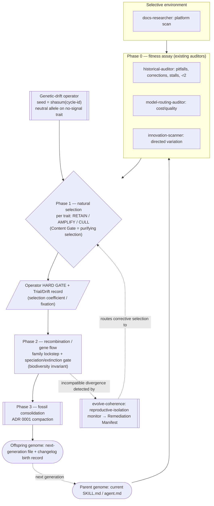

# Evolutionary-Theory Core for the evolve-* Skills

## Problem Statement

**What.** The three evolution skills — `.claude/skills/evolve-agents/SKILL.md`, `.claude/skills/evolve-skills/SKILL.md`, and `.claude/skills/evolve-coherence/SKILL.md` — are meant to "simulate real evolutionary changes in the heritable characteristics of sub-agents and their skills over successive generations." Today they implement a *quality-improvement review pipeline* (audit → per-target review → coherence → compaction) decorated with two evolutionary-flavored sections ("Innovation Mandate", "Scientific Trial Protocol"). The biological framing is metaphorical and partial: there is no defined fitness function, no mechanism for non-adaptive (stochastic) variation, no explicit generation boundary, and no shared vocabulary tying the three skills to one theory. The operator wants the *core mechanism* — not a label — driven by the actual processes of natural selection and genetic drift, with selection acting on heritable characteristics and permitting speciation/biodiversity.

**Why now.** The skills already gather rich phenotype data every cycle (Phase 0 historical audit: pitfalls re-fires, operator corrections, `TeammateIdle` stalls, `-r2` respawns, shutdown-rejections, model-routing outcomes) but use it only as loosely-prioritized "focus areas." That data is a latent fitness signal going unused as a selection mechanism. Separately, the repository has already recorded a concrete failure of selection-without-diversity: commit `1ea590c` ("record fable-monoculture routing pitfall and cost-tier restoration") documents convergence to a single model tier — exactly the local-optimum collapse that population genetics predicts when selection runs without drift in a small population. The system has hit the failure mode the missing theory addresses.

**Who is affected.** The operator (runs the cycles), and indirectly every agent/skill whose definition the cycles edit. No runtime user-facing surface.

**Constraints.** (1) No new external dependencies; no commits during implementation. (2) The 500-line per-file budget is a hard gate — `evolve-agents` is at 487 lines, `evolve-skills` at 491, leaving 13 and 9 lines of headroom respectively (verified via `wc -l` 2026-06-10). Any net-additive design is dead on arrival; additions must be offset by reframing existing prose. (3) Existing hard gates are preserved unless a change is flagged as a deliberate open decision: the Content Gate (4 checks), the 500-line budget, evolve-coherence's report-and-route-only constraint, and ADR 0001 history compaction. (4) Editing `agents/claude-code/*.md` or `skills/*` bodies is out of scope — this work edits only the three `evolve-*` SKILL.md files. (Implementation does add one shared `CANONICAL:EVOLUTION-MODEL` block to the three skills; if the family-parity machinery requires registering that tag in the evolve-coherence D4 audited-tag set, that edit lands inside evolve-coherence's own SKILL.md, still within the three in-scope files.)

**Acceptance criteria** (from the approved brief; each maps to an Implementation Phase):
1. **Natural selection modeled explicitly** — fitness signals defined, and a rule for how they retain / amplify / cull heritable traits per generation.
2. **Genetic drift modeled explicitly** — a defined mechanism for non-fitness-driven (stochastic) variation across generations.
3. **Heritability + generations** — agent/skill definitions treated as heritable; the generation boundary defined.
4. **Speciation/biodiversity** — how NEW agent/skill variants emerge and under what gate.
5. **One coherent shared vocabulary** across all three skills — identical theory, not three divergent metaphors.

**Business context.** This is infrastructure for the team's own self-improvement loop. The payoff is a principled, auditable selection mechanism (less arbitrary "focus area" churn) plus an explicit diversity-preservation arm that counteracts the documented monoculture failure.

## Context & Prior Art

**In-repo precedent.**
- **Phase-structured orchestration.** All three skills share a Phase 0 (parallel read-only auditors) → Phase 1 (per-target review, orchestrator applies edits) → Phase 2 (coherence) → Phase 3 (gated compaction) shape. evolve-coherence diverges deliberately: it is report-and-route-only and never edits (`No-Edit Guard`, enforced by `disallowed-tools: ["Edit", "Write"]`).
- **Content Gate** (`evolve-agents` §Content Gate, identical in `evolve-skills`): every proposed addition must pass Executable / Behavioral / Non-redundant / Concrete. This is already a selection filter on new traits — it culls non-functional variation at birth.
- **Scientific Trial Protocol** (both editing skills): Hypothesis → Trial → **operator-approval HARD GATE** → Measurement (reuses Phase 0 audit) → Adopt-or-rollback. This is already a gated, measured adoption loop — the skeleton of a selection-coefficient-with-fixation mechanism, missing only the population-genetics vocabulary and a non-adaptive variation arm.
- **CANONICAL:* parity blocks.** `BANNER`, `DOCS-PATHS-LOCAL`, `HARVEST` are carried byte-identically across carriers and audited by evolve-coherence D4 for parity. This is the exact machinery a shared-vocabulary block needs (AC #5).
- **ADR 0001** defines history compaction as "summarize-then-remove, never silent deletion," keying off git-HEAD containment — the changelog already functions as a fossil/phylogenetic record.
- **`.claude/agent-memory/*/pitfalls.md`** records recurring failure classes per role; the staff-engineer pitfalls file documents a lesson re-firing across 3 consecutive cycles — a fitness signal that persisted because nothing acted on it selectively.

**External precedent.** The Modern Synthesis (Fisher, Wright, Kimura) distinguishes two forces changing trait frequencies across generations: **natural selection** (deterministic, fitness-driven) and **genetic drift** (stochastic, fitness-independent, dominant in small populations). Kimura's neutral theory holds that most fixed variation is selectively neutral — directly relevant because our "population" is tiny (7 agents, 13 skills), so drift is theoretically significant, not a rounding error. The design borrows the *mechanisms*, not a simulation: we are not running a genetic algorithm with random mutation over a fitness landscape, we are giving an LLM-driven review pipeline a principled vocabulary and two missing operators (a drift operator and an explicit selection disposition).

**How this work fits.** It is a *reframing-plus-two-operators* change, not a rewrite. The existing audit becomes the **fitness assay**; the existing per-target review becomes **selection** (retain/amplify/cull); the Content Gate becomes **purifying selection**; the Scientific Trial Protocol becomes the **selection-coefficient/fixation gate**; the changelog becomes the **phylogenetic record**. The two genuinely new pieces are (a) a **genetic-drift operator** and (b) an explicit **speciation/extinction gate with a biodiversity invariant**.

## Alternatives Considered

### Alternative A — Shared canonical vocabulary block + reframe existing machinery + add drift & speciation operators (CHOSEN)

**Shape.** Introduce one `CANONICAL:EVOLUTION-MODEL` block (byte-identical across all three skills) that defines the vocabulary and the mapping of biological concept → existing mechanism. Reframe the Innovation Mandate and Scientific Trial Protocol sections in the two editing skills to *consume* that vocabulary (reclaiming their line budget). Add a genetic-drift operator (Phase 0 sourcing + pre-flight seed + `Drift:` changelog convention) and an explicit speciation/extinction gate (Phase 2). evolve-coherence adopts the same vocabulary and audits the new canonical block for parity, preserving report-and-route-only.

**Strengths.** Maps 1:1 onto existing phases, so behavioral churn is minimal and the existing hard gates survive intact. Net-line cost is controllable because the compact block (≈5 physical lines) replaces the Innovation Mandate + Scientific Trial Protocol prose (measured 13 lines in evolve-agents / 16 in evolve-skills), making the foundation phase net-negative. Uses the proven CANONICAL parity machinery for AC #5. The two new operators are small and gated.

**Weaknesses.** A new CANONICAL family means evolve-coherence D4 must learn one more tag. The drift operator adds a stochastic element that must be made reproducible/auditable or it becomes noise. Reframing prose risks "wordsmithing churn" with no behavioral gain (Content Gate guards against this).

**Verdict.** Chosen. Lowest blast radius, preserves every hard gate, reuses existing machinery for the hardest AC (shared vocabulary), and directly remediates the recorded monoculture failure.

### Alternative B — Full generational genetic-algorithm engine (population, genotype encoding, RNG mutation/crossover, fitness scoring loop)

**Shape.** Encode each agent/skill as a genotype string, run real RNG mutation + crossover, score candidates against a numeric fitness function derived from audit metrics, and select survivors automatically across generations.

**Strengths.** The most literal realization of "real evolutionary processes"; selection and drift fall out of the algorithm naturally.

**Weaknesses.** Requires a genotype encoding/decoding layer and a numeric fitness function — both net-new infrastructure (violates "no new dependencies / no new measurement infrastructure"). Auto-applying RNG-generated edits to agent definitions removes the operator HARD GATE that every existing skill enforces, and would blow the 500-line budget with engine scaffolding. LLM-generated "mutations" are not bit-flips; forcing a GA abstraction over prose edits is a category error. Catastrophically over-budget.

**Verdict.** Rejected. Over-engineered, removes the human-in-the-loop gate, and infeasible within the line budget and dependency constraints.

### Alternative C — Per-skill evolutionary framing (each skill gets its own metaphor section)

**Shape.** Add an evolutionary-framing section to each of the three skills independently, tuned to that skill's role.

**Strengths.** No cross-file parity machinery; each skill is self-contained.

**Weaknesses.** Directly violates AC #5 ("one coherent shared vocabulary, not three divergent metaphors") — three independently-authored sections *will* drift (the repo's own pitfalls memory documents CANONICAL drift as a recurring class). Triples the line cost of the vocabulary.

**Verdict.** Rejected. Fails AC #5 by construction and maximizes drift surface.

## Architecture & System Design

### The shared model: `CANONICAL:EVOLUTION-MODEL`

One canonical block, byte-identical across the three skills, defines the vocabulary and the concept→mechanism mapping. It is the single source of truth for AC #5. The mapping deliberately binds each biological term to an **existing** mechanism so the framework is descriptive of real behavior, not aspirational:

| Biological concept | This system |
|---|---|
| Population | the set of agents (`agents/claude-code/*.md`) / skills (`*/SKILL.md`) under evolution this cycle |
| Organism / individual | one agent or skill definition file |
| Genome | the full set of behavioral traits in that file |
| Gene / trait | one discrete Content-Gate-passing behavioral unit (a rule, gate, workflow step, or CANONICAL block) |
| Allele | an alternative formulation of one trait |
| Phenotype | observed runtime behavior (transcripts, stalls, corrections, error/abort, cost) |
| Generation | one evolve-* cycle; the boundary is the apply-time edit + changelog entry (parent file → offspring file) |
| Fitness signal | the Phase 0 audit measurements (see below) |
| Natural selection | fitness-driven **retain / amplify / cull** of traits |
| — purifying selection | the Content Gate (rejects non-functional new alleles at birth) |
| — positive selection | amplification: propagate a demonstrably-fit trait to siblings (Phase 2 family lockstep) |
| — background/negative selection | cull traits correlated with recurring failure signals |
| Genetic drift | stochastic, fitness-**independent** neutral variation (new operator) |
| Mutation | a single-file trait edit (Phase 1) |
| Recombination / gene flow | cross-family propagation of shared traits (Phase 2 coherence) |
| Speciation | creation of a new agent/skill variant (gated) |
| Extinction | retirement of a redundant agent/skill (gated) |
| Phylogenetic record | the changelogs; ADR 0001 compaction = fossil consolidation |
| Reproductive isolation / hybrid inviability | CANONICAL-parity breakage / role-contract drift that evolve-coherence detects |

The table above is the **design reference**, not the literal skill text. A 21-row table replicated byte-identically would be net-additive against the 13/9-line headroom (the budget concern both reviewers raised). The skills instead carry a **compact dense-paragraph block** (the BANNER precedent: physical-newline count is what the `wc -l` budget measures, so one long wrapped paragraph costs ~1 line). The full table lives only here in the TDD.

#### Actual `CANONICAL:EVOLUTION-MODEL` block (the literal skill text — byte-identical in all three files)

```markdown
<!-- CANONICAL:EVOLUTION-MODEL:BEGIN -->
**Evolutionary model (shared vocabulary — evolve-agents, evolve-skills, evolve-coherence).** One cycle = one **generation**: the current definition file is the **parent genome**, the post-cycle file the **offspring**, the changelog entry the birth record (changelogs are the **phylogenetic record**; ADR 0001 compaction = fossil consolidation). A **trait** is one Content-Gate-passing behavioral unit; an **allele** is an alternative formulation of a trait; the file is the heritable **genome**, the population is the agents/skills under this cycle. **Fitness signals** are the Phase 0 audit measurements (pitfalls re-fires, operator-corrections, `TeammateIdle`/`-r2`/shutdown-rejection stalls, error/abort, model-routing, prior `Trial:`/`Drift:` outcomes). **Natural selection** assigns each evaluated trait a disposition from CITED fitness — AMPLIFY (cited gain → propagate family-wide in Phase 2 = positive selection) or CULL (cited recurring failure → remove = purifying/background selection); unlisted traits default to RETAIN. The **Content Gate is purifying selection** on every introduced allele. **Genetic drift** is bounded, fitness-INDEPENDENT neutral allele-substitution on a no-signal trait (see the drift operator). **Speciation/extinction** (new/retired organism) is a Phase 2 event gated by operator approval + vote, floored by the **biodiversity invariant** (never cull the last carrier of a live niche). Adaptive change and drift alike pass the operator-approval HARD GATE, are measured by the next cycle's Phase 0 audit, and adopt-or-rollback via the Phase 1 self-correct step. **evolve-coherence does not reproduce** — it is the **reproductive-isolation monitor**: it detects cross-organism incompatibility (parity/contract drift) and routes corrective selection to evolve-agents/evolve-skills; it never edits.
<!-- CANONICAL:EVOLUTION-MODEL:END -->
```

Physical-line cost: 3 lines (2 markers + 1 paragraph), or 5 with surrounding blank lines. The block is the single definition site for every term the ACs reference (verified by inspection: `generation`, `genome`, `trait`/`allele`, `fitness signal`, `natural selection`/AMPLIFY/CULL/RETAIN, `purifying selection`, `genetic drift`, `speciation`/`extinction`, `biodiversity invariant`, `reproductive-isolation monitor` all present in the paragraph).

#### Phase A budget arithmetic (MC1 — executable-by-inspection)

Phase A inserts the block (≈5 physical lines incl. blanks) and **replaces** the existing `## Innovation Mandate` + `## Scientific Trial Protocol` sections with compressed equivalents that defer all vocabulary to the block while retaining the behavioral gate. Measured today (`sed -n` / `wc -l`, 2026-06-10):

- **evolve-agents** — absorbable region L30–42 = **13 physical lines**. Compressed replacement (both headings kept — evolve-coherence's Innovation Mandate audit checks their presence — each section becomes one dense paragraph) = **7 physical lines**. Freed = 6. Net Phase A = +5 (block) − 6 (freed) = **−1**. Result: 487 − 1 = **486 ≤ 500**.
- **evolve-skills** — absorbable region L30–45 = **16 physical lines**. Same compressed replacement = **7 physical lines**. Freed = 9. Net Phase A = +5 − 9 = **−4**. Result: 491 − 4 = **487 ≤ 500**.
- **evolve-coherence** — 323 lines, 177 headroom; +5 (block) ≈ 328. No absorption needed.

The compressed replacement text (the actual Phase A edit, evolve-agents shown; evolve-skills swaps "agent"→"skill" nouns):

```markdown
## Innovation Mandate

Each cycle sources variation three ways (see CANONICAL:EVOLUTION-MODEL): the **innovation-scanner** (directed adaptive exploration of new model/tool/coordination frontiers), the **historical-auditor** (reactive, fitness-driven), and the **genetic-drift operator** (stochastic, fitness-independent). Refactor authority — speciation (new agents) and extinction (retiring redundant agents) — is exercised per the Phase 2 speciation gate.

## Scientific Trial Protocol

Every non-neutral adaptive change AND every drift proposal passes this gate: **Hypothesis** (expected improvement + why) → **Operator approval (HARD GATE)** — present hypothesis, scope, and blast radius via AskUserQuestion BEFORE any edit; an unapproved item is recorded as `Trial: <hypothesis> → proposed` (or `Drift: … → proposed`) and NOT implemented → **Measurement** (reuse the Phase 0 audit; add no new infrastructure) → **Adopt or rollback** (adopt if the next-cycle audit improves against criteria, else the Phase 1 self-correct/revert step). Record the outcome as a `Trial:`/`Drift:` line in the changelog `### Summary`.
```

This preserves every behavioral element of the current STP (the AskUserQuestion HARD GATE, the proposed-vs-implemented distinction, the Phase-0 measurement arm, the adopt/rollback mapping) while moving the conceptual prose into the block. Phases B–D each ADD content and are governed by the Budget Ledger in §Implementation Phases — every phase is net-neutral-or-negative against the post-apply `wc -l`, the only budget truth.

### AC #1 — Natural selection (fitness signal → retain / amplify / cull)

**Fitness signal (the assay).** A trait's fitness is the sign and strength of the Phase 0 evidence bearing on it. Higher fitness = fewer/weaker failure signals attributable to the behavior the trait governs. The signal sources already exist and are *not* changed by this work — only their interpretation is formalized:
- `pitfalls.md` entries attributable to the trait's domain (recurring failure → strong negative).
- Operator-correction signals in transcripts (operator-typed turns only, per the existing FP filter).
- Stall signals: `TeammateIdle` clusters, `-r2` respawns, shutdown-rejections (the strongest evidence of definition-level gaps).
- Error/abort signals tied to the agent/skill.
- Model-routing outcomes (cost/quality fitness).
- Prior-cycle `Trial:` outcomes (adopted = fit, rolled back = unfit) and `Drift:` outcomes.

**Selection rule (per generation).** For every trait a Phase 1 reviewer evaluates, it assigns exactly one **selective disposition**, keyed to fitness evidence:
- **RETAIN** — no signal against the trait (neutral or positive); no change. This is the **default for every trait not otherwise dispositioned** — it is never enumerated.
- **AMPLIFY** — the trait demonstrably reduces a failure class; strengthen it and, if shared, flag for Phase 2 family-wide propagation (positive selection). Requires a cited fitness signal.
- **CULL** — the trait is correlated with recurring failure signals, or is superseded; remove or replace it (background/purifying selection). Requires a cited fitness signal.

**Changelog recording (S1 — protects the 20-line entry cap).** Only **AMPLIFY** and **CULL** dispositions are recorded, each as one `### Changes` bullet with its cited evidence (e.g., `CULL: removed X — cited TeammateIdle×3 in session …`). RETAIN is the unstated default — listing every retained trait would blow the Changelog Format's 20-line cap, so retained traits are silent. The Content Gate continues to run as **purifying selection** on any allele introduced by AMPLIFY or by drift. This makes selection explicit and falsifiable: a CULL/AMPLIFY without a cited fitness signal is reject-class, exactly as the existing Model-Routing "evidence citation required" rule already demands for routing changes.

### AC #2 — Genetic drift (stochastic, fitness-independent variation)

Drift is the genuinely missing force. It must be **stochastic**, **reproducible/auditable**, **neutral**, **Content-Gate-filtered**, and **bounded**.

- **Drift seed (reproducible stochasticity).** In pre-flight, compute `{drift_seed}` deterministically from the cycle identity: `printf '%s' "evolve-agents-{today_date}" | shasum | cut -c1-8`. The seed varies cycle-to-cycle (date changes) and is **uncorrelated with which traits are failing** — that uncorrelatedness is the "stochastic, fitness-independent" property. Determinism makes the cycle's drift reproducible and reviewable. **(S2 — caveat made explicit in the skill text:)** because the seed is the cycle id, two runs *on the same date* reproduce the *same* drift target — they are not independent draws; across-generation stochastic variation comes from the date advancing. This is intentional (reproducibility/auditability over per-run randomness) and stated in the drift section so an operator re-running a cycle is not surprised.
- **Drift rate (bounded).** `{drift_rate}` = number of drift proposals per cycle, default **1**, overridable via a `drift=N` argument token (`drift=0` disables). Bounding the rate keeps drift from swamping selection — in a small population, unbounded neutral change would overwhelm the corrective signal.
- **Drift target selection — MC2 mechanism (option b: deterministic structural list minus auditor-cited traits).** The "no-signal trait set" is **materialized by the orchestrator from file structure, NOT from the Phase 0 auditor's output** (which emits a findings narrative, not an enumerable trait inventory — so it cannot be the source). Concretely: (1) enumerate the target file's **candidate traits** as its section headings and top-level list items — `grep -nE '^#{2,4} |^- |^[0-9]+\. ' <target-file>`; (2) subtract any candidate whose heading/bullet text the historical-auditor **cited** in a finding for that file (string-match the auditor's cited excerpts against the candidate text) — the remainder is the **no-signal set**; (3) index into the sorted no-signal set with `{drift_seed} mod len(set)` to pick `{drift_rate}` (organism, trait) pairs. This requires **no change to the Phase 0 auditor output contract**, is fully deterministic, and is fitness-independent by construction (the candidate list is structural; only auditor-flagged traits are excluded, so the pick can never land on a trait selection is acting on). If the no-signal set is empty (every candidate was cited), drift is a no-op for that organism this cycle.
- **Drift operator (the variation).** A *neutral allele substitution*: replace the selected trait's current formulation with a semantically-equivalent alternative (re-wording, reordering a checklist, merging/splitting adjacent bullets, swapping an illustrative example). Because it is a substitution of an existing functional trait — not an addition — it is net-line-neutral and does not violate the Content Gate's "Behavioral" check (the trait still changes output; only its expression drifts).
- **Gating + record.** Drift proposals route through the **same operator-approval HARD GATE** as adaptive trials (Scientific Trial Protocol). Approved drift is recorded with a `Drift: <neutral variation applied> → <outcome>` line prepended to the changelog `### Summary` (parallel to the existing `Trial:` convention), so the phylogenetic record distinguishes drift from selection. The next cycle's audit measures whether the drifted allele had any (unforeseen) fitness effect → adopt or rollback via the existing Self-correct/revert step.
- **Why drift earns its place (load-bearing).** Pure fitness-driven selection in a small population converges to local optima and monoculture — the documented `fable-monoculture` failure (`1ea590c`). Drift maintains standing variation (alternative formulations) that may become advantageous when the environment (the Claude Code platform) shifts. It complements the **innovation-scanner** (directed adaptive exploration) and the **historical-auditor** (reactive, fitness-driven) with a third, non-teleological source of variation.

### AC #3 — Heritability and generations

- **Heritable substrate.** The agent/skill definition *file* is the genome; it physically persists between cycles, so traits are inherited by construction. A cycle reads the current file (the **parent** genome) and produces the next file (the **offspring** genome).
- **Generation boundary.** One evolve-* cycle = one generation. The boundary event is **apply-time**: the moment Phase 1/Phase 2 edits are applied and the changelog entry is prepended. Pre-cycle file = parent; post-cycle file = offspring; the changelog entry is the birth record.
- This requires no new mechanism — it is a definition the shared block states explicitly, so all three skills count generations identically.

### AC #4 — Speciation and biodiversity

- **Speciation (new organism).** Already latent in the Innovation Mandate's "refactor authority." Formalized as a gated Phase 2 event with **evidenced triggers** (a speciation *pressure* must be shown, never arbitrary):
  - *Cladogenesis (split):* one organism carries traits serving two divergent phenotypes that produce boundary/role-confusion stall signals (e.g., `TeammateIdle` clustering on role ambiguity, shutdown-rejections citing scope) → split into two organisms.
  - *Niche colonization (new):* a recurring fitness gap no existing genome can absorb within the 500-line budget → a new agent/skill.
- **Extinction (retirement).** Two organisms with highly overlapping genomes and low combined fitness (redundancy) → retire one.
- **Gate.** Speciation and extinction are the highest-blast-radius changes, so they require **both** the Scientific Trial Protocol operator HARD GATE **and** vote consensus (an architectural decision), and they execute in **Phase 2** so the new/removed organism's cross-references and CANONICAL-block parity land atomically.
- **Biodiversity invariant (S3 — made enforceable).** Selection must not be permitted to collapse the population to monoculture. Concretely: a CULL or extinction that would remove the **last carrier** of a behavioral niche is **blocked** unless the environmental scan (docs-researcher) confirms the platform has removed the need for that niche. *Carrier detection (so the gate is checkable, not aspirational):* before applying a CULL/extinction, identify the niche's defining token(s) — the capability keyword, CANONICAL tag, or rule name the trait provides — and grep the post-edit population for other organisms whose genome still provides it (`grep -lE '<niche-token>' agents/claude-code/*.md` or `skills/*/SKILL.md` as appropriate, excluding the organism being culled). **Carrier-count = number of remaining provider files; if it would reach 0, the CULL is blocked** pending the docs-researcher obsolescence confirmation. Drift (AC #2) is the standing-variation arm; this carrier-count floor is the hard stop.

### AC #5 — One coherent shared vocabulary

The `CANONICAL:EVOLUTION-MODEL` block is the single definition site, carried byte-identically by all three skills and audited by evolve-coherence D4 for parity (same machinery as `BANNER`/`HARVEST`). The two editing skills reference the block's terms in their reframed Innovation Mandate / Scientific Trial Protocol / Phase 1 / Phase 2 sections; evolve-coherence references the same terms when describing its dimensions as reproductive-isolation checks. No skill redefines a term locally.

### evolve-coherence's evolutionary role (report-and-route-only PRESERVED — open decision, settled)

The brief permits revisiting report-and-route-only only if the design argues for it. **The design argues to KEEP it, with a stronger justification:** evolve-coherence is the **reproductive-isolation / gene-flow integrity monitor**. Its four dimensions (D1 reference integrity, D2 role-authority consistency, D3 naming/rename drift, D4 rule/CANONICAL parity) are precisely detectors of *maladaptive divergence that breaks interbreeding* — when mutation or drift in one organism makes a shared gene incompatible across the population. An observer that also edited would conflate measuring fitness with imposing it; in the model, **selection acts only in the reproducing populations** (evolve-agents/evolve-skills), and the monitor routes corrective pressure to them via the Remediation Manifest. Report-and-route-only is therefore not a limitation to revisit — it is the correct, theory-consistent topology. This is recorded as a settled decision, not an assumption.

### Component / data-flow map



## Data Models & Storage

No persistent data plane is added. The design introduces three small in-band records that ride existing files:

- **`{drift_seed}` / `{drift_rate}`** — cycle-scoped pre-flight variables, never persisted beyond the cycle (computed each run, like the existing `{history_cutoff_*}` values).
- **`Drift:` changelog line** — a new convention parallel to the existing `Trial:` line, prepended inside the changelog `### Summary` section. No other format change. ADR 0001 is amended (Phase ADR, OQ-3 settled) to add `Drift:` to its verbatim-through-compaction set, so `Drift:` lines survive fossil consolidation exactly as `Trial:` lines do.
- **Selective disposition tag** (`AMPLIFY`/`CULL` only; RETAIN is the unstated default per S1) — recorded inside the existing `### Changes` bullets; no new section or file.

The `CANONICAL:EVOLUTION-MODEL` block is content inside the three SKILL.md files, not a data store.

## API Contracts

No programmatic API. The only invocation-surface change is one new optional argument token on the two editing skills:

```
/evolve-agents [agent-name] [days=N] [drift=N]
/evolve-skills [skill-name] [days=N] [drift=N]
```

- `drift=N` — integer ≥ 0, default `1`. `drift=0` disables the drift operator for the cycle. Values are parsed in pre-flight after the existing `days=N` strip; reject negatives with the existing usage-note-and-abort idiom. `evolve-coherence` gains no `drift` token (it does not reproduce).

## Migration & Rollout

**Current state.** Three skills implement a review pipeline with metaphorical evolutionary decoration; no fitness function, no drift, no shared vocabulary, no explicit generation/speciation definitions.

**Target state.** The same pipeline, reframed so its core mechanism *is* natural selection + genetic drift over heritable genomes across generations, under one shared canonical vocabulary, with an explicit speciation/biodiversity gate.

**Rollout sequencing.** Implement in the phase order of §Implementation Phases. Phase A (shared block) is the foundation every editing phase references and must land first; Phase ADR (the ADR 0001 amendment) is independent of A and must precede Phase C. Phases B–D edit the two editing skills; Phase E edits evolve-coherence; Phase F verifies parity and writes changelogs. Each phase is a separate Docket issue (PM decomposes).

**Backward compatibility.** The cycles remain runnable at every step: the shared block is descriptive and additive-by-reframe; the `drift=N` token defaults to a no-op-safe value and is parsed defensively; the selection dispositions are a stricter way of recording changes the cycles already make. No existing argument, phase, gate, or changelog consumer breaks.

**Rollback plan.** Each phase is an independent SKILL.md edit set with its own changelog entry; reverting a phase is a single `git revert` of that edit (no data migration, no state). Because nothing is committed during implementation, pre-merge rollback is simply discarding the working-tree edit. The drift operator can be globally disabled at runtime (`drift=0`) without reverting code, providing a kill-switch independent of rollback.

## Risks & Open Questions

| Risk | Likelihood | Impact | Mitigation |
|---|---|---|---|
| 500-line budget overflow in evolve-agents/evolve-skills (13/9 lines headroom) | High | High (hard gate) | The compact dense-paragraph block (≈5 physical lines) makes Phase A **net-negative** for both files (proven arithmetic in §Architecture → Phase A budget arithmetic: 487→486, 491→487). Phases B–D are governed by the Budget Ledger in §Implementation Phases — each designates named offsetting trims and is gated on the post-apply `wc -l` (the only budget truth). A phase that cannot reach ≤500 trims further or splits a sub-decision to an ADR. (The earlier "~18-22 reclaimable lines/file" claim was unsupported — measured absorbable prose is 13 lines in evolve-agents / 16 in evolve-skills; the fix is the compact block, not larger absorption.) |
| Drift produces churn with no behavioral gain | Medium | Medium | Drift is bounded (`drift=1` default), neutral-only (no-signal traits), Content-Gate-filtered, and operator-gated; next-cycle audit measures effect and rolls back neutral-negative drift. |
| `Drift:` line not preserved by ADR 0001 compaction | Low | Medium | **Resolved (OQ-3 settled):** ADR 0001 is amended to add `Drift:` to the verbatim-through-compaction set (alongside `Trial:`) — Phase ADR in §Implementation Phases. Phase C sequences after Phase ADR, so it may rely on `Drift:` surviving compaction. |
| evolve-coherence D4 unaware of the new CANONICAL tag → silent parity drift of the framework itself | Medium | High | Phase E registers `CANONICAL:EVOLUTION-MODEL` in D4's audited-tag set (carriers = the 3 evolve-* skills, single-family byte-identical); Phase F runs the parity check. |
| Reframing weakens an existing hard gate by accident | Low | High | The Content Gate, 500-line budget, report-and-route-only, and ADR 0001 are preserved verbatim; the shared block *references* them as selection mechanisms rather than restating/altering them. Code review verifies no gate text is deleted. |
| LLM "stochasticity" via shasum seed is deterministic, not truly random | Low | Low | True RNG is neither needed nor desirable here; fitness-*independence* (seed uncorrelated with failure signals) is the property that matters, and determinism buys reproducibility/auditability. Documented as an intentional choice. |

**Open questions (all resolved before vote):**
- **OQ-1 (SETTLED): report-and-route-only for evolve-coherence.** Keep it; the design gives it a stronger theory-consistent justification (observer/isolation-monitor role). Recorded in §Architecture.
- **OQ-2 (SETTLED): hosting of the shared vocabulary.** A new `CANONICAL:EVOLUTION-MODEL` block, byte-identical across the three skills, audited by D4. Reuses proven parity machinery; satisfies AC #5.
- **OQ-3 (SETTLED — operator resolved 2026-06-10): ADR 0001 amendment for `Drift:` preservation.** `Drift:` lines ARE added to ADR 0001's verbatim-through-compaction set (alongside `Trial:`). The amendment is in implementation scope as its own phase (Phase ADR); Phase C sequences after it and may rely on `Drift:` surviving compaction.
- **OQ-4 (SETTLED — operator resolved 2026-06-10): default drift rate.** `{drift_rate}` default = **1** proposal/cycle, with `drift=0` as the kill-switch; operator-tunable per cycle via the `drift=N` token.
- **OQ-5 (SETTLED): speciation/extinction requires vote consensus on top of the operator HARD GATE.** Yes — new/retired organisms are architectural decisions. Recorded in §Architecture AC #4.

All open questions are resolved; none remain escalated.

## Testing Strategy

This work edits prose-and-policy skill files, so "tests" are grep/parse assertions over the edited files plus one dry-run of the cycles. There is no runtime app to exercise.

**Test levels.**
- **Static parity (the load-bearing checks).** After Phase A and Phase F, assert the `CANONICAL:EVOLUTION-MODEL` block is byte-identical across the three carriers: extract each block body, `sed 's/[[:space:]]*$//'`, `shasum`, and assert one unique non-empty hash (mirrors the existing D4 BANNER parity idiom). A vacuous empty-match must fail (assert non-empty).
- **Budget gate.** After every phase, `wc -l` each edited file; assert `evolve-agents` and `evolve-skills` ≤ 500. This is the only budget truth (post-apply count, per the existing orchestrator rule).
- **Argument parsing.** Assert `drift=N` parses after the `days=N` strip, defaults to 1, accepts 0, and rejects negatives with the abort idiom (inspect the pre-flight parsing prose for the rule; a dry-run with `drift=0` and `drift=2` confirms behavior).
- **Disposition presence.** Assert the reframed Phase 1 template requires a RETAIN/AMPLIFY/CULL disposition with a cited fitness signal for non-RETAIN, and that the changelog format documents it.
- **Coherence smoke.** Run `evolve-coherence` (or its D4 dimension alone) post-implementation; assert it reports 0 Blockers on the new block and does not mis-flag it.

**Coverage of acceptance criteria.** Each AC #1-#5 maps to a phase (B/C/A+C/D/A) and to a phase-level AC in §Implementation Phases; the regex/grep ACs there are the executable coverage.

**Untested-claims inventory.** (1) Whether drift *improves* long-run outcomes is unfalsifiable within one cycle by construction — it is measured across generations via the audit, not asserted now. (2) The monoculture-remediation claim is motivational, grounded in commit `1ea590c`, not a unit test. (3) The Phase A net-negative arithmetic (487→486, 491→487) is computed from the drafted block + replacement text in §Architecture; the post-apply `wc -l` is the binding check at implementation time, and Phases B–D carry their own `wc -l` gate via the Budget Ledger.

## Observability & Operational Readiness

- **Signals.** The cycle's existing final Wrap-up report is the primary signal; it gains three lines: drift outcome (target, neutral variation, approved/declined), the per-generation selection summary (counts of AMPLIFY/CULL with cited signals; RETAIN is the silent default), and any speciation/extinction event. The changelog `Trial:`/`Drift:` lines are the durable per-generation record.
- **3am diagnosability.** If a cycle behaves unexpectedly: read the latest changelog entry (selection dispositions + `Drift:`/`Trial:` lines name exactly what changed and why, with cited signals); `git log -S'CANONICAL:EVOLUTION-MODEL'` recovers framework edits; `drift=0` immediately removes the stochastic arm to isolate whether drift caused the surprise.
- **Production readiness.** No new services, no network calls beyond the existing docs-researcher/Mimir queries, no new failure modes that the existing Crash & Stall Recovery doesn't already cover (the operators run inside existing phases). The operator HARD GATE remains the safety interlock for every non-neutral change.
- **Runbook.** Disable drift: add `drift=0`. Audit a generation: read the changelog entry + Wrap-up report. Recover compacted history: ADR 0001 git-history lookup. Re-establish framework parity if drift breaks it: run `evolve-coherence` D4, then route the fix through `evolve-skills` (which carries the block).

## Implementation Phases

> Phases A→F plus Phase ADR. A is the foundation and blocks all editing phases. Phase ADR (the ADR 0001 amendment) is independent of A and blocks C. B/C/D are independent edits to the two editing skills and may proceed in parallel after their deps. E edits evolve-coherence. F is the terminal parity gate. All ACs run against the named files. **Budget Ledger (governs MC1):** evolve-agents and evolve-skills must be ≤ 500 lines at *every phase boundary*, measured by post-apply `wc -l` (the only budget truth). Baseline 487 / 491. Projected per-phase deltas and the named trim pool that keeps each phase net-neutral-or-negative:
>
> | Phase | evolve-agents Δ | evolve-skills Δ | Source / named trim |
> |---|---|---|---|
> | A | −1 (→486) | −4 (→487) | Compact block (+5) replaces Innovation Mandate + STP (−6 / −9). Proven in §Architecture. |
> | B | +2 | +2 | Phase 1 template gains a one-line disposition rule + one changelog-format line; dispositions defined in the block, not re-explained. |
> | C | +8 | +8 | New drift mechanism (seed, `drift=N` parse, structural target selection, `Drift:` convention) — the largest add; cannot be absorbed. Named trims to offset: consolidate the Phase 1 "Frontmatter-field adoption gate" + "Defer parity-bound findings" paragraphs (overlapping "route to Phase 2" guidance, ~4 lines recoverable each file) and the Crash & Stall Recovery bullet wording (~2 lines). |
> | D | +5 | +5 | Phase 2 speciation triggers + carrier-count invariant. Named trims: tighten the Wrap-up report enumeration (~3 lines) + the Innovation Scan template preamble (~2 lines). |
> | E | n/a | n/a | evolve-coherence only (323, 177 headroom — no trim needed). |
>
> Net projected end-state: evolve-agents ≈ 486 −1+2+8+5 with ≈8 lines of named trims → ~492; evolve-skills similarly → ~493. Both under 500 with margin. Any phase that the post-apply `wc -l` shows over 500 trims further from the named pool or splits — the gate, not this projection, is binding.

### Phase ADR — Amend ADR 0001 for `Drift:` preservation (OQ-3, blocks C)

- **Goal.** Add `Drift:` to ADR 0001's verbatim-through-compaction set alongside `Trial:`, so drift outcomes survive fossil consolidation.
- **File scope.** `docs/tdd/adr/0001-retention-and-compaction-policy-for-evolution-cycle.md` (NOTE: outside the three evolve-* skills — the one in-scope file beyond them, per operator resolution of OQ-3).
- **Acceptance criteria.**
  - The ADR's invariant-check (4) "Trial preservation" text and the pitfalls/changelog verbatim-preservation language name `Drift:` alongside `Trial:`: `grep -c 'Drift:' docs/tdd/adr/0001-*.md` ≥ 1, in the verbatim-preservation context.
  - No change to gate formulas or budgets — only the preserved-prefix set widens.
- **Effort.** S.
- **Blocking deps.** None.
- **Out of scope.** Any skill-file edit; changing compaction budgets or formulas.

### Phase A — Shared `CANONICAL:EVOLUTION-MODEL` block (AC #5, foundation)

- **Goal.** Insert the compact dense-paragraph block (drafted in §Architecture) byte-identically into the three skills, and replace the Innovation Mandate + Scientific Trial Protocol sections in the two editing skills with the compressed equivalents (also drafted in §Architecture), reclaiming budget.
- **File scope.** `.claude/skills/evolve-agents/SKILL.md`, `.claude/skills/evolve-skills/SKILL.md`, `.claude/skills/evolve-coherence/SKILL.md`.
- **Acceptance criteria.**
  - The block appears in all three files: `grep -l 'CANONICAL:EVOLUTION-MODEL:BEGIN' .claude/skills/evolve-*/SKILL.md` returns 3 paths.
  - Byte-identical body across carriers: for each file, extract the lines between `EVOLUTION-MODEL:BEGIN` and `:END`, `sed 's/[[:space:]]*$//' | shasum` → exactly one unique hash, and the body is non-empty (guard the vacuous empty==empty match, per the D4 idiom).
  - **Budget net-negative (MC1):** post-insertion `wc -l` shows evolve-agents ≤ 486 and evolve-skills ≤ 487 (baseline 487/491 minus the proven net deltas); both ≤ 500.
  - The block defines every term the ACs name: `grep -ciE 'fitness|selection|drift|generation|genome|speciation|biodiversity' ` on the block body ≥ 6.
  - Behavioral preservation: the compressed STP still contains the AskUserQuestion HARD GATE and the `proposed`-vs-implemented distinction (`grep -E 'HARD GATE|proposed' <each editing file>` matches in the reframed section).
- **Effort.** M.
- **Blocking deps.** None (foundation).
- **Out of scope.** Any behavioral phase change beyond the section reframe; editing `agents/claude-code/*.md` or `skills/*` bodies.

### Phase B — Natural selection made explicit (AC #1)

- **Goal.** Reframe Phase 0 auditors as the fitness assay and the Phase 1 reviewer task as RETAIN/AMPLIFY/CULL keyed to cited fitness signals; document the disposition in the changelog format.
- **File scope.** `.claude/skills/evolve-agents/SKILL.md`, `.claude/skills/evolve-skills/SKILL.md`.
- **Acceptance criteria.**
  - The Phase 1 spawning template requires a selective disposition: `grep -E 'RETAIN|AMPLIFY|CULL' <each file>` matches in the Phase 1 template section of both files (verify the hit is inside the Phase 1 template, not just present).
  - A non-RETAIN disposition requires a cited fitness signal: the template prose states it (manual confirm + grep for "cited" / "evidence" near the disposition rule).
  - **S1:** the changelog-format guidance states only AMPLIFY/CULL are recorded (RETAIN is the unstated default) — confirm the reframed Changelog Format / Phase 1 prose says so, so the 20-line cap is protected.
  - Content Gate text is unchanged (purifying-selection reference added, gate body preserved): `grep -c 'Executable' <each file>` unchanged from baseline.
  - Budget ≤ 500 after edit (`wc -l`), within the Budget Ledger projection.
- **Effort.** M.
- **Blocking deps.** Phase A.
- **Out of scope.** Drift operator; speciation.

### Phase C — Genetic-drift operator (AC #2)

- **Goal.** Add the drift seed (pre-flight), `drift=N` parsing, fitness-independent target selection over the structural no-signal set, the neutral-allele drift operator, the operator-gate routing, and the `Drift:` changelog convention.
- **File scope.** `.claude/skills/evolve-agents/SKILL.md`, `.claude/skills/evolve-skills/SKILL.md`.
- **Acceptance criteria.**
  - Pre-flight computes a reproducible seed: `grep -E 'drift_seed|shasum' <each file>` matches in the pre-flight section.
  - `drift=N` is parsed (default 1, `drift=0` disables, negatives rejected): `grep -E 'drift=' <each file>` matches in Argument Handling; prose states default/disable/reject.
  - **MC2:** the no-signal set is materialized structurally (candidate traits from `grep`-able headings/bullets minus auditor-cited traits), NOT from auditor output — the drift-operator prose states the structural derivation; `grep -iE 'no-signal|structural|heading' <each file>` matches near the operator.
  - **S2:** the drift section states the same-date-reproduces-same-target caveat (`grep -i 'same date\|not independent\|reproduc' <each file>` matches in the drift section).
  - Drift routes through the operator HARD GATE: the operator-approval gate is referenced from the drift operator.
  - `Drift:` changelog convention documented parallel to `Trial:`: `grep -c 'Drift:' <each file>` ≥ 1 and it sits in the Changelog Format section.
  - Budget ≤ 500 after edit, within the Budget Ledger projection (apply the named C-row trims to offset the +8).
- **Effort.** M.
- **Blocking deps.** Phase A **and Phase ADR** (OQ-3 settled — Phase ADR lands first, so Phase C may rely on `Drift:` surviving compaction).
- **Out of scope.** Auto-applying drift without operator approval; the ADR 0001 amendment itself (Phase ADR).

### Phase D — Speciation / biodiversity gate (AC #4)

- **Goal.** Formalize speciation/extinction triggers and the operator-HARD-GATE + vote gate in Phase 2, and add the biodiversity invariant (block last-carrier culls unless the niche is provably obsolete).
- **File scope.** `.claude/skills/evolve-agents/SKILL.md`, `.claude/skills/evolve-skills/SKILL.md`.
- **Acceptance criteria.**
  - Speciation + extinction triggers are enumerated with an evidence requirement: `grep -iE 'speciation|extinction|new agent|new skill|retire' <each file>` matches in the Phase 2 / refactor-authority section.
  - The gate requires both operator approval and vote: prose near the speciation rule names both `vote` and the operator HARD GATE.
  - Biodiversity invariant present AND enforceable (S3): `grep -iE 'last carrier|biodiversity|monoculture' <each file>` matches, and the carrier-count detection mechanism (grep the population for other niche-token providers; block if count → 0) is stated, not just the principle.
  - Budget ≤ 500 after edit, within the Budget Ledger projection (apply the named D-row trims to offset the +5).
- **Effort.** M.
- **Blocking deps.** Phase A.
- **Out of scope.** Actually creating/retiring any agent or skill (that is a future cycle's gated action, not this work).

### Phase E — evolve-coherence reframing + tag registration (AC #5 completion, AC #4 monitor)

- **Goal.** Adopt the shared vocabulary in evolve-coherence's dimension descriptions (reproductive-isolation framing), register `CANONICAL:EVOLUTION-MODEL` in the D4 audited-tag set (carriers = 3 evolve-* skills, single-family byte-identical), and explicitly preserve report-and-route-only.
- **File scope.** `.claude/skills/evolve-coherence/SKILL.md`.
- **Acceptance criteria.**
  - D4 audits the new tag: `grep -E 'EVOLUTION-MODEL' .claude/skills/evolve-coherence/SKILL.md` matches in the D4 rubric / canonical-blocks parse seed.
  - Report-and-route-only preserved: the No-Edit Guard and `disallowed-tools: ["Edit", "Write"]` are unchanged (`grep -c 'No-Edit Guard'` and the frontmatter line unchanged from baseline).
  - Vocabulary consistency: terms used match the shared block (manual confirm against Phase A block; no locally-redefined term).
  - Budget: evolve-coherence ≤ 500 (`wc -l`).
- **Effort.** S–M.
- **Blocking deps.** Phase A.
- **Out of scope.** Giving evolve-coherence edit authority (explicitly rejected).

### Phase F — Cross-skill parity verification (terminal gate)

- **Goal.** Verify the framework is coherent and byte-identical across all three skills, then update the three changelogs.
- **File scope.** verification over the three SKILL.md files; writes `docs/changelog/skills/evolve-agents.md`, `evolve-skills.md`, `evolve-coherence.md`.
- **Acceptance criteria.**
  - `CANONICAL:EVOLUTION-MODEL` byte-identical across the three carriers (the Phase A shasum check, re-run after all edits → one unique non-empty hash).
  - An `evolve-coherence` D4 run (or standalone parity check) reports 0 Blockers attributable to the new block.
  - All three skills ≤ 500 lines (`wc -l`).
  - Each of the three changelogs has a new entry recording the evolutionary-core change (4-section format, ≤20 lines), per the existing Changelog Format.
- **Effort.** S.
- **Blocking deps.** Phases A, B, C, D, E.
- **Out of scope.** Committing (no commits during implementation); the ADR 0001 amendment (its own Phase ADR).
