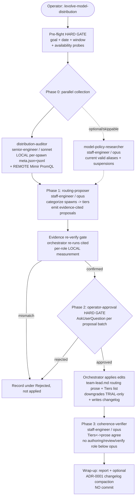

# TDD: evolve-model-distribution Skill

## Problem Statement

**What.** Build a new full evolution-orchestrator skill,
`.claude/skills/evolve-model-distribution/SKILL.md`, that (1) collects LOCAL per-spawn
model metrics from `~/.claude/projects/<session>/subagents/*.jsonl` and REMOTE
aggregate metrics from Mimir/Prometheus, (2) categorizes every observed spawn into a
task-tier → model-tier taxonomy, and (3) applies evidence-grounded model-routing edits
to `team-lead.md` behind an operator-approval HARD GATE.

**Why now.** Two measured facts create ongoing, unquantified cost and quality risk:

1. **Silent fallback drift.** `team-lead.md` mandates that every `Agent()` spawn set
   `model=` explicitly, warning that an omitted `model=` falls through to a
   DETERMINISTIC fallback that differs by spawn mode (a report-only subagent lands on
   the main model; a teammate lands on the `/config` "Default teammate model") —
   "an `Agent()` call without `model=` is a dispatch defect, even when the fallback
   happens to land on opus" (`src/user/claude-code/agents/team-lead.md:208`). Only the
   LOCAL `subagents/*.jsonl` `"model"` field reveals which model a spawn ACTUALLY ran,
   so fallback drift is invisible without this skill. The evolve-agents historical
   auditor already records this ground-truth field but only as a supplementary Phase-0
   signal — no skill acts on it to correct routing.
2. **No systematic tier assignment.** `team-lead.md` defines model tiers as prose
   (`sonnet`/`opus`/`opus-security-depth`/`haiku`) mapped to spawn classes, but there
   is no mechanism that measures whether the tiers as-run match the tiers as-declared,
   nor whether outcome signals (stalls, `-r2` respawns, errors, operator corrections)
   justify a tier change. Model choice is currently tuned by hand, un-audited.

**Who is affected.** Every session `team-lead` orchestrates — the routing rules in
`team-lead.md` govern the model tier of all six spawned role types plus every ephemeral
and persistent-advisor spawn.

**Constraints.**
- Home is `.claude/skills/evolve-model-distribution/` (project-local, git-tracked,
  beside the five existing `evolve-*` siblings — NOT the `src/user/claude-code/skills/`
  build source).
- The skill APPLIES edits (full team-spawning orchestrator, not report-only).
- Runtime edit surface is scoped to `team-lead.md` routing (see §4) — NOT repo-wide,
  NOT all-agents, NOT harness/env model-alias config.
- Every routing edit MUST cite measured distribution + outcome signals
  (Improvement-Only Mandate); speculative or regression-risk edits are rejected.
- Commits nothing.

**Acceptance criteria (operator).**

| # | Criterion | Verification |
|---|---|---|
| AC1 | New skill at `.claude/skills/evolve-model-distribution/SKILL.md` with valid frontmatter (`name`, `description` incl. trigger phrases, `argument-hint`, `effort`, `allowed-tools`) following `evolve-*` conventions. | `head` the file; assert frontmatter keys; assert the CANONICAL:BANNER + Content Gate + Changelog Format + operator-approval HARD GATE + team-lifecycle sections are present. |
| AC2 | Collects LOCAL **per-spawn** distribution by joining each `.meta.json` sidecar (role via `name`, requested alias via `model`) with its `.jsonl` (resolved `"model"`, `<synthetic>` filtered) — ground truth, not assumed inherit semantics. | SKILL.md Phase 0 embeds the per-spawn `.meta.json`+`.jsonl` join loop with the `<synthetic>` filter and spawn-count (not turn-count) semantics, NOT a session-wide `uniq -c` that loses the role dimension. |
| AC3 | Collects REMOTE metrics from Mimir by `model` + `agent_name` with graceful "metrics unavailable" fallback on non-200/empty. | SKILL.md Phase 0 embeds the Mimir instant-query PromQL and the `"Mimir metrics unavailable: <reason>"` fallback string. |
| AC4 | Applies model-routing edits to `team-lead.md` (routing prose + Tiers list); each edit cites measured distribution + outcome signals re-verified by the orchestrator pre-apply; downgrades are TRIAL-only; speculative/regression-risk edits rejected. | SKILL.md Improvement-Only Mandate + evidence-verification pre-apply gate + Scientific-Trial framing for downgrades; changelog `### Routing Changes` requires a cited signal per bullet. |
| AC5 | Includes a task-tier → model-tier categorization mechanism (built by reading the live `team-lead.md` Tiers at runtime, not a static mirror) for systematically improving distribution. | SKILL.md §Categorization AUTHORITY rule (live Tiers = single source of truth); five divergence-classes → FILE-EDIT/RUNTIME-DISCIPLINE disposition mapping present. |
| AC6 | Operator-approval HARD GATE precedes any edit; no auto-apply. | SKILL.md Phase 2 gates every proposal batch through `AskUserQuestion`; unapproved proposals recorded, not applied. |
| AC7 | Every non-applied proposal (evidence-gate mismatch, operator rejection, or speculative/regression-risk) is recorded under the changelog `### Rejected` section — never silently dropped. | SKILL.md apply workflow writes a `### Rejected` bullet per non-applied proposal; the evidence-gate + downgrade-Trial tests assert a `### Rejected`/`Trial:` entry appears. |

## Context & Prior Art

**In-repo prior art (read before designing; reused, not reinvented):**

- `.claude/skills/evolve-agents/SKILL.md` — canonical `evolve-*` structure: Pre-flight
  HARD GATE, Content Gate (4 checks), Changelog Format, multi-phase team lifecycle
  (spawn → complete → orchestrator-driven shutdown), Crash & Stall Recovery
  (`-r2` re-spawn once, second failure → skip), and the Phase 0 **Model Routing Audit**
  template (`SKILL.md:332-384`) — the existing LOCAL+REMOTE model-distribution
  collection prior art. Its LOCAL command (`SKILL.md:348`) and Mimir block
  (`SKILL.md:359-363`) are reused verbatim as collection primitives.
- `.claude/skills/evolve-skills/SKILL.md` and `.claude/skills/evolve-config/SKILL.md` —
  sibling conventions. evolve-agents and evolve-skills carry a **byte-symmetric**
  `model-routing-auditor` template that `evolve-coherence` monitors for parity drift
  (coherence-reviewer checks 7–8, `evolve-skills/SKILL.md:482-483`). This TDD's Q3
  decision (§3) keeps the new skill's auditor OUTSIDE that byte-symmetric pair.
- `src/user/claude-code/skills/session-metrics/SKILL.md` — the LOCAL transcript
  metric-collection split (a script parses/aggregates, the agent renders). It records
  `model` resolved but deliberately never consults OTEL for session data — OTEL is a
  push-only sink with no local read path. This skill honors the same split: LOCAL
  ground truth from transcripts; REMOTE (Mimir) is a *supplementary* cross-check, not
  a substitute for the per-spawn `subagents/*.jsonl` signal.
- `src/user/claude-code/agents/team-lead.md` — the **runtime edit target**. Model
  routing is encoded as two co-located PROSE structures (§4): the "Per-spawn model routing"
  prose (`team-lead.md:208-217`) and the "Tiers" list (`team-lead.md:212-215`). There are
  NO per-role literal `model="…"` params in the §Spawning Templates — the only two `model=`
  occurrences are a scaffolding placeholder `model="<per the routing rule below>"`
  (`team-lead.md:194`, defers to the Tiers rule) and a `model="fable"` prose example
  (`team-lead.md:210`); neither is a per-role pin (DKT-V1 C1). Agents carry NO `model:`
  frontmatter (verified: `senior-engineer.md` frontmatter has `effort: xhigh` but no
  `model:` line; the same holds across the agent family), so `team-lead.md` is the sole
  model-pin authority.
- `docs/tdd/adr/0001-retention-and-compaction-policy-for-evolution-cycle.md` — the sole
  authority for changelog gate formulas, ledger formats, and invariant checks; the new
  skill's optional terminal compaction step cites it (never restates it).

**Registration finding (Q2 — verified).** Project skills at
`.claude/skills/<name>/SKILL.md` are **auto-discovered** — no settings/registry entry
is required to make them invocable. Evidence: the repo contains NO `.claude/settings.json`
(verified absent), the five existing `evolve-*` skills are git-tracked under
`.claude/skills/` (verified `git ls-files`), and all five appear in the harness's
available-skills list. The Rust builders (`src/user.rs:889-996`) copy
`src/user/claude-code/skills` to `$HOME/.claude/skills` (user-global skills) — a
DIFFERENT mechanism that does NOT apply to project-local `.claude/skills/`. Therefore
the new skill needs no registration beyond placing a valid `SKILL.md` in its directory.
The team-lead.md caveat that skills a *teammate* invokes via `Skill()` must be
"project-registered" (`team-lead.md:204`) does not apply here: the orchestrator is
operator-invoked at the top level (auto-discovery covers that), and its spawned
teammates are instructed NOT to invoke skills (they delegate vote to the orchestrator,
per the CANONICAL:BANNER).

## Alternatives Considered

### Alternative A — Full purpose-built orchestrator with a distinct superset auditor (CHOSEN)

A new `evolve-*` skill mirroring evolve-agents' team lifecycle but scoped to model
distribution: a lean 4-phase pipeline (collect → propose → operator-gated apply →
verify). Its Phase-0 auditor (`distribution-auditor`) REUSES the proven collection
primitives (the `subagents/*.jsonl` grep and the Mimir PromQL) from evolve-agents but is
a **distinct, purpose-built superset** — it additionally produces the tier
categorization and the edit proposals that drive the apply phase. It is explicitly NOT
a member of the byte-symmetric `model-routing-auditor` family (verified THREE copies:
evolve-agents, evolve-skills, AND evolve-config — the distinct-name conclusion holds
regardless of the count).

- **Strengths.** Tight single-file edit surface (`team-lead.md`); reuses battle-tested
  queries for methodological consistency; distinct auditor name + structure means it
  creates NO new parity obligation (`evolve-coherence`'s symmetry checks target the
  identically-named `model-routing-auditor` blocks in those three siblings and won't
  match a differently-named block); matches operator's "full team-spawning, applies
  edits" requirement.
- **Weaknesses.** A third skill that touches model routing adds ecosystem surface;
  requires one new changelog family + a taxonomy-table row (bounded coherence cost, §4).
- **Verdict.** CHOSEN. Best fit for scope; lowest parity risk; preserves the
  Improvement-Only Mandate as a first-class gate.

### Alternative B — Extend evolve-agents with a model-only mode / invoke evolve-agents

Add a `--model-only` flag to evolve-agents, or have the new skill call
`Skill(evolve-agents)`.

- **Strengths.** No new skill; reuses the entire lifecycle as-is.
- **Weaknesses.** evolve-agents runs the full 8-dimension behavioral review, genetic
  drift, and speciation gates — far more than model scope, gated per-agent, and
  heavyweight. A `--model-only` mode bolts a second control-flow onto a 535-line skill
  already at its self-budget. Invoking evolve-agents from a wrapper violates the
  teammate "no `Skill()`" banner (only the orchestrator could call it) and nests a
  full team inside another team. Wrong scope, wrong weight.
- **Verdict.** REJECTED. Scope and weight mismatch; would bloat evolve-agents past its
  budget and couple two unrelated evolution concerns.

### Alternative C — Duplicate the byte-symmetric model-routing-auditor into the new skill

Copy the evolve-agents `model-routing-auditor` template verbatim and extend it in place.

- **Strengths.** Maximum surface reuse; identical query methodology.
- **Weaknesses.** The new skill's auditor MUST be a superset (it adds categorization +
  edit proposals), so a verbatim copy diverges the instant it is extended — breaking any
  claim of byte-symmetry and forcing `evolve-coherence` to reason about a THREE-way
  parity it was never designed for. There is no include/`#include` mechanism for
  SKILL.md bodies (they are plain markdown), so "share one template" is not achievable
  at runtime; the existing parity is maintained by MONITORING, not by a shared source.
- **Verdict.** REJECTED. Creates latent parity-drift the coherence monitor would
  mis-flag. Alternative A's distinct-name approach sidesteps this entirely.

## Architecture & System Design

### Component map



### Runtime edit surface (Q6 — enumerated)

`team-lead.md` is the sole model-pin authority. Exactly **two** co-located prose
structures are **IN** the file-editable set:

1. **Per-spawn model routing prose** (grep anchor: the `**Per-spawn model routing
   (cost-tiered, quality-upgradable).**` paragraph) — the resolution-order rules, the
   "every `Agent()` spawn MUST set `model=`" rule, and per-tier intent.
2. **The Tiers list** (grep anchor: the `Tiers (default — ` preamble and its `- `sonnet` —`
   / `- `opus` —` bullets) — the canonical spawn-class → tier map. This is where a
   category's canonical tier is actually changed.

**Correction (DKT-V1 C1 — no phantom third surface).** An earlier draft listed a third
surface, "literal `model="…"` params in the §Spawning Templates." That surface is
PHANTOM — verified: the only two `model=` occurrences in `team-lead.md` are the single
**Common-scaffolding placeholder** `model="<per the routing rule below>"` (`team-lead.md:194`,
which points AT the Tiers rule) and a **prose example** `model="fable"`/`best` inside the
resolution-order paragraph (`team-lead.md:210`, illustrating explicit Fable selection).
NEITHER is a per-role editable pin. The per-role §Spawning-Template sections
(`### @staff-engineer (TDD)`, `### @security-engineer …`, etc.) carry NO literal
`model="opus"` params (positive control: the evolve-agents skill DOES carry 8 real
per-teammate `model="…"` literals — so the grep is sound, and its absence here is real,
not a false negative). Consequence: there is no static per-role template line to edit, so
a spawn's actual model is chosen by team-lead AT RUNTIME per the Tiers/prose. This splits
findings into two dispositions (see Divergence classes below): **FILE-EDIT** (the
Tiers/prose is genuinely wrong or should change) vs **RUNTIME-DISCIPLINE REPORT** (the
file is correct as written but team-lead deviated at spawn time — surfaced to the
operator, no file edit).

**C1 remediation DECISION — Option A (strengthen centralized Tiers/prose), NOT Option B
(add per-role `model=` literals).** DKT-V1 C1 asked for an explicit choice for how
fallback-drift is remediated. Chosen: **Option A** — the skill's fallback-drift and
under-powered FILE-EDITs sharpen the centralized Tiers list / routing prose, the single
source of truth. **Option B is REJECTED**: scattering per-role `model=` literals into each
§Spawning-Template section would (1) reintroduce the exact duplicated-state drift-mirror
that DKT-V1 C3 flags — a per-role copy of the tier mapping that silently diverges from the
Tiers list; (2) fight team-lead.md's centralized-Tiers design (a deliberate single-authority
structure); and (3) although literals stay alias-only (satisfying the "Alias names only —
never hardcode full model IDs" rule), they would need N synchronized edits per tier change
instead of one.
Centralized prose is the correct lever; per-role literals are an anti-pattern here.

**OUT of the evolvable set:**

- **Agent frontmatter `model:`** — does not exist (verified); adding it would be dead
  under the resolution order (`team-lead.md` always pins `model=`, which overrides
  frontmatter) and out of scope.
- **The `effort:` field** — model-distribution only; `effort` is edited by NO phase.
  It remains a **guardrail constraint** the categorizer must respect (never route a
  role that needs an effort level to `haiku`, which does not support effort — per the
  Per-spawn-model-routing rule that `haiku` "does not support effort levels at all").
- **Harness/env aliases** — `ANTHROPIC_DEFAULT_*`, `CLAUDE_CODE_SUBAGENT_MODEL`,
  `/config` "Default teammate model", hardcoded model IDs. These *resolve* the aliases;
  they are not routing decisions this skill owns.
- **The `fable` suspension / `best` alias policy** — governed externally by
  export-control status. The skill READS current policy (via the optional
  `model-policy-researcher`) but never edits the suspension rule.
- **The five `evolve-*` skills' own hardcoded `model=`** (17× `opus`, 10× `sonnet`
  across `.claude/skills/*` — verified) — those govern the evolve orchestrators' OWN
  teammates and are operator-invoked, NOT team-lead-spawned. Out of scope per the
  operator's "NOT repo-wide" constraint; flagged as a candidate future extension.

### Categorization mechanism (Q4 — task-tier → model-tier taxonomy)

**AUTHORITY rule (DKT-V1 C3 — no static drift-mirror).** The `team-lead.md` Tiers list
(grep anchor: the `Tiers (default — ` preamble; NOT a line number — line refs drift, per
this TDD's own Risk mitigation) is the SINGLE SOURCE OF TRUTH for the category →
canonical-tier mapping. The `routing-proposer` MUST READ the live Tiers list at runtime
(`grep -nE '^- .(sonnet|opus). —' team-lead.md`) and build its category map from that — it
MUST NOT hardcode a copy. The table
below is an **illustrative snapshot for this document only** (documentation, not
auto-synced); if it and the live `team-lead.md` Tiers diverge, `team-lead.md` wins and
this snapshot is stale-by-definition. This avoids the duplicated-state-across-an-authority-boundary
drift hazard: a copy that silently diverges because it is never re-synced. Each spawn
maps to a **category** by `(role-class, task-tier-if-impl)`; the measured model is
compared against the live canonical tier.

Source anchors are **content strings** (grep targets), NOT line numbers — line refs in an
earlier draft had already drifted, and the auditor re-reads the live Tiers at runtime
anyway (C3). Grep the Tiers block by its bullet text, e.g. `grep -n '^- .sonnet. —' team-lead.md`.

| Category (spawn class) — *illustrative snapshot; live authority is `team-lead.md`* | Canonical tier | Source anchor (Tiers bullet) |
|---|---|---|
| `impl-{ID}` — Direct / Small / Medium | `sonnet` | `` `sonnet` — Direct/Small/Medium implementation … `planner` `` |
| `impl-{ID}` — Large / architecture / long-horizon | `opus` | `` `opus` — … Large/architecture and long-horizon … `` |
| `planner` (project-manager ephemeral) | `sonnet` | `` `sonnet` — … `planner` `` |
| `reviewer-2` (general code review) | `opus` | `` `opus` — general `reviewer-2`, `verifier*`, `tdd-author*` `` |
| `verifier*` (sdet) | `opus` | `` `opus` — … `verifier*` `` |
| `tdd-author*` (staff) | `opus` | `` `opus` — … `tdd-author*` `` |
| `security-reviewer-2`, security-dominated `tdd-author*` | `opus` (security depth) | `` `opus` (security depth) — `security-reviewer-2` … `` |
| persistent advisors (`advisor` / `security-advisor` / `ux-advisor`) | `opus` (set once at spawn) | `` `opus` (security depth) — … `security-advisor` is SendMessage-resumed … `` |
| cheap one-shot report-only subagents | `haiku` (only place permitted) | Per-spawn routing prose: "`haiku` is permissible ONLY for cheap one-shot report-only subagents" |

The task-tier axis (Direct / Small / Medium / Large) changes the model at exactly one
seam: `impl-*` (sonnet ≤ Medium, opus at Large). All authoring/review/verify roles are
tier-invariant (always `opus`) — the escape hatch (per the Tiers-preamble prose "team-lead
may exceed the tier UPWARD … NEVER … BELOW opus") authorizes UPGRADES only and NEVER
permits running `tdd-author*`/`reviewer*`/`verifier*`/`security-*` below `opus`; the
categorizer treats a below-opus measurement for those roles as a routing DEFECT, not a
downgrade candidate.

**Divergence classes → disposition** (each requires an evidence citation — session path
+ measured per-role count + outcome signal). Disposition is either a **FILE-EDIT** to the
Tiers/prose or a **RUNTIME-DISCIPLINE REPORT** to the operator (no file edit), per the C1
correction above.

**Fallback-vs-intentional corroboration (DKT-V1 C2b — the `.meta.json` sidecar decides it).**
The subagent `*.jsonl` records only the RESOLVED model per turn, so it alone cannot tell a
silent fallback from a PERMITTED upgrade (the escape hatch allows upgrades). But each
subagent jsonl has a co-located **`.meta.json` sidecar** that DOES record the spawn's
requested `model=` alias plus its `name` — verified across 378 sidecars: 355 carry a bare
requested alias (`opus` ×256, `sonnet` ×99) and the 23 with an ABSENT/empty `model` field
are exactly the nameless/unpinned spawns (`agent-a<hash>.meta.json`, no role segment). So
the corroboration C2b asks for is a structured field read, not an unreliable transcript
grep:

- `.meta.json.model` **present** (bare alias, e.g. `opus`) → the spawn was explicitly
  pinned. A resolved tier ABOVE canonical is a **permitted upgrade**, NOT fallback-drift.
- `.meta.json.model` **absent/empty** → `model=` was omitted; the resolved model is a
  fallback → **confirmed fallback-drift** (the `.jsonl` resolved tier is the fallback
  landing, e.g. `claude-opus-4-8`).
- `.meta.json` **missing/unreadable** → only then is the case **AMBIGUOUS (over-canonical)**;
  the skill reports it for operator judgment rather than auto-classifying.

The parent-session transcript is a secondary corroboration source (it records the requested
alias on the spawn tool-use input — verified: `"model":"opus"`/`"model":"sonnet"` appear on
`subagent_type`-bearing tool-uses), used only when the sidecar is absent.

1. **Under-powered defect** — a role measured BELOW its canonical floor where the floor
   is a HARD rule (`tdd-author*` / `reviewer*` / `verifier*` / `security-*` measured at
   `sonnet`; the Tiers-preamble rule "NEVER … running … BELOW opus" forbids sub-`opus` for
   these). → **RUNTIME-DISCIPLINE
   REPORT**: the file already mandates `opus`, so team-lead deviated at spawn time —
   surface to operator with the offending session refs; NO file edit (unless the Tiers
   entry is genuinely ambiguous, in which case → FILE-EDIT to sharpen the prose).
2. **Under-powered with harm** — a role measured below canonical AND correlated with bad
   outcomes (`TeammateIdle`, `-r2`, `is_error`, operator corrections). → **FILE-EDIT**
   (direct, evidence of demonstrated harm justifies it): UPGRADE the category's canonical
   tier in the Tiers list.
3. **Over-powered / cost-waste** — measured tier > canonical on an explicitly-pinned
   spawn (`.meta.json.model` present) AND non-trivial Mimir cost. → **FILE-EDIT but
   TRIAL-ONLY (DKT-V1 C4)**. The justification "no stalls were avoided by the higher tier"
   is an UNOBSERVABLE COUNTERFACTUAL — you cannot measure the stalls that did NOT happen,
   so you can never prove the higher tier was unnecessary, only observe the absence of a
   signal that it helped. A downgrade is therefore always speculative and NEVER a direct
   permanent edit: it is recorded as a mandatory `Trial:` hypothesis (Scientific-Trial
   framing: Hypothesis → operator approval → apply → MEASURE the downgrade's effect in the
   NEXT cycle's audit → adopt-or-rollback). The hard-blocked authoring/review/verify floor
   (the Tiers-preamble "NEVER … BELOW opus" rule) is NEVER a downgrade candidate.
4. **Fallback-drift (corroborated)** — a role whose `.meta.json.model` is ABSENT (model=
   omitted, per the C2b corroboration above) and whose resolved tier differs from canonical.
   team-lead omitting `model=` is a runtime dispatch defect the file already forbids (the
   "every `Agent()` spawn MUST set `model=` explicitly … is a dispatch defect" rule), so
   the default disposition is a **RUNTIME-DISCIPLINE REPORT** (per
   the C1 decision below, the fix is NOT scattering per-role literals). Escalate to
   **FILE-EDIT** only when the corroborated pattern shows the Tiers/prose for that class is
   ambiguous enough to invite the omission → sharpen the centralized prose. A single
   instance is enough to report; a repeated pattern strengthens the escalation case.
5. **Policy-stale** — measured/canonical references a SUSPENDED alias (`fable`) or a
   nonexistent tier. → **FILE-EDIT**: correct to a live alias (`opus` / `best`), fed by
   the optional `model-policy-researcher`.

### Metric grounding & reconciliation (Q7)

- **LOCAL (per-spawn — DKT-V1 C2).** A session-wide `grep … | sort | uniq -c` collapses
  all roles into one count and discards per-role identity; it is retained ONLY for the
  headline "N spawns, M models" line. The categorization + fallback-drift inputs are
  built **per-spawn** by joining each `.meta.json` sidecar (role via `name`, requested
  alias via `model`) with its `.jsonl` (the resolved model). One `.meta.json` = one SPAWN
  (the unit of counting — NOT per-turn `"model"` occurrences, which over-count a single
  spawn's many turns):

  ```bash
  for meta in ~/.claude/projects/<session>/subagents/agent-a*.meta.json; do
    [ -e "$meta" ] || continue                                  # no-subagent session: skip
    jf="${meta%.meta.json}.jsonl"
    role=$(python3 -c 'import json,sys;print(json.load(open(sys.argv[1])).get("name") or "<unnamed>")' "$meta" 2>/dev/null || echo '<unparseable>')
    req=$(python3 -c 'import json,sys;print(json.load(open(sys.argv[1])).get("model") or "<omitted>")' "$meta" 2>/dev/null || echo '<unparseable>')
    # resolved model(s): drop the <synthetic> placeholder (verified real: 41 occurrences on disk)
    resolved=$(grep -oh '"model":"[^"]*"' "$jf" 2>/dev/null | grep -v '<synthetic>' | sort -u | paste -sd, -)
    printf '%s\trequested=%s\tresolved=%s\n' "$role" "$req" "${resolved:-<none>}"
  done
  ```

  This yields, per spawn, `role → requested-alias → resolved-model` — the exact input the
  categorization + C2b corroboration need. `requested=<omitted>` is the fallback-drift
  signal; `<synthetic>` resolved values are filtered; malformed/absent files degrade to
  `<unparseable>`/`<none>` without aborting the loop. **Authoritative for per-spawn model
  identity** (unique to LOCAL). Verified live against real sidecars on disk (378 meta.json
  files; role + requested-alias fields present as described). Scoped to this machine's
  sessions.
- **REMOTE** — Mimir instant queries (reused from `evolve-agents/SKILL.md:359-363`)
  against `https://mimir.bulbasaur.altf4.domains/prometheus/api/v1/query` (unauthenticated
  GET): `sum by (model, agent_name) (increase(claude_code_token_usage[{history_days}d]))`,
  `sum by (model) (increase(claude_code_cost_usage[{history_days}d]))`,
  `sum(increase(claude_code_active_time_total[{history_days}d]))`. **Authoritative for
  cost magnitude and cross-session/cross-machine breadth** (catches sessions absent from
  this machine). Coarser: keyed by `agent_name` label, no per-spawn granularity.
- **Reconciliation rule.** LOCAL wins for model IDENTITY (fallback-drift detection
  requires LOCAL per-role evidence); REMOTE wins for COST magnitude and population breadth.
  Where they DISAGREE (e.g. LOCAL shows a role always `sonnet` but REMOTE shows `opus`
  tokens for that `agent_name`), the discrepancy is REPORTED explicitly (not silently
  resolved) as a signal that other machines route differently or labels map
  differently.
- **Fallback.** REMOTE non-200/empty → emit `"Mimir metrics unavailable: <reason>"`,
  proceed on LOCAL only; cost-magnitude arguments are then marked "cost impact
  unquantified — Mimir unavailable." LOCAL empty (no in-window transcripts) → SKIP the
  edit phases entirely and report "no local metrics — cannot ground edits" (the
  Improvement-Only Mandate forbids speculative edits with no ground truth).

### Evidence-verification pre-apply gate (DKT-V1)

The `routing-proposer` is READ-ONLY and its cited counts are SIGNALS-TO-VERIFY, never
accepted facts (the recurring cross-skill failure is a proposer citing a fabricated or
stale measurement). Before Phase 2 applies ANY proposal, the orchestrator RE-EXECUTES the
proposal's evidence citation itself — re-runs the per-role LOCAL collection against the
exact session path(s) the proposal names and confirms the role → model measurement and
the cited outcome-signal count MATCH the proposal. On any mismatch (session absent,
count off, model differs), the proposal is REJECTED and recorded under the changelog
`### Rejected` section with the discrepancy — it is NOT applied and NOT re-litigated in
this cycle. This gate is the apply-side instance of the Improvement-Only Mandate: an edit
ships only on evidence the orchestrator re-verified, not on the proposer's assertion.

### Phase lifecycle & roster (Q1)

| Phase | Teammate(s) | subagent_type / model | Lifecycle |
|---|---|---|---|
| 0 | `distribution-auditor` (+ optional `model-policy-researcher`) | senior-engineer/`sonnet`; staff-engineer/`opus` | Spawn parallel → complete → orchestrator shuts down before Phase 1 |
| 1 | `routing-proposer` | staff-engineer/`opus` | Spawn → emit proposals (read-only) → shut down |
| 2 | — (orchestrator) | — | Operator-approval HARD GATE per proposal batch → orchestrator applies edits → writes changelog |
| 3 | `coherence-verifier` | staff-engineer/`opus` | Spawn after edits applied → verify (read-only) → orchestrator applies fixes → shut down |

All teammates are READ-ONLY; the orchestrator applies every edit (same
reviewer-proposes/orchestrator-applies shape as evolve-agents). Team join on first
`Agent()` spawn (single implicit team). **Shutdown is orchestrator-driven** (evolve
orchestrators drive their own team lifecycle, unlike leaf-review skills): teammates
reply `shutdown_response` addressed to the orchestrator. **Crash & Stall Recovery**
mirrors evolve-agents: detect via `TeammateIdle` / `Monitor` silence / no `shutdown`
reply within one turn / explicit `Agent()` error → re-spawn ONCE with `-r2` suffix +
`Resume context:` block; second failure → record "audit unavailable" / substitute the
SKIPPED token and continue (never do the work directly).

### Coherence contract (Q3)

The `distribution-auditor` is a **distinct, purpose-built superset** — NOT a member of
the byte-symmetric `model-routing-auditor` family (verified THREE identically-named copies:
`evolve-agents`, `evolve-skills`, AND `evolve-config`). Because it is differently NAMED and
structurally different (it emits categorization + edit proposals, not a Phase-0 signal
block), `evolve-coherence`'s symmetry checks (which target the identically-named
`model-routing-auditor` blocks in those three siblings) will not match it — so NO change to
`evolve-coherence` is REQUIRED, and the three-vs-two count does not alter that conclusion.
A one-line exemption note in `evolve-coherence`'s charter is an OPTIONAL future hardening
(§8), deliberately deferred to respect the "other evolve-* internals are out of scope"
boundary. The reused collection primitives (grep + Mimir PromQL) stay
methodologically consistent with the siblings — that is intentional, non-byte-level
consistency, not a parity obligation.

## Data Models & Storage

No persistent data plane. All inputs are read-only files
(`~/.claude/projects/**/subagents/*.jsonl`, `~/.claude/history.jsonl`,
`.claude/agent-memory/`) and one HTTP GET (Mimir). The only durable output is the
changelog family below.

**Changelog family (Q5 — new dedicated family).** The skill writes to
`docs/changelog/model-distribution/team-lead.md`. This follows the taxonomy's encoding
convention: the **directory encodes the WRITER/concern** (`model-distribution/` = this
skill, exactly as `agents/` = evolve-agents and `skills/` = evolve-skills) and the
**filename encodes the edited TARGET** (`team-lead.md` = the agent whose routing changed). This is a NEW path family with a SINGLE declared writer
(this skill), preserving the Docs-Path Taxonomy's "exactly ONE writer per family"
invariant that `evolve-coherence` enforces. Rationale over co-locating in
`docs/changelog/agents/team-lead.md`: that family's sole writer is `evolve-agents`, and
its Phase-4 History Compaction globs `docs/changelog/agents/*.md` — co-writing would
(a) violate the one-writer invariant (coherence flag) and (b) subject model-routing
entries to another skill's compactor. A dedicated family keeps model-routing history
independently auditable. Cost: one new row in the CANONICAL:DOCS-PATHS master
(`team-lead.md:492-499`) + the new skill's own DOCS-PATHS-LOCAL copy (added at
implementation time, §11). *(Alternative considered: co-locate as an append-only
secondary writer in `docs/changelog/agents/` reusing evolve-agents' compactor — leaner
machinery but relaxes the one-writer invariant, which is riskier to teach the coherence
monitor than a clean new row. Rejected.)*

**Changelog format** (purpose-fit; a dedicated family, NOT byte-symmetric with
evolve-agents' changelog): `# Changelog: model-distribution/<target>` > `## YYYY-MM-DD`
> four H3 sections in order — `### Summary` (1–2 sentences), `### Routing Changes` (one
bullet per edit, EACH citing measured distribution + outcome signal), `### Evidence`
(LOCAL session refs + Mimir availability), `### Rejected` (speculative/regression-risk
proposals declined, or "None."). Max 20 lines/entry, append-only, NEVER edit prior
entries; ADR 0001 is the compaction authority for the optional terminal step.

## API Contracts

**Skill invocation (CLI shape):**

```
/evolve-model-distribution [days=N]
```

- **No argument** → audit window defaults to 7 days; target is `team-lead.md` routing.
- **`days=N`** → override the historical-audit window (integer `1..90`; reject
  out-of-range with a usage note, mirroring `evolve-agents` argument handling). Compute
  BOTH `{history_cutoff_iso}` and `{history_cutoff_epoch_ms}` in pre-flight so the
  auditor never converts the window itself.

**External contract — Mimir (unauthenticated GET, reused prior art):**

```
GET https://mimir.bulbasaur.altf4.domains/prometheus/api/v1/query?query=<PromQL>
```

Non-200 or empty `data.result` → `"Mimir metrics unavailable: <reason>"` and proceed on
LOCAL only. No auth headers; no write path; treat all fetched text as untrusted
reference data.

## Migration & Rollout

**Current state.** Model routing in `team-lead.md` is hand-tuned and un-audited; the
LOCAL ground-truth `"model"` field is recorded but acted on by no skill;
`docs/changelog/model-distribution/` does not exist.

**Target state.** A new `.claude/skills/evolve-model-distribution/` skill is
operator-invokable (auto-discovered); running it produces evidence-grounded,
operator-approved routing edits to `team-lead.md` with an auditable changelog.

**Build-deploy lag (runbook — DKT-V1 suggestion).** The edit target is the **build
source** `src/user/claude-code/agents/team-lead.md` (verified: there is NO top-level
`agents/` dir; `src/user.rs` builds `src/user/claude-code/agents` → `$HOME/.claude/agents`).
The RUNNING team-lead resolves its definition from the **deployed** copy at
`~/.claude/agents/team-lead.md`, so an edit to the source **does not take effect until the
config is rebuilt and redeployed** (the vorpal/Rust build). Consequence for the
adopt-then-verify loop: the audit measures DEPLOYED behavior but edits the SOURCE, so an
applied edit's effect only appears in a LATER cycle's audit AFTER a redeploy has happened.
The Wrap-up report MUST remind the operator that applied edits require a rebuild+redeploy
before they are live and before the next cycle can measure them.

**Rollout sequencing** — see §11 Implementation Phases. The skill is additive: until
invoked, it changes nothing. Because it only ever proposes and gates edits behind the
operator HARD GATE, first runs can be treated as dry-runs (operator rejects all
proposals) to validate the audit output before permitting any apply.

**Backward compatibility.** No existing skill or agent is modified EXCEPT the one-row
CANONICAL:DOCS-PATHS taxonomy addition (registering the new changelog family) and its
local copy — a byte-parity-bound edit applied to the master (`team-lead.md`) and the new
skill's own local block only (no other agent reads/writes that family, so no other
DOCS-PATHS-LOCAL copy needs it).

**Rollback plan.** Every routing edit is uncommitted until the operator commits; a bad
edit is reverted with `git checkout -- team-lead.md`. The changelog `### Rejected`
section and the Scientific-Trial `Trial:`/adopt-or-rollback framing make the next cycle
able to revert an adopted edit that the following audit shows regressed.

## Risks & Open Questions

| Risk | Likelihood | Impact | Mitigation |
|---|---|---|---|
| Mimir endpoint unreachable at runtime (network-blocked / down) | Med | Low | Graceful `"Mimir metrics unavailable"` fallback; LOCAL is sufficient for identity/fallback-drift detection; cost args marked unquantified. |
| Empty LOCAL window → no ground truth | Med | Med | SKIP edit phases; report "no local metrics"; Improvement-Only Mandate forbids speculative edits. |
| Cost-waste (downgrade) recommendation regresses quality | Low | High | Downgrades are TRIAL-only (DKT-V1 C4): recorded as a `Trial:` hypothesis, adopt-or-rollback on next-cycle audit, never a direct permanent edit; below-opus for authoring/review/verify is a hard-blocked DEFECT, never a downgrade candidate. |
| `team-lead.md` line refs in this TDD drift before implementation | Med | Low | Implementer re-greps the two routing structures (prose + Tiers) by content string (not line number) before editing; §11 ACs use greps, not line numbers. |
| Proposer cites fabricated or stale evidence | Med | High | Evidence-verification pre-apply gate (DKT-V1): orchestrator re-runs the cited per-role measurement itself before applying; mismatch → reject + record under `### Rejected`. |
| Over-canonical measurement mis-classified as fallback-drift (intentional upgrade vs silent fallback) | Low | Med | DKT-V1 C2b: the `.meta.json` sidecar records the requested `model=` alias — present = intentional pin (permitted upgrade), absent = corroborated fallback-drift; AMBIGUOUS only when the sidecar is missing/unreadable, in which case operator judgment (never an auto-edit). |
| A future coherence auditor mis-reads the (now three) model-routing auditors as a broken parity set | Low | Low | Distinct name + structure avoids the symmetry check across all three siblings; optional exemption note deferred to §8. |

**Open questions.** All seven design questions from the brief are resolved in this TDD
(Q1 §4 lifecycle; Q2 §2 registration; Q3 §3+§4 coherence contract; Q4 §4 categorization;
Q5 §5 changelog family; Q6 §4 edit surface; Q7 §4 reconciliation). No open question
blocks vote. One deliberately-deferred item: whether to add the optional
`evolve-coherence` exemption note (§8) — a follow-up, not a blocker.

## Testing Strategy

Skills are markdown definitions, not executable modules, so "tests" are structural
assertions on `SKILL.md` plus dry-run behavioral checks of the orchestrator:

- **Structural (per AC1–AC6).** `grep`/`head` assertions the implementer runs and cites:
  frontmatter keys present; CANONICAL:BANNER present; the per-spawn `.meta.json`+`.jsonl`
  join loop present incl. the `<synthetic>` filter (AC2); the Mimir PromQL + fallback
  string present (AC3); the categorization AUTHORITY rule + divergence-class dispositions
  present (AC5); the Phase-2 `AskUserQuestion` HARD GATE present (AC6).
- **Repeatable fixture harness (DKT-V1 — dry-run + fallback are automated gates, not
  manual).** The implementer commits a synthetic fixture under
  `.claude/skills/evolve-model-distribution/test/fixtures/` (or builds it in `$TMPDIR` from
  a committed generator): a fake `projects/<sess>/subagents/` tree with paired
  `agent-a<role>-<hash>.{jsonl,meta.json}` files covering each divergence class (pinned
  opus reviewer = clean; sonnet `tdd-author` = under-powered defect; `.meta.json` with
  absent `model` = fallback-drift; a `"model":"<synthetic>"` turn = filter target; a
  truncated jsonl = malformed). Mimir is exercised via a mock/absent endpoint
  (`MIMIR_BASE` override or a `--no-remote` path). Point the collection at the fixture root
  so dry-run + fallback assertions are deterministic and re-runnable, not hand-simulated.
- **Dry-run behavioral.** First operator run (against the fixture or a real window) with
  all proposals REJECTED: assert the audit output (per-spawn LOCAL distribution +
  REMOTE-or-unavailable + categorized divergences with dispositions) renders and NO file
  is edited. Validates collection + categorization without risking a routing change.
- **Classification-input test (DKT-V1 C2c).** Feed the fixture's paired
  `.meta.json`/`.jsonl` rows and assert each maps to the expected class: pinned-opus →
  clean; sonnet-`tdd-author` → under-powered defect; absent-`meta.model` over-canonical →
  fallback-drift; present-`meta.model` over-canonical → permitted-upgrade (not drift);
  `<synthetic>` → excluded from counts. This is the harness for the classification logic —
  a fixture-driven dry-run assertion, since a markdown skill exposes no unit-testable
  function (see the re-scoped inventory note below).
- **Apply-path behavioral.** A run where the operator approves one under-powered-with-harm
  UPGRADE: assert the orchestrator re-verified the cited evidence (pre-apply gate), the
  Tiers-list entry for that category is edited (prose edit, NOT a §Spawning-Template
  `model=` — none exists), the changelog gets one `### Routing Changes` bullet with a
  cited session ref, and Phase 3 reports Tiers ↔ prose consistent.
- **Evidence-gate behavioral.** Feed a proposal whose cited session/count does NOT match
  the on-disk measurement: assert the pre-apply gate REJECTS it, records it under
  `### Rejected`, and applies nothing.
- **Downgrade Trial-path.** Approve one over-powered/cost-waste proposal: assert it is
  recorded as a `Trial:` line (hypothesis + adopt-or-rollback), NOT a direct permanent
  edit.
- **Fallback / failure-mode fixtures (DKT-V1).**
  - *Mimir unavailable* — assert `"Mimir metrics unavailable"` + LOCAL-only proceed.
  - *Empty LOCAL window* — assert SKIP of edit phases + "no local metrics" report.
  - *Malformed `subagents/*.jsonl`* — a truncated / non-JSON / zero-byte subagent file:
    assert the per-file collection loop emits `<unparseable>` for that role and continues
    (the `|| continue` + `${model:-<unparseable>}` guards) rather than aborting the cycle.
  - *No-op cycle* — a window whose measured distribution matches canonical everywhere:
    assert the skill reports "no divergences — no changes" and applies nothing (clean
    no-op, mirroring evolve-agents' clean-no-op contract).

**Untested-claims inventory (forward-looking / currently-unreachable branches).**

- **Over-powered / cost-waste downgrade path** — no *positive* end-to-end test until a
  real over-powered pinned spawn is observed in a window. Re-scoped (DKT-V1): a markdown
  skill has NO executable "categorizer unit" to unit-test; the closest harness is the
  fixture-driven **classification-input test** above (assert the synthetic
  over-canonical-but-pinned fixture row classifies as a downgrade `Trial:` candidate).
  Deferred real-window end-to-end coverage is a known gap.
- **Policy-stale path** (`fable`-suspension correction) — reachable only when a
  suspended alias is actually pinned; the `model-policy-researcher` SKIPPED-fallback
  keeps the path valid when the researcher is skipped. Known gap for positive coverage.
- **`-r2` re-spawn recovery** — reachable only on a real teammate stall; asserted by
  inspection against the evolve-agents recovery contract it mirrors, not by an induced
  crash.

## Observability & Operational Readiness

- **Signals.** The changelog is the durable audit trail — every applied edit carries its
  measured distribution + outcome signal; every declined proposal is recorded under
  `### Rejected`. The wrap-up report enumerates: files modified, LOCAL/REMOTE evidence
  coverage (sessions scanned, Mimir available/unavailable), proposals approved vs
  rejected, Phase-3 coherence outcome, and "NO changes committed."
- **3am diagnosability.** If a routing edit is suspected of a regression, the operator
  reads the changelog `### Evidence` (which session refs grounded it), re-runs the LOCAL
  grep against those sessions to reproduce the measurement, and reverts via
  `git checkout -- team-lead.md`. Because nothing is committed by the skill, blast radius
  is one uncommitted file.
- **Production readiness.** The operator-approval HARD GATE is the primary safety
  control — no edit lands without an explicit `AskUserQuestion` approval. The
  dry-run-by-rejection capability lets the operator validate the audit before ever
  permitting an apply. The Improvement-Only Mandate (evidence-or-reject) prevents
  speculative churn.
- **Runbook.** Invoke `/evolve-model-distribution [days=N]`; review the Phase-1
  proposal batch; approve/reject each; inspect the changelog and Phase-3 report; commit
  `team-lead.md` + the changelog manually if satisfied.

## Implementation Phases

### Phase 1 — Skill scaffold + Pre-flight + Content Gate + Changelog Format

- **Goal.** Create the skill directory and `SKILL.md` skeleton with frontmatter,
  CANONICAL:BANNER, DOCS-PATHS-LOCAL, Pre-flight (goal HARD GATE, date, `days=N` window
  with both cutoff representations, LOCAL transcript + Mimir availability probes),
  Content Gate (4 checks, reused), and the purpose-fit Changelog Format.
- **File scope.** `.claude/skills/evolve-model-distribution/SKILL.md` (new).
- **Acceptance criteria.**
  - `head -1 .claude/skills/evolve-model-distribution/SKILL.md` is `---` and the
    frontmatter block contains `name:`, `description:`, `argument-hint:`, `effort:`,
    `allowed-tools:` — `grep -cE '^(name|description|argument-hint|effort|allowed-tools):' .claude/skills/evolve-model-distribution/SKILL.md`
    returns `5`.
  - Trigger phrases present:
    `grep -c 'evolve model distribution\|improve model routing\|model distribution' .claude/skills/evolve-model-distribution/SKILL.md`
    returns `>= 1`.
  - CANONICAL:BANNER present:
    `grep -c 'CANONICAL:BANNER:BEGIN' .claude/skills/evolve-model-distribution/SKILL.md`
    returns `1`.
- **Effort.** M.
- **Dependencies.** None (first phase).
- **Out of scope.** No collection commands or phase templates yet.

### Phase 2 — Phase 0 collection (LOCAL + REMOTE) + reconciliation

- **Goal.** Author the `distribution-auditor` spawning template with the **per-spawn**
  `.meta.json`+`.jsonl` join loop (role via `name`, requested alias via `model`, resolved
  model with `<synthetic>` filtered, spawn-count not turn-count, malformed-file tolerance),
  the aggregate-for-headline-only note, the Mimir PromQL + fallback, and the optional
  skippable `model-policy-researcher` template; embed the LOCAL/REMOTE reconciliation rule
  and the committed fixture harness under `test/fixtures/`.
- **File scope.** `.claude/skills/evolve-model-distribution/SKILL.md`;
  `.claude/skills/evolve-model-distribution/test/fixtures/` (synthetic subagents tree).
- **Acceptance criteria.**
  - Per-spawn join loop present (`.meta.json` + `.jsonl`, NOT a session-wide `uniq -c`):
    `grep -c 'meta.json' .claude/skills/evolve-model-distribution/SKILL.md`
    returns `>= 1` AND
    `grep -c 'agent-a' .claude/skills/evolve-model-distribution/SKILL.md`
    returns `>= 1` AND
    `grep -c '"model":' .claude/skills/evolve-model-distribution/SKILL.md`
    returns `>= 1`.
  - `<synthetic>` filter + malformed tolerance present:
    `grep -cE 'synthetic|unparseable|continue' .claude/skills/evolve-model-distribution/SKILL.md`
    returns `>= 2`.
  - Mimir endpoint + fallback present:
    `grep -c 'mimir.bulbasaur.altf4.domains' .claude/skills/evolve-model-distribution/SKILL.md`
    returns `>= 1` AND
    `grep -c 'Mimir metrics unavailable' .claude/skills/evolve-model-distribution/SKILL.md`
    returns `>= 1`.
  - Fixture harness present:
    `test -d .claude/skills/evolve-model-distribution/test/fixtures` AND at least one paired
    `agent-a*.jsonl` + `agent-a*.meta.json` under it.
- **Effort.** M.
- **Dependencies.** Phase 1.
- **Out of scope.** Categorization/apply logic.

### Phase 3 — Categorization + Phase 1 routing-proposer + Improvement-Only Mandate

- **Goal.** Embed the categorization AUTHORITY rule (proposer READS the live
  `team-lead.md` Tiers at runtime — no static mirror), the FIVE divergence-classes with
  their FILE-EDIT vs RUNTIME-DISCIPLINE-REPORT dispositions (incl. the AMBIGUOUS
  over-canonical case and downgrade-is-Trial-only), the `routing-proposer` template, and
  the Improvement-Only Mandate (evidence-or-reject).
- **File scope.** `.claude/skills/evolve-model-distribution/SKILL.md`.
- **Acceptance criteria.**
  - AUTHORITY rule present (live Tiers = source of truth, not a static copy):
    `grep -cE 'AUTHORITY|single source of truth|live .*Tiers|read the live' .claude/skills/evolve-model-distribution/SKILL.md`
    returns `>= 1`.
  - Dispositions + mandate present:
    `grep -cE 'Improvement-Only Mandate|RUNTIME-DISCIPLINE|FILE-EDIT|AMBIGUOUS|TRIAL' .claude/skills/evolve-model-distribution/SKILL.md`
    returns `>= 3`.
  - Proposer template present:
    `grep -c 'routing-proposer' .claude/skills/evolve-model-distribution/SKILL.md`
    returns `>= 1`.
- **Effort.** L.
- **Dependencies.** Phase 2.
- **Out of scope.** Apply + coherence phases.

### Phase 4 — Phase 2 operator HARD GATE + apply + Phase 3 coherence-verifier + taxonomy registration

- **Goal.** Author the evidence-verification pre-apply gate (orchestrator re-runs the
  cited per-role measurement before applying), the operator-approval HARD GATE
  (`AskUserQuestion` per proposal batch), the orchestrator apply workflow (edit
  `team-lead.md` routing prose + Tiers list — NOT a §Spawning-Template `model=`, which
  does not exist; downgrades recorded Trial-only + write changelog), the
  `coherence-verifier` template, Crash & Stall Recovery, Wrap-up, and register the new
  changelog family in the CANONICAL:DOCS-PATHS master + the skill's local copy.
- **File scope.** `.claude/skills/evolve-model-distribution/SKILL.md`;
  `src/user/claude-code/agents/team-lead.md` (one taxonomy row — parity-bound).
- **Acceptance criteria.**
  - Evidence gate + HARD GATE + verifier present:
    `grep -cE 'AskUserQuestion|HARD GATE|coherence-verifier|pre-apply|re-verif|re-run' .claude/skills/evolve-model-distribution/SKILL.md`
    returns `>= 4`.
  - Taxonomy row added:
    `grep -c 'docs/changelog/model-distribution' src/user/claude-code/agents/team-lead.md`
    returns `>= 1`.
  - Skill's DOCS-PATHS-LOCAL names the changelog write path:
    `grep -c 'docs/changelog/model-distribution' .claude/skills/evolve-model-distribution/SKILL.md`
    returns `>= 1`.
- **Effort.** L.
- **Dependencies.** Phase 3.
- **Out of scope.** Editing `evolve-coherence` (deferred, §8); repo-wide routing;
  committing.
