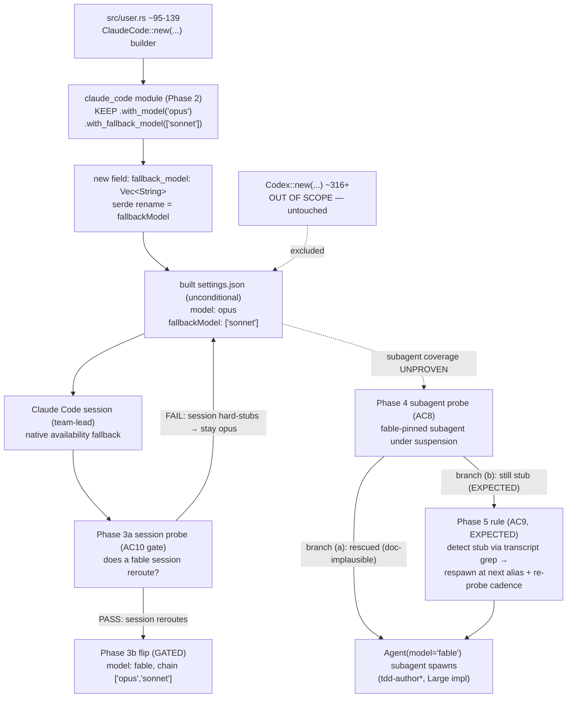

## Problem Statement

**What.** `src/user.rs:139` currently reads
`.with_model("opus") // Change back to fable once available` — a **manual temporary
patch** applied because Anthropic suspended Fable 5 access. The config has **no
`fallbackModel` chain**, so the only resilience against a model going unavailable is
hand-editing the session model. This TDD adds the native `fallbackModel` chain as
**overload/availability future-proofing** and handles THIS access suspension by other
means — because the two are not the same class of failure (see the honest-scope note).

**Honest-scope note (load-bearing).** Native `fallbackModel` triggers on **overload,
unavailability, or other non-retryable SERVER errors** — and explicitly **NOT** on auth,
billing, **entitlement/access**, rate-limit, request-size, or transport errors (those
follow normal retry/error handling; model-config doc). The **current Fable suspension is
an access/entitlement condition**, which most likely falls in the NON-triggering class —
so `fallbackModel` may **not** auto-handle this specific suspension at all. Its real value
is **future-proofing overload/availability outages**. THIS access suspension is handled by
(a) keeping the session on `opus` (safe-plan, below) and (b) the team-lead.md respawn rule
for fable-pinned subagents. The Phase 3a probe MEASURES whether the session actually
reroutes before we rely on it.

**Why now.** The Fable suspension exposed that the config has no availability-fallback at
all, AND that hand-editing the session model is the only lever today. Claude Code ships a
native feature for the availability case — `fallbackModel` — and the operator has decided
(verified) to adopt it as future-proofing, lifting the prior `src/user.rs` scope exclusion.
The triggering case is Fable, but the chain future-proofs ANY routing-tier model
(`sonnet`/`opus`/`fable`/future) going overloaded or transiently unavailable.

**Safe-plan note (load-bearing — supersedes any "restore fable" framing).** The session
model **stays `opus`** in this change. We do **NOT** flip `.with_model("opus")` back to
`fable` as part of the unconditional work, because doing so during the live suspension
would regress team-lead's own session onto a suspended model and rely on an UNVERIFIED
assumption that `fallbackModel` rescues the session reroute. The `opus`→`fable` flip is
**gated behind a post-deploy session-reroute probe** (Phase 3a): only after we observe
that a `fable` session actually reroutes via `fallbackModel` do we flip the primary back.
Until then, keeping `opus` is strictly safe — the chain is additive and changes nothing
about the current working session.

**Who is affected.** The operator (who performs the manual toggle today), team-lead's main
session, and the fable-tier subagent spawns team-lead dispatches (whose access-suspension
behavior is resolved empirically below).

**Constraints (CLOSED — prescribed, not open for the design to revisit).**

1. **Native feature only.** The fix is the harness-native `fallbackModel` setting on the
   `ClaudeCode` config in `src/user.rs`. The dead prose-walk-the-chain approach (a
   team-lead spawn-time decision rule) is rejected — it was unexecutable because
   team-lead has no documented spawn-time "model unavailable" signal to branch on.
2. **Claude-Code only.** `fallbackModel` goes ONLY on the `ClaudeCode::new(...)` builder
   (`src/user.rs` ~95-139). The `Codex::new(...)` builder (`src/user.rs` ~316+) is
   **out of scope** — do NOT touch it.
3. **Alias names only** — chain entries are aliases (`fable`/`opus`/`sonnet`), never
   hardcoded full model IDs. (The `ANTHROPIC_DEFAULT_*_MODEL` env block at
   `src/user.rs:110-113` already resolves aliases to pinned `[1m]` IDs; the chain rides
   on that resolution.)
4. **NEVER `haiku`** in the chain (xhigh-effort frontmatter errors on Haiku; Haiku has
   no 1M pin). Haiku is excluded from every chain.
5. **Security floor:** the chain must not degrade security-relevant work below the
   `opus`-equivalent tier (addressed via chain ordering — see §4).
6. **Reversibility / zero-edit auto-resume is mandatory:** restoration to the primary
   model must require no human edit. The native feature provides this — the switch
   "lasts for the current turn only," so the next turn retries the primary first.

**Acceptance criteria** (all verifiable against `src/user.rs` + the built settings.json).

- **AC1 (UNCONDITIONAL)** — The session model is **left as `.with_model("opus")`**; the
  unconditional change does NOT flip it to `fable`. `grep -nE '\.with_model\("opus"\)' src/user.rs`
  still returns its hit in the ClaudeCode block. (The opus→fable flip is AC10, gated.)
- **AC2 (UNCONDITIONAL)** — A `fallbackModel` chain is set on the `ClaudeCode` config (and
  ONLY there — not on `Codex`), as an ordered alias array, via a builder setter call.
- **AC3 (UNCONDITIONAL)** — The chain is `["sonnet"]` while the session primary is `opus`
  (opus → sonnet), so a session `opus` overload/unavailability degrades to sonnet.
  `haiku` does not appear (AC-haiku). ≤3 entries after dedup (native cap). (When AC10
  flips the primary to `fable`, the chain becomes `["opus","sonnet"]` in the same edit.)
- **AC4 (UNCONDITIONAL)** — The built settings.json serializes `fallbackModel` as a JSON
  array of the chain aliases under the ClaudeCode config and NOT under any Codex output.
- **AC5 (UNCONDITIONAL)** — The line-139 comment is rewritten so it no longer reads as a
  stale manual-toggle TODO: `grep -n 'Change back to fable once available' src/user.rs`
  returns **zero** hits. (It is replaced by a comment pointing at the AC10 flip-gate, NOT
  removed-and-flipped.)
- **AC6 (UNCONDITIONAL)** — The `claude_code` builder exposes a `with_fallback_model(...)`
  setter serializing to the `fallbackModel` settings key (added if absent — see Q2 / §4).
- **AC7 (UNCONDITIONAL)** — Security floor: the chain's lowest entry is `sonnet`, but
  security-dominated subagent spawns are pinned to `opus` by the team-lead routing table
  (out-of-scope to change), so the session chain never forces security work below opus.
  The team-lead.md `opus (security depth)` row is unchanged.
- **AC8 (GATE — subagent access-suspension)** — Subagent coverage is an
  **implement-then-verify gate**. After AC1-AC6 land and the config is rebuilt, a throwaway
  `model="fable"` subagent probe is re-run under the live suspension. Branch **(a)** — the
  probe is rescued by `fallbackModel` — is **doc-implausible** (the model-config doc scopes
  `fallbackModel` to the session's active model / current turn, NOT per-spawn
  `Agent(model=)`; and the prior probe proved the access suspension returns a hard stub,
  not a reroute). The **expected** outcome is branch **(b)**: the probe still returns the
  unavailability stub, so the team-lead.md respawn rule (AC9) is the operative subagent
  path, not a fallback. The gate is satisfied when the probe outcome is recorded and (for
  the expected branch b) AC9's rule is added and a re-probe confirms recovery.
- **AC9 (subagent respawn rule — the expected subagent path)** — `team-lead.md` carries an
  operational rule: when team-lead detects a spawn's unavailability stub, it respawns that
  spawn class at the **next chain alias** (NOT the same model — amending the line-320
  "respawn with SAME name+model" path). **Stub-detection mechanism (required, per
  reviewer-1):** team-lead reads the idle ephemeral's last assistant message (or greps its
  transcript) for the literal unavailability marker `currently unavailable` (the
  `"Claude … is currently unavailable"` stub) combined with 0-token / immediate-idle — NOT
  inferred from idleness alone. **Re-probe cadence (required, per C2 — for true
  auto-resume):** the respawn-at-fallback is NOT sticky; team-lead periodically re-attempts
  the primary alias (e.g. the next time that spawn class is dispatched, attempt `fable`
  first; only fall to the next alias if the stub recurs) so the tier auto-resumes the
  moment the model returns, with zero edit. The rule states the tier auto-resumes; `fable`
  remains the documented primary.
- **AC10 (GATED — session opus→fable flip)** — Conditional on the Phase 3a **session**-reroute
  probe: ONLY after observing that a `fable` *session* reroutes via `fallbackModel` to opus
  (does real work, not the stub) is `.with_model("opus")` flipped to `.with_model("fable")`
  and the chain updated to `["opus","sonnet"]`. If the session probe shows the session
  also hard-stubs on `fable`, the primary STAYS `opus` and the flip is recorded N/A with
  evidence. This is the only step that touches the session primary; it is never part of the
  unconditional work.

**Business context.** This is high-blast-radius config: it ships to every Claude Code
session on the next vorpal build/deploy. The win is eliminating manual toggle toil and
removing the failure mode where the operator forgets to revert line 139 (leaving the
session pinned to opus after Fable returns). The chain must NOT re-introduce the
`fable-monoculture` regression (commit `1ea590c`, operator-reverted per DKT-266/267/268)
— it degrades downward only and changes no per-spawn routing tier.

## Context & Prior Art

**In-repo prior art (all verified this session).**

- `src/user.rs:95-139` — the `ClaudeCode::new(...)` builder chain. Line 110-113 sets
  `ANTHROPIC_DEFAULT_{FABLE,HAIKU,OPUS,SONNET}_MODEL` (fable→`claude-fable-5[1m]`,
  opus→`claude-opus-4-8[1m]`, sonnet→`claude-sonnet-4-6[1m]`, haiku→`claude-haiku-4-5`).
  Line 139: `.with_model("opus") // Change back to fable once available` — the manual
  patch this TDD eliminates.
- `src/user/claude_code.rs` — the `ClaudeCode` builder is a **local module**
  (`mod claude_code;` at `src/user.rs:25`; `use claude_code::ClaudeCode;` at line 7),
  owned by THIS repo (not an external crate). It has typed `with_*` setters only — NO
  generic raw/settings-key passthrough. Model setters present: `with_model` (line 624),
  `with_model_override`→`modelOverrides` (630), `with_available_models`→`availableModels`
  (637). There is **no** `fallbackModel` field or setter (verified by enumerating all
  119 `with_*` setters). The `available_models` field (struct line 254-255:
  `#[serde(skip_serializing_if = "Vec::is_empty", default)] available_models: Vec<String>`)
  is the exact pattern a new `fallback_model` field should mirror.
- `.claude/agent-memory/team-lead/project_model_routing.md` — measured routing reality:
  Fable's safety classifier content-reroutes **content-flagged** subagent requests to Opus
  4.8 (measured: all non-pinned subagent spawns ran opus while the session was on Fable).
  **NOTE — this is the CONTENT-FLAGGING reroute, which the §4 empirical probe proves does
  NOT cover an ACCESS suspension** (a suspended fable pin returns a hard unavailability
  stub instead). The same file records that `CLAUDE_CODE_SUBAGENT_MODEL` was **deliberately
  NOT used** (DKT-256) because it overrides per-invocation `Agent(model=)` and flattens the
  routing table — so it is NOT an available lever for subagent fallback.
- `agents/claude-code/team-lead.md:127-133` (routing table) + ~line 320 (recovery model) —
  the per-spawn routing table is unchanged by this TDD; the recovery model gains the AC9
  unavailability-respawn rule ONLY if the Phase 3 probe lands on branch (b). The
  `opus (security depth)` row keeps security spawns at the opus floor independently of the
  session chain.

**Out-of-repo precedent — the native feature itself** (code.claude.com/docs/en/model-config,
fetched this session):

- `fallbackModel` is an ordered array (settings) or `--fallback-model` comma list (flag).
  Claude Code tries entries in order and shows a notice on switch.
- It triggers on **"the primary model is overloaded, unavailable, or returns another
  non-retryable server error."** It does **NOT** trigger on auth, billing, rate-limit,
  request-size, or transport errors — those follow normal retry/error handling.
  **Classification of THIS suspension:** the current Fable access/entitlement suspension is
  most plausibly an auth/entitlement condition — i.e. the NON-triggering class — so
  `fallbackModel` may not switch on it at all. The Phase 3a session probe is precisely what
  measures this; the design does NOT assume `fallbackModel` rescues the access suspension.
- **"The switch lasts for the current turn only,"** so the next message tries the primary
  first again — this IS the zero-edit auto-resume (AC6/constraint 6).
- Chains are **capped at three models after duplicate removal**; extra entries ignored.
- Entries are skipped if **unavailable** (e.g. a retired pinned model) or **outside the
  `availableModels` allowlist**. (This repo sets no `availableModels`, so no entry is
  dropped on that basis.)
- Separately, **automatic content-based fallback from Fable 5**: when a safety
  classifier flags a request, Claude Code re-runs it on the default Opus model. This is a
  CONTENT mechanism — the §4 probe proves it does NOT cover an ACCESS suspension (which
  returns a hard unavailability stub), so it must not be relied on for subagent
  suspension coverage.

## Alternatives Considered

### Alternative A — Native `fallbackModel` on the ClaudeCode config (CHOSEN)

Add `.with_fallback_model(["sonnet"])` to the `ClaudeCode` builder (AC2/AC3) while KEEPING
`.with_model("opus")` (AC1), and add the `with_fallback_model` setter + `fallback_model`
field to `src/user/claude_code.rs` (AC6, mirroring `available_models`). The opus→fable flip
(extending the chain to `["opus","sonnet"]`) is deferred to the gated AC10/Phase 3b after a
session-reroute probe. The native feature handles availability detection, ordered fallback,
the 3-entry cap, and per-turn session auto-resume.

- **Strengths.** Uses the harness's own, documented availability-fallback machinery — no
  invented detection logic, no prose decision rule team-lead can't execute. Zero-edit
  auto-resume is a documented property ("current turn only"). The builder change is a few
  lines and mirrors an existing field pattern exactly. Fully reversible (revert the
  commit). Eliminates the line-139 toil permanently.
- **Weaknesses.** Likely covers the **session** model only; per-spawn
  `Agent(model="fable")` subagent pins are NOT proven covered (Q1) — and the §4 probe shows
  the content-classifier reroute does NOT rescue them under an access suspension. This is
  handled by the AC8 implement-then-verify gate + the pre-decided AC9 (b)(i) respawn rule,
  not assumed away. Requires a small crate change (the setter) — in-repo, but genuine code.
- **Verdict.** CHOSEN — the operator-directed approach; the only one using a documented,
  executable harness feature.

### Alternative B — Prose "walk the chain" spawn-time decision rule in team-lead.md (REJECTED — was the prior design)

team-lead reads a per-class fallback chain and, on an unavailable-model spawn, retries
down the chain. (This was the previous revision of this TDD.)

- **Strengths.** Pure prose, no code; expressible per spawn class.
- **Weaknesses.** **Unexecutable.** Verified against code.claude.com/docs/en/model-config
  and team-lead's documented recovery model: team-lead has no spawn-time "model X
  unavailable" signal to branch on — its recovery path (TeammateIdle / stuck-task /
  hard-`Agent()`-error → probe-once + respawn with the SAME name+model) re-tries the same
  alias, which would just re-fail against a suspended model. There is no documented hook
  for "respawn with the next alias." The rule describes behavior the harness does not
  provide.
- **Verdict.** Rejected (operator decision, confirmed against docs). Dead approach.

### Alternative C — `CLAUDE_CODE_SUBAGENT_MODEL` to force all subagents off the down tier

Set `CLAUDE_CODE_SUBAGENT_MODEL` to a healthy model during a suspension so every subagent
spawn uses it.

- **Strengths.** Would cover subagent spawns (the Q1 gap).
- **Weaknesses.** It **overrides the per-invocation `Agent(model=)` parameter and the
  routing table** — flattening the entire cost-tier table into one model (the exact
  failure DKT-256 documents and deliberately avoided). It is also a manual set/unset, not
  zero-edit. Re-creates the monoculture risk.
- **Verdict.** Rejected. Explicitly contraindicated by project_model_routing.md.

## Architecture & System Design

The unconditional change is a setter in the local `claude_code` module plus a few lines in
`src/user.rs` that KEEP the session on `opus` and add a `["sonnet"]` chain. Two gated steps
follow, each behind its own probe: the session opus→fable flip (gated on a session-reroute
probe) and the team-lead.md subagent respawn rule (the expected subagent path, after a
subagent probe). No Codex change. No new file.

### Component map

EMPIRICAL FACT (prior probe, no fallbackModel): a fable-pinned subagent under the access
suspension returned the hard `"...currently unavailable"` stub and did 0 work — it did NOT
reroute via the content classifier. Subagent coverage is therefore the AC9 respawn rule
(expected), and the session opus→fable flip is gated behind the AC10 session probe — the
session safely stays `opus` until then.

### The change (2 unconditional edits + 2 gated steps)

1. **`src/user/claude_code.rs`** — add a struct field and setter mirroring
   `available_models`:
   - field: `fallback_model: Vec<String>` with
     `#[serde(rename = "fallbackModel", skip_serializing_if = "Vec::is_empty", default)]`,
     initialized to `Vec::new()` in the constructor's defaults block.
   - setter: `pub fn with_fallback_model(mut self, models: Vec<String>) -> Self { self.fallback_model = models; self }`.
   (Exact placement/strings are the implementer's; the `available_models` field at struct
   line ~254 and setter at line ~637 are the template.)
2. **`src/user.rs:139` (UNCONDITIONAL, KEEP opus).** Keep `.with_model("opus")` and add
   `.with_fallback_model(vec!["sonnet".to_string()])`. Rewrite the stale comment so it no
   longer reads as a manual-toggle TODO — point it at the AC10 flip-gate instead (e.g.
   `// session stays opus; opus→fable flip gated on the Phase 3a session-reroute probe`).
   The `with_*` call order is serialization-irrelevant (each sets an independent field).
   Do NOT flip to `fable` here — that is AC10/Phase 3b, gated on the session probe.
3. **`agents/claude-code/team-lead.md` (EXPECTED, AC9).** The model-config doc makes
   branch (a) (fallbackModel rescuing a subagent) implausible, so the respawn rule is the
   EXPECTED subagent path, added after the Phase 3 probe confirms branch (b): team-lead
   detects the unavailability stub (transcript grep) and respawns the spawn class at the
   next chain alias, with a re-probe cadence for auto-resume.
4. **`src/user.rs` (GATED, AC10/Phase 3b).** Only if the Phase 3a session probe shows a
   `fable` session reroutes via `fallbackModel`: flip `.with_model("opus")`→`("fable")`
   and the chain `["sonnet"]`→`["opus","sonnet"]`.

### Chain ordering and the security floor (AC3, AC7)

**Two states, because the session primary is gated.** While the session stays `opus`
(unconditional state): `model: opus`, `fallbackModel: ["sonnet"]` — an opus
overload/unavailability degrades to sonnet. After the AC10 flip (only if the Phase 3a
session probe passes): `model: fable`, `fallbackModel: ["opus","sonnet"]`. The flip is a
single coordinated edit (primary + chain together). Rationale:

- `opus` is the highest-fidelity degrade and the documented content-flag fallback target,
  so the session and any content-flagged path agree on opus; it sits first in the chain
  once `fable` is primary.
- `sonnet` is the terminal degrade — present in both states as the lowest entry.
- `haiku` excluded (constraint 4). `default` not used (it would expand to the tier
  default and is redundant with the explicit aliases).
- **Security floor (AC7):** the session chain does not govern security-dominated
  *subagent* spawns — those are pinned to `opus` by the team-lead routing table's
  `opus (security depth)` row, which this TDD does NOT change. So even if the session
  degrades to `sonnet`, a `security-reviewer-2` / security `tdd-author*` spawn is still
  dispatched at `opus`. The floor is preserved by *not* touching that row, not by the
  chain itself. (Documented so a reviewer doesn't expect the floor to live in the chain.)

### Subagent coverage — the central question, resolved empirically (Q1)

**Question:** does session-level `fallbackModel` rescue subagent/team spawns that
team-lead pins via `Agent(model="fable")`, or only the main session model?

**EMPIRICAL FACT (operator probe, this live suspension — supersedes the prior
doc-inference).** A subagent pinned `model="fable"`, run WITHOUT any `fallbackModel`
configured (current `src/user.rs` state), returned on BOTH turns exactly:

> `Claude Fable 5 is currently unavailable. Learn more: https://www.anthropic.com/news/fable-mythos-access`

…and did **zero work** (0 tokens, immediate idle). This proves:

1. **A fable-pinned subagent during an ACCESS suspension HARD-FAILS** with a visible
   unavailability stub. It does **NOT** reroute to opus. My prior claim that "the measured
   content-classifier reroute covers fable-tier subagents" is **FALSIFIED for the
   access-suspension case** — the content-classifier reroute (model-config doc:
   "re-runs that request on the default Opus model") applies only to **content-flagged**
   requests; an **access suspension** returns this hard stub instead. The two mechanisms
   are distinct and the classifier does not cover suspension.
2. **The failure is OBSERVABLE**, not silent: a visible assistant message + immediate
   idle + 0 tokens. So team-lead CAN detect "fable unavailable" from a spawn's output —
   which reopens detection-based recovery (below).
3. The probe ran **without** `fallbackModel`. Whether configuring `fallbackModel` rescues
   a fable-pinned *subagent* (vs. only the session model) is therefore **still unknown**
   and is the crux this design resolves by re-probing AFTER implementation.

**Design: implement-then-verify (AC8); branch (a) is doc-implausible, so the respawn rule
(AC9) is the EXPECTED subagent path — not a fallback.**

After the unconditional setter+chain (AC1-AC6) lands and the config is rebuilt, re-run a
throwaway `model="fable"` subagent probe under the live suspension:

- **Branch (a) — `fallbackModel` rescues the subagent (DOC-IMPLAUSIBLE).** The model-config
  doc scopes `fallbackModel` to the *session's active model* and the *current turn*, and
  enumerates the subagent-model surface SEPARATELY (`availableModels`,
  `CLAUDE_CODE_SUBAGENT_MODEL`) — `fallbackModel` is not listed for per-spawn
  `Agent(model=)`. Combined with the prior probe (access suspension → hard stub, not a
  reroute), we do NOT expect this branch. If it nonetheless occurs, document
  `fallbackModel` as the covering mechanism and record AC9 N/A — but the design does NOT
  rely on it.
- **Branch (b) — probe still returns the unavailability stub (EXPECTED).** This is the
  planned-for outcome. The team-lead.md respawn rule (AC9) is the operative subagent
  coverage path, designed up front rather than treated as a contingency.

**The respawn rule (AC9) — the expected subagent path.** It *reuses the existing recovery
machinery*: `team-lead.md:320` already does "probe-once → respawn with SAME `name` +
original prompt." Two amendments make it cover access suspension:

- **Stub-detection mechanism (per reviewer-1) — detect, don't infer.** team-lead does NOT
  treat mere idleness as unavailability. It reads the idle ephemeral's **last assistant
  message** (or greps the spawn's transcript) for the literal marker `currently
  unavailable` (the `"Claude … is currently unavailable"` stub) together with the
  0-token / immediate-idle signature. Only that combination triggers the unavailability
  branch; an ordinary stall still follows the normal probe-once+respawn-same-model path.
- **Respawn at the next chain alias.** On a confirmed stub, respawn that spawn class at the
  next alias down its tier's order (e.g. a `tdd-author*` `fable` spawn → respawn at `opus`).
- **Re-probe cadence (per C2) — for TRUE auto-resume.** The fallback respawn is NOT sticky.
  The next time that spawn class is dispatched, team-lead attempts the **primary alias
  (`fable`) first**; only if the stub recurs does it fall to the next alias again. This is
  what makes the tier auto-resume the instant the model returns, with zero edit — without
  the cadence, a one-time degrade would silently pin the class to opus forever (the gap C2
  flagged). `fable` remains the documented primary tier.

**Why the operational rule, not a tier restructure.** The rejected alternative — permanently
repinning the fable tier or using `CLAUDE_CODE_SUBAGENT_MODEL` — either breaks auto-resume
(permanent repin) or flattens the routing table (DKT-256). The operational rule is the
smaller, reversible surface, lives entirely in the already-authorized
`agents/claude-code/team-lead.md`, and is the only candidate compatible with the
"tiers auto-resume" mandate — **no separate operator scope call required.** (A structural
tier-restructure would warrant its own operator decision; flagged, not recommended.)

## Data Models & Storage

N/A. The only persisted artifact is the generated `settings.json` for Claude Code, which
gains one key — `fallbackModel` (`["sonnet"]` while the session stays `opus`; becomes
`["opus","sonnet"]` if the AC10 flip lands) — serialized from the new
`fallback_model: Vec<String>` field. No database, schema, or migration; the field is a
plain ordered string array, omitted from output when empty (`skip_serializing_if`).

## API Contracts

The contract touched is the **`claude_code` builder API** (a local module) and the
**emitted settings.json shape**:

- **New builder method:** `ClaudeCode::with_fallback_model(self, models: Vec<String>) -> Self`
  — additive, mirrors `with_available_models`; existing call sites are unaffected.
- **New settings key:** `fallbackModel` — a JSON array of alias strings, emitted only on
  the ClaudeCode config, only when non-empty. Matches the native key the model-config doc
  documents (`"fallbackModel": [...]` in settings).
- **`model` unchanged by the unconditional work** — stays `opus` (still a single alias
  string). Its value changes to `fable` ONLY if the gated AC10 flip lands. No change to any
  Codex builder method or output.

## Migration & Rollout

**Current state.** `src/user.rs:139` manually pins `model: "opus"` with a "change back"
TODO; no `fallbackModel`; the builder has no `with_fallback_model` setter.

**Target state (unconditional).** Session `model` STAYS `"opus"`; `fallbackModel: ["sonnet"]`
set on the ClaudeCode config; the setter+field exist in the `claude_code` module; the
line-139 comment points at the AC10 flip-gate (no stale toggle TODO). **Gated additions:**
the AC9 respawn rule in team-lead.md (expected, after the Phase 3 subagent probe) and the
AC10 opus→fable session flip (only if the Phase 3a session-reroute probe passes).

**Rollout sequencing.** (1) Add the setter+field to the module (Phase 1). (2) Edit
`src/user.rs` to KEEP opus + add `fallbackModel: ["sonnet"]` + rewrite the comment (Phase
2). (3) `cargo check`. (4) Rebuild/redeploy. (5) **Phase 3a session probe:** run a `fable`
*session* (or equivalent) and observe whether `fallbackModel` reroutes it; if yes, do the
AC10 flip (Phase 3b) and re-verify. (6) **Phase 3 subagent probe:** dispatch a `fable`-pinned
throwaway subagent; on the expected stub, add the AC9 respawn rule (Phase 4) and re-probe to
confirm recovery. Verify the built `settings.json`: while unconditional, `"model":"opus"` +
`"fallbackModel":["sonnet"]` under ClaudeCode, neither under Codex; after AC10,
`"model":"fable"` + `"fallbackModel":["opus","sonnet"]`.

**Backward compatibility.** Strictly additive and SAFE: the unconditional change leaves the
working `opus` session untouched and only adds a degrade chain. Nothing about the current
session behavior changes until the gated AC10 flip is explicitly approved by the Phase 3a
probe evidence.

**Rollback plan.** Revert the commit(s) and rebuild. No data/state to unwind; the field is
omitted when empty, so even a partial revert that drops the `with_fallback_model` call
leaves valid settings. AC10 (the flip) is independently revertable from the unconditional
chain.

## Risks & Open Questions

| Risk | Likelihood | Impact | Mitigation |
|---|---|---|---|
| **Session regression** — flipping the primary to `fable` during the live suspension would regress team-lead's own session onto a suspended model on an UNVERIFIED assumption that `fallbackModel` rescues the session reroute | Medium (if the flip were unconditional) | High (team-lead's own session could hard-stub) | **GATED (AC10/Phase 3a):** the opus→fable flip is NOT unconditional — it ships only after a session-reroute probe observes a `fable` session actually rerouting via `fallbackModel`. Until then the session STAYS `opus` (strictly safe). This reclassifies the prior "restore fable" step from unconditional to gated-High. |
| `fallbackModel` does NOT cover fable-pinned subagent spawns — EMPIRICALLY CONFIRMED a fable subagent hard-fails with the stub (0 work) without fallbackModel; branch (a) rescue is doc-implausible | High (expected) | High (fable-tier subagents do no work during a suspension) | The AC9 respawn rule is the EXPECTED subagent path (not a contingency): team-lead detects the stub via transcript grep and respawns at the next chain alias, with a re-probe cadence for auto-resume. The Phase 3 probe confirms; if the implausible branch (a) occurs instead, AC9 is N/A. |
| Builder setter must be added (genuine code change, not config-only) | High (certain) | Low | Verified the `claude_code` module is in-repo and the `available_models` field/setter is an exact template; the change is a few lines. Scope flag raised to team-lead (in-repo reach, no external crate). |
| Chain re-introduces a monoculture (e.g. someone later sets it to all-fable) | Low | High | Chain degrades downward only and changes no per-spawn tier; `fable-everywhere is NOT the policy` invariant in team-lead.md is untouched. The chain is never forced onto subagents. |
| Once-degraded subagent class never returns to fable after the model is restored (sticky fallback) | Medium | Medium | AC9 re-probe cadence (per C2): team-lead re-attempts the primary alias on the next dispatch of that class, so the tier auto-resumes with zero edit. Without the cadence a one-time degrade pins the class to opus forever. |
| `availableModels` allowlist (not set today) is added later and drops a chain entry | Low | Low | Documented native behavior (entries outside the allowlist are dropped); if `availableModels` is ever introduced it must include `fable`/`opus`/`sonnet`. Noted for the evolve-config governance surface. |

**Open questions.**

- **Q1 (subagent coverage) — resolved by design: the AC9 respawn rule is the expected
  path.** Proven: a fable-pinned subagent hard-fails with the unavailability stub (no
  reroute, 0 work) without `fallbackModel`. Branch (a) (fallbackModel rescuing a subagent)
  is doc-implausible, so the design plans for branch (b) up front via AC9 (transcript-grep
  stub detection + respawn-at-next-alias + re-probe cadence). The Phase 3 probe confirms
  the branch; the design is complete-and-closeable either way.
- **Q3 (session reroute under `fallbackModel`) — NEW, gated.** Does a `fable` SESSION
  reroute via `fallbackModel` (vs. hard-stub like the subagent did)? UNKNOWN — resolved by
  the Phase 3a session probe. The opus→fable flip (AC10) ships ONLY if this probe passes;
  until then the session safely stays `opus`. The unconditional win (additive chain) does
  not depend on this.
- **Q2 (builder API) — RESOLVED:** no setter exists; the `claude_code` module is in-repo;
  add `with_fallback_model` mirroring `with_available_models`. In-repo reach, no external
  crate dependency. (Scope flag delivered to team-lead.)

## Testing Strategy

This change is config-builder code; tests are **compile checks, built-artifact
inspection, and a behavioral confirm.**

**Build / inspection checks.**

- `cargo check` (or `cargo build`) succeeds with the new field+setter — `vorpal run go`
  is not relevant; this is the Rust config builder. Run via the repo's normal
  `cargo check` permission (already allowlisted).
- `grep -n 'with_fallback_model' src/user/claude_code.rs` returns the setter definition;
  `grep -n 'fallbackModel' src/user/claude_code.rs` returns the serde rename (AC6).
- `grep -n 'Change back to fable once available' src/user.rs` returns **zero** hits (AC5 —
  the stale toggle TODO is gone, replaced by the flip-gate comment).
- `grep -nE '\.with_model\("opus"\)' src/user.rs` returns a hit in the ClaudeCode builder
  (AC1 — session stays opus unconditionally); `grep -n 'with_fallback_model' src/user.rs`
  returns the call in the ClaudeCode builder only (AC2) — confirm it is NOT inside the
  `Codex::new(...)` block (~316+, via line-number comparison).
- Built-artifact (unconditional state): in the generated ClaudeCode `settings.json`, confirm
  `"model": "opus"` and `"fallbackModel": ["sonnet"]` (AC3/AC4); Codex output has neither key.
  After the gated AC10 flip: `"model":"fable"` + `"fallbackModel":["opus","sonnet"]`.
- `grep` the chain for `haiku` → **zero** hits (AC-haiku); confirm chain length ≤3.

**Behavioral confirm (implementer, post-deploy).**

- Unconditional state: the session runs `opus` (status line / `/status`); the additive
  chain changes nothing about the working session.
- **Phase 3a session probe (Q3):** run a `fable` session and observe whether a
  Fable-unavailable turn shows the documented switch notice and reroutes to `opus` via
  `fallbackModel` (branch pass → AC10 flip) or hard-stubs (flip stays N/A, session keeps
  `opus`). Record the served model with a NON-FLAGGABLE payload (per the suggestion) so a
  content-classifier reroute is not mistaken for a `fallbackModel` reroute — a benign
  prompt that won't trip the safety classifier, then read which model actually served it.
- **Phase 3 subagent probe (AC8):** dispatch a `fable`-pinned throwaway subagent with the
  same non-flaggable payload; expected stub → add AC9 rule → re-probe confirms respawn at
  opus does the work and a later dispatch re-attempts fable (cadence).

**Coverage of acceptance criteria.** AC1/AC5 by the src/user.rs greps; AC2/AC4 by the
built-artifact inspection + Codex-exclusion grep; AC3/AC-haiku by chain inspection; AC6 by
the module greps + `cargo check`; AC7 by confirming the team-lead.md `opus (security
depth)` row is unchanged; AC8/AC9 by the Phase 3 subagent probe + team-lead.md rule grep +
re-probe; AC10 by the Phase 3a session probe evidence + (if passed) the flipped artifact.

### Untested-claims inventory

- **Q3 session reroute under `fallbackModel`** — gates AC10. UNKNOWN until the Phase 3a
  session probe: whether a `fable` session reroutes via `fallbackModel` or hard-stubs like
  the subagent did. The flip ships only on a pass; the session safely stays `opus`
  otherwise. Use a non-flaggable payload to avoid mistaking a content-classifier reroute
  for a `fallbackModel` reroute.
- **Q1 subagent rescue under `fallbackModel`** — expected to be branch (b) (stub). PROVEN
  (operator probe): a `model="fable"` subagent WITHOUT `fallbackModel` hard-fails with the
  stub, 0 work. The Phase 3 subagent probe confirms whether `fallbackModel` changes that;
  the design plans for the stub (AC9) regardless. No other claim is unverified: the builder
  API, the current `src/user.rs` state, and the native-feature semantics are all
  doc/code-confirmed this session.

## Observability & Operational Readiness

**Signals.** A `fallbackModel` switch is surfaced by Claude Code itself — the doc states
it "show[s] a notice when it switches." Per-spawn model distribution remains observable
via the existing subagent-transcript grep
(`grep -o '"model":"[^"]*"' .../subagents/*.jsonl`, per project_model_routing.md) and the
evolve-* historical auditors' per-spawn model-distribution capture.

**3am diagnosability.** If the session is unexpectedly off its primary, the operator runs
`/status`, sees the active model and the in-transcript switch notice, and reads
`settings.json`'s `fallbackModel` to know the degrade order — no guessing. The line-139
flip-gate comment (AC5) tells the operator the session intentionally stays `opus` until the
AC10 probe passes. For subagents, the `currently unavailable` stub in a spawn's transcript
is the unambiguous unavailability signal the AC9 rule keys on.

**Production readiness.** Ships on the next vorpal build/deploy; no feature flag. The
unconditional change is fail-safe — it only ADDS a degrade chain and leaves the working
`opus` session untouched. Rollback is a commit revert (§7); AC10 is independently revertable.

**Runbook (one line).** *Subagent returns `currently unavailable` + idle → AC9 rule
respawns it at the next chain alias; on the model's return the next dispatch re-attempts the
primary (cadence) and auto-resumes with zero edits. Session off-primary → check `/status` +
switch notice; the chain is working as designed.*

## Implementation Phases

### Phase 1 — Add the `with_fallback_model` setter + field to the claude_code module

- **Goal.** Expose `fallbackModel` on the `ClaudeCode` builder.
- **File scope.** `src/user/claude_code.rs` only.
- **Acceptance criteria.** A `fallback_model: Vec<String>` struct field exists with
  `#[serde(rename = "fallbackModel", skip_serializing_if = "Vec::is_empty", default)]` and
  is initialized in the constructor defaults; a `pub fn with_fallback_model(mut self,
  models: Vec<String>) -> Self` setter exists.
  `grep -n 'fallbackModel' src/user/claude_code.rs` and
  `grep -n 'with_fallback_model' src/user/claude_code.rs` each return ≥1 hit; `cargo check`
  passes. Mirror the `available_models` field (~254) and `with_available_models` setter
  (~637) exactly for placement/serde idiom.
- **Effort.** S.
- **Dependencies.** None.
- **Out of scope.** `src/user.rs` call sites (Phase 2); any Codex code; the `model` setter.

### Phase 2 — Add the chain, KEEP opus, in src/user.rs (CORE, UNCONDITIONAL)

- **Goal.** Add `fallbackModel: ["sonnet"]` to the ClaudeCode builder while leaving the
  session model as `opus`; rewrite the stale toggle comment to the flip-gate comment.
- **File scope.** `src/user.rs` (the `ClaudeCode::new(...)` block, ~95-139) only.
- **Acceptance criteria.**
  - `grep -n 'Change back to fable once available' src/user.rs` → **zero** hits (AC5).
  - `grep -nE '\.with_model\("opus"\)' src/user.rs` → ≥1 hit inside the ClaudeCode block
    (AC1 — session stays opus; NOT flipped to fable here).
  - `grep -n 'with_fallback_model' src/user.rs` → exactly one hit inside the ClaudeCode
    block, argument `vec!["sonnet".to_string()]` (AC2/AC3). Verify by line number it is
    BEFORE the `Codex::new(` line (~316) via `grep -n 'Codex::new' src/user.rs`
    (AC-Codex-exclusion).
  - `grep -nE 'haiku' <the with_fallback_model argument>` → zero (AC-haiku).
  - `cargo check` passes.
  - Built-artifact: generated ClaudeCode settings.json has `"model":"opus"` and
    `"fallbackModel":["sonnet"]`; Codex output has neither (AC4).
- **Effort.** S.
- **Dependencies.** Phase 1.
- **Out of scope.** Flipping to fable (that is Phase 3b/AC10); `Codex::new(...)` (~316+);
  `ANTHROPIC_DEFAULT_*_MODEL` env lines (110-113, unchanged); team-lead.md.

### Phase 3a — Session-reroute verification probe (AC10 GATE)

- **Goal.** Determine whether a `fable` SESSION reroutes via `fallbackModel` (vs. hard-stub)
  — the gate that decides whether the opus→fable flip is safe.
- **Scope.** A `fable` session (or equivalent observation) under the live suspension, AFTER
  Phase 2's rebuilt config is active. No file edits in this phase.
- **Acceptance criteria.** Using a **non-flaggable payload** (a benign prompt that won't
  trip the safety classifier — so a content reroute isn't mistaken for a `fallbackModel`
  reroute), observe and record the served model:
  - **PASS** — the session reroutes via `fallbackModel` to opus and does real work →
    proceed to Phase 3b (the flip is safe).
  - **FAIL** — the session hard-stubs (`currently unavailable`) → AC10 recorded N/A; the
    session STAYS `opus`; skip Phase 3b.
  - Evidence captured as transcript text + served-model + token count.
- **Effort.** S.
- **Dependencies.** Phase 2.
- **Out of scope.** Any file edit; Codex; the subagent probe (Phase 4).

### Phase 3b — Session opus→fable flip (AC10, GATED on Phase 3a PASS)

- **Goal.** If and only if Phase 3a passed, flip the session primary to `fable` and extend
  the chain.
- **File scope.** `src/user.rs` (ClaudeCode block) only.
- **Acceptance criteria.** `.with_model("opus")`→`.with_model("fable")` and the chain
  `["sonnet"]`→`["opus","sonnet"]` in ONE coordinated edit. `cargo check` passes;
  built-artifact shows `"model":"fable"` + `"fallbackModel":["opus","sonnet"]`. If Phase 3a
  FAILED, this phase is recorded N/A with the Phase 3a evidence and the session stays opus.
- **Effort.** S.
- **Dependencies.** Phase 3a PASS.
- **Out of scope.** Codex; team-lead.md; running if Phase 3a failed.

### Phase 4 — Subagent unavailability probe (AC8)

- **Goal.** Confirm the expected branch (b) — a fable-pinned subagent hard-stubs even with
  `fallbackModel` configured — driving the AC9 rule.
- **Scope.** A throwaway `Agent(model="fable", ...)` probe with a **non-flaggable payload**,
  AFTER Phase 2 (and Phase 3b if it landed). No file edits.
- **Acceptance criteria.** Outcome recorded verbatim (transcript + token count):
  - **Branch (b) — EXPECTED** — probe shows `Claude … is currently unavailable` + 0 tokens
    + immediate idle → proceed to Phase 5.
  - **Branch (a) — doc-implausible** — probe does real work / served a non-stub model
    (rescued by `fallbackModel`) → record the served model; AC9 → N/A.
- **Effort.** S.
- **Dependencies.** Phase 2 (+ Phase 3b if landed).
- **Out of scope.** Any file edit; Codex; routing tiers.

### Phase 5 — Subagent unavailability-respawn rule in team-lead.md (AC9, EXPECTED)

- **Goal.** Give team-lead an executable rule to recover a fable-pinned subagent that
  hard-fails with the unavailability stub (the expected Phase 4 outcome).
- **File scope.** `agents/claude-code/team-lead.md` — the §"Teammate Stall & Crash
  Recovery" / "Probe-once + stall recovery" region (~line 320).
- **Acceptance criteria.** A rule states all three required mechanics:
  - **Stub detection (per reviewer-1):** team-lead reads the idle ephemeral's last
    assistant message / greps the spawn transcript for the literal `currently unavailable`
    marker + 0-token/immediate-idle — DISTINCT from an ordinary stall; detection is by
    reading output, NOT inferred from idleness alone.
  - **Respawn at next chain alias:** on a confirmed stub, respawn that spawn class at the
    next alias down its tier (fable→opus), NOT the same model — amending the line-320
    "respawn with SAME `name` + … model" path for this case.
  - **Re-probe cadence (per C2):** the fallback respawn is NOT sticky — the next dispatch of
    that class re-attempts the primary alias first, falling onward only if the stub recurs,
    so the tier auto-resumes with zero edit.
  - `grep -nE 'currently unavailable|next chain alias|re-attempt.*primary|re-probe' agents/claude-code/team-lead.md`
    returns ≥1 hit (actual wording; confirm non-empty). The `opus (security depth)` row and
    `fable-everywhere is NOT the policy` invariant remain unchanged (AC7) —
    `grep -n 'fable-everywhere is NOT the policy' agents/claude-code/team-lead.md` still hits.
  - Re-run the Phase 4 probe to confirm the rule recovers the spawn (respawns at opus, does
    work) and that a subsequent dispatch re-attempts fable (cadence).
- **Effort.** S.
- **Dependencies.** Phase 4 branch (b). Recorded N/A (with Phase 4 evidence) if Phase 4
  lands on the doc-implausible branch (a).
- **Out of scope.** The tier-restructure / `CLAUDE_CODE_SUBAGENT_MODEL` route (not
  recommended; a larger surface warranting a separate operator decision if pursued); Codex
  files; the dead prose-walk-the-chain idea; `.claude/skills/evolve-config` (the chain lives
  in code, governed by evolve-config's existing §"Core & model routing" routing-audit
  requirement).
