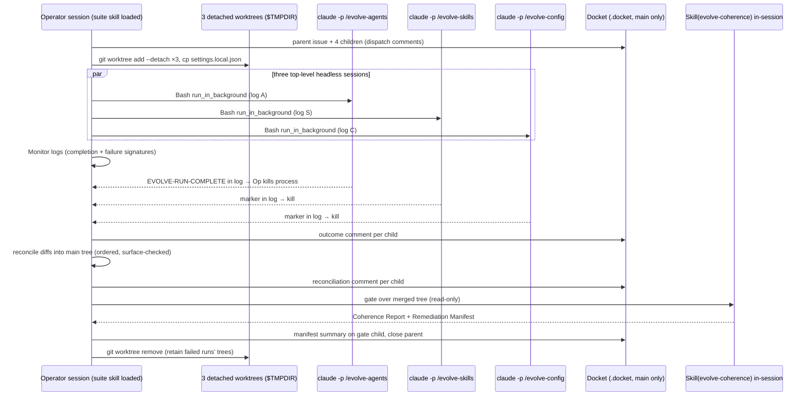

# Parallel Evolution Orchestrator Skill (`evolve-suite`)

## Problem Statement

The repo carries four evolution skills under `.claude/skills/`: `evolve-agents`, `evolve-skills`, `evolve-config` (each a full multi-agent self-review cycle that edits its target surface), and `evolve-coherence` (report-and-route audit that never edits). Today the operator runs them one at a time, serially, in separate sessions. A full evolution pass costs four sequential orchestrations and leaves coherence verification to operator discipline.

**Goal (verified by team-lead, settled dimensions closed by operator):** one new orchestrator skill, invocable via `Skill()`, that

1. runs `evolve-agents`, `evolve-skills`, and `evolve-config` **in parallel**, each with multi-agent isolation that Claude Code actually supports;
2. runs `evolve-coherence` **after** all three complete, as a verification/routing gate over their combined output;
3. tracks each sub-run's dispatch, outcome, and reconciliation in **Docket** issues;
4. commits nothing.

**Who is affected:** the operator (single entry point for a full evolution pass), the agent/skill/config genomes (now evolved in one cycle), and future evolve-coherence cycles (the new skill becomes an audit target).

**Constraints (all verified this session — citations in Context & Prior Art):**

- Each of the three parallel targets is itself an orchestrator requiring `TeamCreate` + `Agent` (frontmatter `allowed-tools`, e.g. `.claude/skills/evolve-agents/SKILL.md:10`).
- A Claude Code session can lead **one team at a time**, and **teammates cannot spawn their own teams or teammates** (platform limitations, agent-teams docs; mirrored by the `CANONICAL:BANNER` in every evolve skill and by `agents/team-lead.md:19`).
- The three targets have largely disjoint write surfaces but share: `.claude/agent-memory/*/pitfalls.md` (all spawned teammates append; evolve-agents Phase 3 may additionally compact), the Docket DB, and the `.claude/skills/` tree (evolve-skills' edit scope contains the other evolve skills' files and the new skill's own file).
- Scope (out): no redesign of the four existing evolve-* skills (wrap, don't change); no `agents/*.md` changes; no changes to non-evolve `skills/*`.

**Acceptance criteria (suite-level, from the approved brief):**

- AC1 — A skill directory `.claude/skills/evolve-suite/` exists with a `SKILL.md` whose `name:` matches the directory, with trigger phrases, invocable via `Skill(evolve-suite)`.
- AC2 — The skill dispatches the three evolve skills concurrently to isolated top-level sessions (one per skill, each in its own git worktree) with no working-tree write collisions in the main checkout.
- AC3 — `evolve-coherence` runs after all three complete, against the merged main tree, per its report-and-route contract (no edits by the gate).
- AC4 — Docket issues track dispatch, outcome, and reconciliation per sub-run (parent + per-run children + gate child, comment protocol below).
- AC5 — The workflow commits nothing: no `git add`/`commit`/`push` in any session; worktrees are detached (no branches created); cleanup leaves no refs; post-run `git worktree list` shows no remaining suite worktrees (failure-retained trees are the named exception, enumerated in the wrap-up report with their cleanup commands).

## Context & Prior Art

**In-repo.** All four evolve skills were Read in full this session. Load-bearing facts:

- `.claude/skills/evolve-agents/SKILL.md:14` (and byte-identical siblings): *"Teammates MUST NOT spawn sub-agents, invoke `/vote`, or use `Skill()`, `Agent()`, or `TeamCreate` — delegate to the orchestrator."* A teammate therefore cannot host an evolve cycle.
- `.claude/skills/evolve-agents/SKILL.md:73` (and siblings): pre-flight goal gate — *"Team mode: adopt the verified goal from the orchestrator prompt"*; scope gate at `:81` — *"Team mode: skip — orchestrator already verified scope."* Sub-runs can be driven non-interactively if the dispatching prompt supplies the verified goal and experience feedback.
- `.claude/skills/evolve-agents/SKILL.md:40` (Scientific Trial Protocol, identical in siblings): an unapproved trial/drift item *"is recorded as `Trial: <hypothesis> → proposed` … and NOT implemented."* This is the documented degradation path when the operator-approval `AskUserQuestion` gate cannot fire — exactly the headless case.
- `.claude/skills/evolve-coherence/SKILL.md:23`: *"REPORT + ROUTE ONLY … NEVER edits any agent or skill file."* Safe to run against the merged main tree directly.
- `agents/team-lead.md:209`: `TeamCreate` errors `Already leading team "<prior-name>"` — empirical confirmation of the one-team-per-session constraint.
- `src/user.rs:106`: `.with_env("CLAUDE_CODE_EXPERIMENTAL_AGENT_TEAMS", "1")` — agent teams are enabled at user scope by the deployed config, so worktree sessions inherit it.
- `git check-ignore .docket` → ignored; `docket config` → DB at `<repo>/.docket/issues.db`. Worktrees contain **no Docket DB**; the suite's Docket tracking lives only in the main checkout, eliminating DB write contention by construction.
- `git ls-files .claude` → `.claude/skills/**` and `.claude/agent-memory/**` are tracked (present in worktrees); `.claude/settings.local.json` is untracked (worktrees lack the per-project WebFetch grants the evolve pre-flights rely on, e.g. `.claude/skills/evolve-agents/SKILL.md:87`) — the suite must copy it into each worktree.
- `git check-ignore .claude/worktrees` → not ignored, and the `CANONICAL:HARVEST` scan (`find "$HOME/Development" … -path '*/.claude/agent-memory/*/pitfalls.md'`) would discover in-repo worktree copies — so worktrees must live **outside** `~/Development` (under `$TMPDIR`).

**Platform (fetched 2026-06-11, code.claude.com/docs/en/agent-teams).** Verbatim: *"One team at a time: a lead can only manage one team"*; *"No nested teams: teammates cannot spawn their own teams or teammates"*; and the docs explicitly bless manual parallelism: *"Manual parallel sessions: Git worktrees let you run multiple Claude Code sessions yourself without automated team coordination."*

**CLI (verified via `claude --help` on the installed binary).** `-p/--print` non-interactive mode; `--permission-mode` (`acceptEdits`, `bypassPermissions`, `dontAsk`, …); `--output-format stream-json`; `--append-system-prompt`; `--bare` help text states *"Skills still resolve via /skill-name"* (evidence that slash-skill invocation works in print mode; end-to-end confirmation is Phase 1's smoke test, not assumed). A native `-w/--worktree` flag exists; the design uses explicit `git worktree add --detach` instead, for deterministic paths, `$TMPDIR` placement, and no-ref cleanup.

## Alternatives Considered

### A. In-session sequential `Skill()` invocation

The calling session invokes the four skills one after another. **Strengths:** simplest; full interactivity (every `AskUserQuestion` gate works); no reconciliation. **Weaknesses:** fails the parallelism requirement outright — a session leads one team at a time (`agents/team-lead.md:209`; agent-teams limitations) and executes one orchestration at a time regardless. **Verdict: rejected** (violates a closed dimension).

### B. Background `Agent()` teammates each invoking one evolve skill

The suite spawns three teammates/subagents whose prompts invoke `Skill(evolve-agents)` etc. **Strengths:** stays inside one session; native Monitor/task plumbing. **Weaknesses:** infeasible twice over — platform (*"teammates cannot spawn their own teams or teammates"*) and project policy (`CANONICAL:BANNER`: teammates must not use `Skill()`, `Agent()`, or `TeamCreate`). Each evolve skill requires its own team; a teammate cannot host one. **Verdict: rejected** (infeasible on the platform; forbidden by policy).

### C. Shared main tree with strict file-partition contracts (no worktrees)

Run three headless sessions concurrently in the main checkout, relying on disjoint write surfaces. **Strengths:** no merge step; no worktree plumbing. **Weaknesses:** the shared surfaces are real — concurrent appends to the same `.claude/agent-memory/*/pitfalls.md` race and lose updates; Phase 2 of each cycle may legitimately reach across boundaries (rename reference updates are scoped to `agents/`, `skills/`, **and** `.claude/skills/` in both evolve-agents `:162` and evolve-skills `:179`); evolve-skills edits `.claude/skills/*` while siblings execute from it; a failed run leaves no rollback unit (partial edits interleaved with healthy runs' edits in one tree). **Verdict: rejected** (unsound shared-surface semantics; no per-run rollback).

### D. Three headless top-level sessions in detached git worktrees, diff-based reconciliation, in-session coherence gate (chosen)

The suite skill loads into the calling top-level session, which: creates three detached worktrees under `$TMPDIR`; launches three `claude -p "/evolve-<x> …"` background processes (each a full top-level session — it may `TeamCreate` freely); monitors logs; reconciles each worktree's uncommitted diff back into the main tree under a write-surface contract; then invokes `Skill(evolve-coherence)` in-session over the merged tree. **Strengths:** genuine parallelism with process-level + filesystem-level isolation; each sub-run is a normal evolve cycle in "team mode" (goal supplied via prompt); per-run rollback unit (discard a worktree); zero Docket contention (`.docket` ignored → absent in worktrees); the docs-blessed "manual parallel sessions via worktrees" pattern. **Weaknesses:** headless sub-runs lose `AskUserQuestion` (mitigated by the skills' own documented degradation: unapproved trials/drift recorded as `proposed`); a reconciliation step exists and must handle the pitfalls append surface; orchestrating session burns context monitoring three runs (mitigated by Monitor filters and ranged log reads). **Verdict: chosen.**

## Architecture & System Design

One new project-local skill: `.claude/skills/evolve-suite/SKILL.md` (single file; no supporting files needed — all logic is orchestration prose + Bash templates). Name `evolve-suite`; trigger phrases: "evolve suite", "run the evolution suite", "evolve everything", "full evolution cycle". Frontmatter `allowed-tools`: `Bash, Read, Write, Edit, Glob, Grep, Monitor, AskUserQuestion, Skill` — **no** `Agent`/`TeamCreate`/`SendMessage` in the allow list, and deliberately **no `disallowed-tools` line**: a `disallowed-tools` hard-removal risks persisting into the nested `Skill(evolve-coherence)` invocation, which needs `Agent`/`TeamCreate`/`SendMessage` for its own team (DKT-288 review round, Concern 2 — this TDD originally prescribed the line and the C2 decision reversed it). The no-teammates constraint is carried at prose level (skill Rules: "Never `Agent()`/`TeamCreate` directly"); the Phase 3 supervised run is the live confirmation that the gate's tool pool is intact. It carries the orchestrator-family `CANONICAL:BANNER` byte-identical to evolve-agents/evolve-skills (the commit prohibition is load-bearing for AC5; the teammate clause binds the sub-runs' fleets transitively via the dispatch directive).



### Workflow phases

**Pre-flight (interactive — the operator is present in this session).**

1. Goal gate: standalone `AskUserQuestion` confirming scope (all three cycles + gate), `days=N`/`drift=N` passthrough, and the sub-run permission mode (default `acceptEdits`; `bypassPermissions` offered explicitly as the unattended fallback — see Risks R2). Gather `experience_feedback` once; it is forwarded verbatim to all three sub-runs (satisfying each cycle's pre-flight step 2 skip condition).
2. Clean-surface precondition: `git status --porcelain` over the union write surface (`agents/`, `skills/`, `.claude/skills/`, `.claude/agent-memory/`, `src/user.rs`, `src/user/`, `scripts`, `docs/changelog/` — the union of the write-surface table, including evolve-config's `scripts` entry; corrected during DKT-288 review to match the table). Worktrees branch from HEAD, so pre-existing uncommitted edits on those paths make reconciliation patches mis-apply. Dirty → `AskUserQuestion` (proceed anyway / abort).
3. Probes: `claude --version`; `ls .claude/skills/evolve-{agents,skills,config,coherence}/SKILL.md`; Docket reachable (`docket stats`). Any failure → abort loudly.

**Dispatch.** For each of the three runs (`agents`, `skills`, `config`):

- `git worktree add --detach "$WT_ROOT/evolve-<name>" HEAD` where `WT_ROOT="${TMPDIR:-/tmp}/evolve-suite-<date>"`. Detached → no branch refs created (AC5). `$TMPDIR` placement keeps worktree pitfalls copies out of the `CANONICAL:HARVEST` find scan's `~/Development` root.
- Then — strictly after the worktree exists — `mkdir -p "$WT/.claude" && cp .claude/settings.local.json "$WT/.claude/"` (per-project WebFetch grants for the Phase 0 docs-researchers). The `mkdir -p` is a guard: `.claude/` is present in the worktree today only because tracked content lives under it; the guard keeps the copy correct if that tracked set ever changes.
- Launch via Bash `run_in_background`:

```bash
cd "$WT" && claude -p "/evolve-<name> days=<N> drift=<N>" \
  --permission-mode <mode> --output-format stream-json --verbose \
  --append-system-prompt "$SUITE_DIRECTIVE" > "$WT_ROOT/<name>.log" 2>&1
```

- `--verbose` is REQUIRED, not provisional: the CLI hard-errors on `--output-format stream-json` under `-p` without it (measured — DKT-287 go/no-go note, deviation D1).
- Docket: one dispatch comment on the PARENT issue first, recording `$WT_ROOT` (post-crash cleanup is Docket-discoverable from that single comment); then per run: child issue moved `in-progress`, dispatch comment (worktree path, log path, args, permission mode).

**The suite directive** (`--append-system-prompt`, identical skeleton per run, name substituted) carries five clauses:

1. *Team mode:* "Verified goal: <forwarded goal>. Experience feedback: <forwarded>. Adopt per your pre-flight team-mode branches; scope gates are pre-verified."
2. *Headless degradation:* "AskUserQuestion is unavailable in this run. Every Scientific-Trial and drift item follows your documented unapproved path: record as `proposed`, do NOT implement. Ordinary Content-Gate-passing Phase 1/2 changes apply normally."
3. *Write-surface contract:* "Apply edits ONLY within your primary surface (enumerated per run — see Data Models). Any Phase 2 fix or rename-reference update that would touch a file outside it: do NOT apply; emit a `DEFERRED-PARITY: <file> — <OLD→NEW one-liner>` line in your final report instead."
4. *No Docket:* "This worktree has no Docket DB. Do not `docket init`. Where your skill delegates Docket issue creation, emit `TRACKING-NEEDED: <one-line lesson>` in your final report instead."
5. *Completion marker:* "End your final message with `EVOLVE-RUN-COMPLETE: <name> status=<ok|partial|failed>` plus a ≤10-line summary."

This wraps the existing skills without editing them: every clause lands on a branch the skills already define (team-mode adoption, unapproved-trial path, Phase 2 deferral idiom, PM-delegation point, wrap-up report).

**Monitoring & termination semantics (measured — DKT-287 go/no-go note, deviation D3).** Team-spawning headless sub-runs do NOT self-terminate: the session deadlocks awaiting shutdown confirmation and `TeamDelete` fails on active members. **Cap-and-kill is therefore the MANDATORY, expected terminal state for every run — and process exit code carries no signal in either direction (exit 0 is not a pass).** One Monitor tails all three logs for actionable signatures only: `EVOLVE-RUN-COMPLETE|Already leading team|is_error.:true.*(team|spawn)|rate limit|credit|EPERM|Operation not permitted`. Completion = the `EVOLVE-RUN-COMPLETE` marker (with final report) appearing in a log → the orchestrator kills that process and judges the run from log tail + worktree state. The per-run wall-clock cap (default 60 min) is the failure boundary only for runs whose marker has NOT appeared: capped-without-marker = failed. **Rate-limit policy (decided): full-parallel-or-fail.** When the Monitor surfaces a rate-limit/credit signature, the suite does NOT stagger or re-dispatch mid-flight — mid-flight topology changes are a flip-flop hazard and the affected run's state is unknowable from outside. The run fails per the standard path (worktree retained), and the wrap-up names the standalone re-run command (`/evolve-<name>` in a normal session) as the fallback; persistent rate-limiting across cycles argues for `skip=`-narrowed passes, not suite-internal staggering. The orchestrator does not stream raw logs into context (R1) — on completion it reads only the tail (final report + marker) of each log.

**Reconciliation (sequential, after all three terminate).** Per run, in fixed order `agents → skills → config` (evolve-agents first because its Phase 3 may compact pitfalls files; appends from the other runs then layer on top):

1. `git -C "$WT" status --porcelain` → modified + untracked sets.
2. **Surface check:** every path must fall in that run's declared primary surface (table in Data Models). A path under a declared surface whose directory does not yet exist in the main tree is **valid-to-create**, not out-of-surface — `docs/changelog/config/` is the live example (evolve-config's pre-flight step 5 anticipates the first cycle creating it). Out-of-surface paths are quarantined — not applied, posted to the child issue, surfaced to the operator.
3. **Cross-run intersection check:** pairwise-intersect the three changed-path sets. The only permitted shared class is `.claude/agent-memory/*/pitfalls.md`. Any other overlap → halt reconciliation for the affected paths, `AskUserQuestion` with both diffs. This check is the **structural backstop** for the `.claude/skills/` tree in particular: even if a sub-run ignores directive clause 3 (e.g. evolve-config edits its own SKILL.md while evolve-skills edits the same file), the overlap is caught here independent of prompt compliance.
4. **Atomicity pre-pass, then apply.** Reconciling one run is three non-atomic operations (tracked apply, pitfalls merge, untracked copy) — so before applying ANYTHING from a run, pipe its full tracked diff (`git -C "$WT" diff HEAD`) through `git apply --check` executed from the main repo root; a failed check fails the whole run (nothing applied, worktree retained). Then apply tracked modifications via `git -C "$WT" diff HEAD -- <non-pitfalls paths> | git apply`, also executed **from the main repo root**, with git-native `a/`/`b/` path prefixes at the default `-p1` strip level (no `--directory` remapping). **`diff HEAD`, never plain `diff` (measured — DKT-287, deviation D2):** plain `git diff` is unstaged-only, and `git mv` stages the rename, so a plain diff silently drops rename hunks. Copy untracked files (`mkdir -p` + `cp`), creating valid-to-create surface directories as needed.
5. **Pitfalls merge:** for each touched `pitfalls.md`, attempt `git apply` of the per-file `git -C "$WT" diff HEAD -- <file>` (same `diff HEAD` rule as step 4); on context failure (a sibling run already appended), fall back to appending the diff's added lines. The append-only assumption is grounded twice: the agent-side contract (`CANONICAL:PITFALLS`, e.g. `agents/senior-engineer.md:337`: *"ALWAYS APPEND a new entry rather than overwriting, never edit or remove prior entries"*) and the skill-side bound — evolve-skills and evolve-config orchestrators never touch pitfalls at all (*"no pitfalls arm; this phase never touches any `pitfalls.md`"*, `evolve-skills/SKILL.md:186`, `evolve-config/SKILL.md:196`). A pitfalls diff containing non-append hunks from any run other than evolve-agents (sole compaction authority, ADR 0001) is therefore a contract violation → quarantine + operator.
6. Post reconciliation comment (applied paths, quarantined paths, pitfalls merge mode) on the child issue; close the child on success. **Legitimate no-op:** an `EVOLVE-RUN-COMPLETE … status=ok` marker + empty `git -C "$WT" status --porcelain` is a clean no-op cycle (exit code is not part of the test — runs are cap-and-killed by design) — the skills explicitly permit "report honestly if no improvements found" — close the child with outcome `no-op`; nothing to apply, not a failure.
7. Failed run (marker never appeared before the wall-clock cap, CLI crash, or failed `--check` pre-pass): child issue stays open with a `FAILED: <reason> log=<path>` comment; its worktree is **retained** for forensics; its diff is not applied.

**Gate.** If ≥1 run reconciled successfully, invoke `Skill(evolve-coherence)` **in-session** over the merged main tree (read-only by its No-Edit Guard; the session is team-free at this point, so its `TeamCreate` is legal). Collected `DEFERRED-PARITY` lines are passed as operator-reported-drift context. Its Coherence Report + Remediation Manifest land in-context; the manifest summary is posted to the gate child issue. Zero successful runs → skip the gate, mark the cycle failed. The gate is in-session rather than a fourth headless run because the operator is present (interactive pre-flight gates work) and the manifest must land in-context for routing; the cost is bounded because coherence is read-only and the suite reads sub-run logs only by tail.

**Wrap-up.** `git worktree remove` successful worktrees (`--force` is safe only after their diffs are applied; failed trees retained); `rm -rf` the empty `$WT_ROOT` when all retained trees are gone; close the parent issue with the cycle summary (per-run outcome, merged paths, proposals deferred, TRACKING-NEEDED items, manifest headline, "nothing committed — review with `git diff`").

### Spawn-topology legality (explicit)

The three sub-run processes are **not** teammates or subagents of the suite session — they are independent top-level Claude Code sessions started by Bash, the docs-blessed manual-parallel-sessions pattern. Each may create its own team (one each, in its own session). The suite session creates no team during dispatch/monitor/reconcile, so the gate's in-session `TeamCreate` does not collide with the one-team limit. No rule in `agents/team-lead.md` or the evolve banners constrains what a top-level session may launch via Bash; the banner's teammate prohibitions apply inside each sub-run's own team, where they already hold.

### Self-reference conflict policy

`evolve-suite` lives in `.claude/skills/` and is a normal future evolve-skills target (a genome like any other). During a suite run, the evolve-skills sub-run may edit `.claude/skills/evolve-suite/SKILL.md` **in its worktree**; the running suite instance is unaffected (the skill body was loaded into context at invocation) and the edit arrives via normal reconciliation. The suite never dispatches itself (its directive does not include `evolve-suite` as a sub-run), so there is no recursion. evolve-coherence's D4 family rule may flag the new skill's orchestrator-family banner as an unenumerated carrier on its first post-ship cycle; that is expected first-cycle behavior and routes to evolve-skills via the Remediation Manifest (in-band self-healing) — editing evolve-coherence's rubric is out of scope here.

## Data Models & Storage

No persistent data plane beyond Docket and log files. Three conventions:

**Write-surface table (the suite's enforcement input — derived from each skill's DOCS-PATHS-LOCAL block plus pitfalls/compaction prose):**

| Run | Primary surface (apply) | Shared (merge per pitfalls rule) |
|---|---|---|
| evolve-agents | `agents/*.md`, `docs/changelog/agents/` | `.claude/agent-memory/*/pitfalls.md` (teammate appends + sole compaction authority) |
| evolve-skills | `skills/`, `.claude/skills/`, `docs/changelog/skills/` | `.claude/agent-memory/*/pitfalls.md` (teammate appends only) |
| evolve-config | `src/user.rs`, `src/user/`, `scripts`, `.claude/skills/evolve-config/SKILL.md` (own CANONICAL blocks — overlaps evolve-skills' surface, so these specific edits are DEFERRED-PARITY by clause 3), `docs/changelog/config/` | `.claude/agent-memory/*/pitfalls.md` (teammate appends only) |

The shared-column basis for evolve-skills and evolve-config is **not** an orchestrator pitfalls arm — both skills explicitly have none (*"no pitfalls arm; this phase never touches any `pitfalls.md`"*, `evolve-skills/SKILL.md:186`, `evolve-config/SKILL.md:196`). Their pitfalls writes come exclusively from spawned teammates' shutdown protocol: every agent definition carries `CANONICAL:PITFALLS` (e.g. `agents/senior-engineer.md:337`, `agents/staff-engineer.md:249`), and all three fleets spawn those roles. Only evolve-agents' row adds compaction, via its Phase 3 pitfalls arm (ADR 0001).

**Docket shape:** parent `evolve-suite cycle <date>` (label `evolve-suite`); children `evolve-suite: <name> run <date>` (`--parent`, labels `evolve-suite`, `run:<name>`) plus `evolve-suite: coherence gate <date>`. Comment protocol: `dispatched:`, `outcome:`, `reconciled:`/`FAILED:`, `TRACKING-NEEDED:` (one comment per harvested line), `manifest:` (gate child). Plain comments, no new `[ROLE→]` tag — the role-tag set is closed at seven (evolve-coherence D3 #3) and inventing an eighth would be flagged as drift. The suite creates these issues directly via the Docket CLI: the "PM is the only issue creator" rule binds role agents inside dev teams; the suite session spawns no team and has no PM to delegate to. This carve-out is documented in the skill prose so evolve-coherence D2 reads it as intentional.

**Run-state:** in-context table only (name, worktree, log, pid, status) — deliberately not written to disk; a crashed suite session is re-entrant via the Docket child issues (which record worktree + log paths).

## API Contracts

**Skill invocation:** `Skill(evolve-suite)` / `/evolve-suite [days=N] [drift=N] [skip=<name[,name]>]`. `days` (default 7, range 1..90) and `drift` pass through to all three sub-runs. `drift` defaults to **0** at the suite level — drift proposals require the interactive operator-approval HARD GATE, which headless runs cannot fire; a nonzero override flows through and lands as `Drift: … → proposed` changelog lines (the skills' documented unapproved path). `skip` excludes named sub-runs (the gate still runs over whatever merged); skipping all three is a usage error → pre-flight abort with a note to run `/evolve-coherence` directly instead. Unknown tokens → usage note + abort (matching the evolve-* idiom).

**Sub-run CLI contract:** the dispatch command shown in Architecture; prompt is exactly the slash invocation (no prose — keeps slash parsing unambiguous), directives ride `--append-system-prompt`. Output contract per run: stream-json log; final assistant message ends with `EVOLVE-RUN-COMPLETE: <name> status=<ok|partial|failed>`; optional `DEFERRED-PARITY:` / `TRACKING-NEEDED:` lines above it. Ground truth for outcome is the log tail (marker + final report) plus `git -C "$WT" status` / `diff HEAD` — never the process exit code: sub-runs are cap-and-killed by design (DKT-287, deviation D3 — team-spawning headless sessions do not self-terminate), so exit status carries no signal. A killed run whose worktree shows edits but whose log has no marker is `partial`, not failed.

## Migration & Rollout

**Current state:** four standalone evolve skills, operator-serialized. **Target state:** those four unchanged, plus `.claude/skills/evolve-suite/SKILL.md`. No data migration, no consumers to migrate — net-new skill. **Rollout:** Phase 1 smoke test validates the headless mechanics cheaply before the skill file exists; Phase 2 ships the skill; Phase 3 is a supervised first full run (operator present, watching Docket + logs). **Backward compatibility:** the four skills remain individually invocable exactly as today; the suite adds an entry point, changes nothing. **Rollback:** delete the `evolve-suite` directory; remove any leftover `$TMPDIR` worktrees via `git worktree prune` + `rm -rf`; no refs or commits exist to unwind (detached worktrees, AC5).

## Risks & Open Questions

| # | Risk | Likelihood | Impact | Mitigation |
|---|---|---|---|---|
| R1 | Slash-skill invocation or `--append-system-prompt` misbehaves under `-p` (help-text evidence, not end-to-end-verified) | Medium | High — sub-runs no-op | Phase 1 smoke test (read-only `/evolve-coherence d1` headless in a worktree) gates Phase 2; abort criteria defined there |
| R2 | `acceptEdits` insufficient for unattended sub-runs (Bash/WebFetch prompts auto-deny or stall headless) | Medium | High — stalled runs | User-scope settings carry the team's allow rules; `settings.local.json` copied in; smoke test measures BOTH paths (read-only d1 run + one-file write probe); pre-flight offers `bypassPermissions` as explicit operator-approved fallback |
| R3 | Reconciliation conflict outside the pitfalls whitelist | Low (surfaces disjoint by contract + directive clause 3) | Medium | Pairwise intersection check + quarantine + operator dialog; per-run worktree is the rollback unit |
| R4 | Pitfalls merge corruption (non-append hunk from a non-evolve-agents run) | Low | Medium | Hunk-shape check before merge; quarantine on violation; evolve-agents-first apply order |
| R5 | Orchestrating-session context saturation across 3 monitors + gate | Medium | Medium | Filtered Monitor signatures only; tail-only log reads; gate is the session's single team |
| R6 | Cost: three full multi-agent cycles + gate in one pass | High (by design) | Low–Medium | Pre-flight scope gate states the weight before commit; `skip=` arg narrows a pass |
| R7 | Sub-run ignores a directive clause (writes out-of-surface, inits Docket) | Low | Medium | Reconciliation surface check catches writes regardless of compliance; worktree has no `.docket` to corrupt; `TRACKING-NEEDED` loss is bounded to one run's report |

**Open questions — all resolved for this draft (operator-overridable at the suite's own pre-flight, so none block the vote):**

1. *Permission mode default?* Resolved: `acceptEdits`, with `bypassPermissions` as an explicit pre-flight option (R2).
2. *Drift default for headless sub-runs?* Resolved: `drift=0` (rationale in API Contracts).
3. *Gate in-session vs fourth headless run?* Resolved: in-session (operator interactivity + in-context manifest; rationale in Architecture). A future cycle may revisit if saturation (R5) is observed.
4. *Worktree placement?* Resolved: `$TMPDIR` (verified: `.claude/worktrees` is not gitignored, and in-repo placement contaminates the HARVEST find scan).

## Testing Strategy

- **Phase 1 smoke test (pre-implementation, cheap, read-only):** from the main checkout, create one detached `$TMPDIR` worktree, copy `settings.local.json`, run `claude -p "/evolve-coherence d1" --permission-mode acceptEdits --output-format stream-json --verbose --append-system-prompt "<2-line team-mode goal>" > log`. Pass criteria (as measured — DKT-287): log tail shows the skill executed (TeamCreate + final report) and `git -C "$WT" status --porcelain` is empty (read-only skill) — NOT exit code: the team-spawning run must be cap-and-killed (deviation D3); no team residue in the main session. **Plus a minimal write probe** (accepted from secondary review): a second headless invocation in the same worktree — `claude -p "Use the Write tool to create smoke-probe.txt containing ok" --permission-mode acceptEdits` — passing when the file exists afterward. This retires the edit-path half of R2 before Phase 3; the d1 run itself already evidences the read-only Bash permission path. Fail (either part) → R1/R2 abort criteria fire and the design returns for revision before any skill file is written.
- **Reconciliation rehearsal (no Claude involved):** synthesize edits in a scratch worktree (modify one `agents/*.md` line, add an untracked changelog file, append a pitfalls entry, **and `git mv` one file** — evolve cycles legitimately rename, so the rehearsal must prove the diff-apply path handles rename hunks), run the documented reconcile commands against a scratch clone, assert byte-equal results, including the append-fallback path with a pre-existing conflicting append. The rehearsal validates **this TDD's specified command sequence verbatim**; any deviation discovered (flag, ordering, strip level) feeds back into Phase 2 authoring — the skill ships the rehearsed sequence, never this TDD's unexecuted draft.
- **AC verification (per-AC, static):** AC1 — `ls .claude/skills/evolve-suite/SKILL.md` + `grep -E '^name: evolve-suite' .claude/skills/evolve-suite/SKILL.md`; AC2/AC3/AC4 — structural greps per Phase 2's ACs plus the Phase 3 supervised run's observed behavior; AC5 — after the supervised run: `git log --oneline -1` unchanged from pre-run HEAD, `git branch --list 'evolve*'` empty, `git worktree list` shows only the main checkout (or only named failure-retained trees), `git status` shows only the expected merged modifications.
- **Untested-claims inventory (explicit):** (a) slash-in-print + append-system-prompt composition — measured green in DKT-287's smoke run; (b) `acceptEdits` sufficiency for a full editing cycle — the smoke test's write probe covers the single-file Write path and the d1 run covers read-only Bash; the supervised Phase 3 run remains the first full-cycle (multi-tool, team-spawning) evidence; (c) stream-json terminal-event shape — irrelevant by design: outcome keys off the log-tail marker + worktree state, and process exit was retired as a signal entirely (DKT-287, deviation D3: cap-and-kill is the expected terminal state).

## Observability & Operational Readiness

Per-run stream-json logs at `$WT_ROOT/<name>.log` (paths recorded in Docket dispatch comments — a crashed suite session or a 3am debugger recovers everything from the child issues alone). Monitor emits only actionable signatures (completion markers + the failure alternation). Docket is the durable audit trail: dispatch → outcome → reconciliation per child, manifest on the gate child, cycle summary on the parent. Failed runs retain their worktrees and logs; the wrap-up report names the retained paths and the cleanup commands (`git worktree remove <path>` then `git worktree prune`). Runbook lives in the skill's own failure-handling section: per-failure-class (timeout, permission stall, **exit non-zero with empty log** — the CLI crashed before the session started (bad flag, auth, environment); a crashed run is not a clean no-op and its child issue is marked `FAILED:` with the exact command line for manual replay — reconcile quarantine, gate abort) with the exact recovery command. Two named recovery procedures: **partial-apply rollback** — if reconciliation of one run fails mid-way despite the `--check` pre-pass, `git checkout -- <applied-paths>` using the applied-paths list from that run's reconciliation comment (the comment is written incrementally for exactly this reason); **crash re-entry** — a new session recovers the whole cycle from Docket alone: parent dispatch comment → `$WT_ROOT`, `git worktree list` → surviving trees, child comments → which runs reconciled; resume reconciliation for unapplied trees or clean up. Nothing is committed at any point, so operator recovery is always `git diff` review + selective `git checkout --` at worst.

## Implementation Phases

**Phase 1 — Headless mechanics smoke test.** Goal: prove the dispatch primitive before writing the skill. Files: none in-repo (scratch `$TMPDIR` only; results as Docket comments on the phase's issue). ACs: (a) smoke-test command from Testing Strategy exits 0 with skill-execution evidence in the log; (b) worktree porcelain-clean after the d1 run; (c) the write probe creates `smoke-probe.txt` in the worktree under `acceptEdits` (retires R2's edit-path half); (d) reconciliation rehearsal asserts byte-equal apply including the pitfalls append-fallback AND a rename (`git mv`) hunk; (e) a written go/no-go note citing the measured permission mode, recording whether `--verbose` was required for stream-json (verify-or-drop per the dispatch template), and enumerating any deviation between the rehearsed command sequence and this TDD's draft (deviations bind Phase 2 — the skill ships the rehearsed sequence). Effort: S. Dependencies: none. Out of scope: any edit to any tracked file. **Executed: GO** (DKT-287 closed; go/no-go note on the issue is the measurement source). Measured deviations D1 (`--verbose` required), D2 (`git diff HEAD`, not plain `diff`), and D3 (cap-and-kill terminal state; exit-0 not a pass signal) are folded into the sections above and supersede this phase's original exit-0 AC phrasing.

**Phase 2 — Author `.claude/skills/evolve-suite/SKILL.md`.** Goal: ship the skill per this TDD. Files: `.claude/skills/evolve-suite/SKILL.md` (new; sole file). ACs (run each grep against the named file; expected hit count 1 unless stated): (a) `grep -c '^name: evolve-suite' .claude/skills/evolve-suite/SKILL.md` = 1; (b) `grep -c 'CRITICAL — applies to orchestrator AND every spawned teammate' .claude/skills/evolve-suite/SKILL.md` = 1 and the banner body is byte-identical to evolve-agents' (compare via the D4 strip/hash method); (c) `grep -cE 'EVOLVE-RUN-COMPLETE|DEFERRED-PARITY|TRACKING-NEEDED' .claude/skills/evolve-suite/SKILL.md` ≥ 3 (all three markers defined); (d) `grep -c 'worktree add --detach' .claude/skills/evolve-suite/SKILL.md` ≥ 1; (e) `grep -cE 'Trigger: .*evolve suite' .claude/skills/evolve-suite/SKILL.md` = 1; (f) `wc -l` ≤ 500 — budget arithmetic: frontmatter+banner ~20, overview+args ~35, pre-flight ~45, dispatch+directive template ~90, monitoring ~30, reconciliation ~80, gate+wrap-up ~45, Docket protocol ~35, failure runbook ~50, rules ~15 → ~445 estimated; the post-authoring `wc -l` is the only budget truth and is this AC; (g) `grep -c 'docket issue create' .claude/skills/evolve-suite/SKILL.md` ≥ 1 with the PM-carve-out sentence present (`grep -c 'spawns no team'` ≥ 1). Effort: M. Dependencies: Phase 1 go. Out of scope: edits to the four existing evolve skills, `agents/*.md`, `skills/*`.

**Phase 3 — Supervised first run.** Goal: one full suite execution with the operator present; first full-cycle evidence for AC2–AC5. Files: whatever the cycle legitimately evolves (not pre-enumerable; bounded by the write-surface table). ACs: (a) three child issues show dispatch→outcome→reconciled comment chains; (b) zero quarantined paths, or each quarantine resolved via the documented dialog; (c) gate ran and its manifest is on the gate child; (d) `git log` head unchanged and `git branch --list 'evolve*'` empty post-run (AC5); (e) wrap-up report delivered. Effort: M (mostly wall-clock + tokens). Dependencies: Phase 2. **Escalation rule:** a headless `TeamCreate`/spawn failure at this phase — despite a Phase 1 pass — invalidates the architecture (Alternative D's core premise), not merely the skill text; route back to TDD revision, do not patch the skill around it. Out of scope: acting on the Remediation Manifest (that is the operator's routed follow-up, per evolve-coherence's contract).
