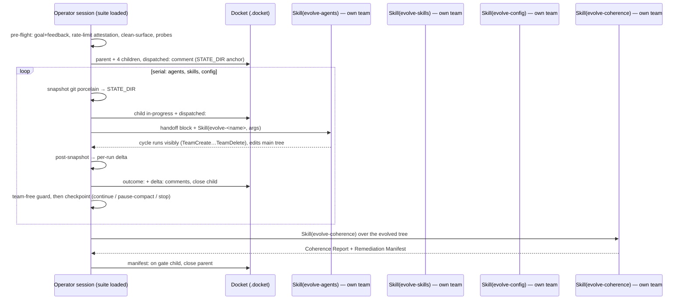

# Evolution Suite Orchestrator Skill (`evolve-suite`) — Rev 2: Serial In-Session

> **Revision provenance.** Rev 1 (parallel headless-worktree dispatch) was accepted, shipped at `9aec11d`, and executed once on 2026-06-11. The operator aborted that first cycle mid-flight: the parallel run hit 93% seven-day rate-limit utilization (`allowed_warning` events in all three log tails) before any sub-run produced a single diff — zero edits reconcilable, three worktrees discarded (DKT-295/296/297/298). Operator directive 2026-06-11 (closed decision — recorded on DKT-295: *"rework evolve-suite to SERIAL native-team mode (in-session, no headless processes) — supersedes the parallel-dispatch architecture"*): the suite must run the evolution skills serially in the operator's own session using native Claude Code agent teams, each with its full team lifecycle visible, replacing opaque background processes. Rev 1's architecture is preserved below as superseded Alternative D, including its three measured deviations (D1–D3), because that evidence remains load-bearing for any future headless path.

## Problem Statement

The repo carries four evolution skills under `.claude/skills/`: `evolve-agents`, `evolve-skills`, `evolve-config` (each a full multi-agent self-review cycle that edits its target surface), and `evolve-coherence` (report-and-route audit that never edits). Rev 1 gave the operator a single entry point that dispatched the three editing cycles as parallel headless processes in isolated worktrees. That design's first execution demonstrated its two structural costs: the runs were invisible (opaque logs, no interactive gates — every trial/drift item degraded to `proposed`), and three concurrent full cycles burn the shared rate-limit budget ~3x faster than the operator can react (93% utilization before first diff, DKT-296/297/298).

**Goal (operator directive 2026-06-11, closed):** rework the `evolve-suite` skill so that one invocation runs the evolution suite **serially in the operator's session** using native agent teams:

1. `evolve-agents`, then `evolve-skills`, then `evolve-config` — each invoked in-session via `Skill()`, each creating and deleting its own team with the full lifecycle visible to the operator, in that fixed order;
2. `evolve-coherence` after them, in-session, as the verification/routing gate (unchanged from Rev 1);
3. Docket tracking retained: parent + per-run children + gate child;
4. commits nothing;
5. no worktrees and no diff-reconciliation: serial execution means the skills edit the main tree directly under their own contracts — no write collisions by construction.

**Who is affected:** the operator (visible, steerable evolution pass; interactive HARD GATEs now fire, so trials/drift get live approval instead of degrading to `proposed`), the three genomes, and future evolve-coherence cycles.

**Closed dimensions (operator, 2026-06-11 — do not reopen):** serial in-session native-team execution REPLACES parallel headless dispatch as the execution path; order agents → skills → config → gate; Docket tracking retained; commit prohibition unchanged; no worktrees / no reconciliation in the serial path; the parallel architecture survives only as a superseded alternative here.

**Constraints (verified this session):**

- One team per session; teammates cannot spawn teams (platform limitations re-verified Rev 1; `agents/team-lead.md:209` "Already leading team" error class). Serial is what makes native teams legal: each evolve skill TeamCreates at cycle start and TeamDeletes at wrap-up (`evolve-agents/SKILL.md:117`/`:184`, `evolve-skills/SKILL.md:119`/`:196`, `evolve-config/SKILL.md:134`/`:206`, `evolve-coherence/SKILL.md:143`/`:179`), so the session is team-free between runs **iff** each run completes its wrap-up.
- No programmatic rate-limit probe exists: `claude --help` (2.1.174) lists no `usage` subcommand; `claude usage --help` falls through to general help. Rate-limit pre-flight must be operator-attested.
- The four evolve skills are wrapped, not edited (scope-out unchanged from Rev 1): no changes to their files, to `agents/*.md`, or to non-evolve `skills/*`.

**Acceptance criteria (suite-level):**

- AC1 — `.claude/skills/evolve-suite/SKILL.md` exists, `name:` matches directory, trigger phrases present, invocable via `Skill(evolve-suite)`.
- AC2 — The skill runs the three evolve skills serially in-session via nested `Skill()` in the order agents → skills → config, each with its own full team lifecycle (TeamCreate → teammates → TeamDelete) visible in the operator's session. Zero headless machinery: no `claude -p`, no worktrees, no stream-json logs, no pid files anywhere in the skill body.
- AC3 — `evolve-coherence` runs after the editing runs, in-session, per its report-and-route contract (no edits by the gate), if ≥1 editing run completed.
- AC4 — Docket issues track the cycle: parent + per-run children + gate child, with dispatch/outcome/delta comments per the protocol below.
- AC5 — The workflow commits nothing: no `git add`/`commit`/`push` in the session; no branches or worktrees created; post-run `git status` shows only the cycles' legitimate uncommitted edits.
- AC6 — The skill carries a rate-limit pre-flight attestation gate, between-run checkpoints, and a `skip=`-based resume contract so partial cycles are clean by construction.

## Context & Prior Art

**In-repo, verified this session (2026-06-11):**

- All four evolve skills Read/grepped this session. Team lifecycle: deterministic team names `evolve-<name>-{today_date}` with `TeamDelete` mandated at wrap-up (line cites above) — the serial design's between-run team-free invariant rests on these wrap-up steps.
- Team-mode branches exist in every evolve skill's pre-flight: goal gate *"Team mode: adopt the verified goal from the orchestrator prompt"* (`evolve-agents/SKILL.md:73`), feedback *"Skip if orchestrator prompt already includes experience_feedback"* (`:74`), scope gate *"Team mode: skip — orchestrator already verified scope"* (`:81`). In serial nesting the suite's pre-flight answers live in the same session context; the suite restates them in a handoff block immediately before each `Skill()` call so these skip-conditions fire.
- Docket DB lives at `<repo>/.docket/issues.db` in the main checkout — in serial mode every run executes in the main checkout, so Rev 1's "worktree has no Docket" directive clause is obsolete; the skills' native Docket access just works.
- The aborted Rev 1 cycle (DKT-295 parent; DKT-296/297/298 children): all three sub-runs killed at 93% seven-day utilization, *"zero diffs in worktree at kill time — nothing reconcilable"*. One harvested operator request (DKT-295 TRACKING-NEEDED): `claude -n/--name` exists in 2.1.174 for session identification, `--bg` does not — relevant only to a future headless path; recorded with Alternative D.
- DKT-287 (Rev 1 Phase 1, closed GO) measured deviations D1–D3 — preserved under Alternative D below.
- `Skill()`-from-loaded-skill is the established in-repo pattern (every agent definition invokes `Skill(tdd)`, `Skill(code-review-verdict)`, etc. from its own loaded body; Rev 1's gate already prescribed in-session `Skill(evolve-coherence)`); a skill body is appended context, not a process boundary — nested invocation is the session calling the Skill tool.

**Platform (re-verified Rev 1, 2026-06-11, code.claude.com/docs/en/agent-teams):** *"One team at a time: a lead can only manage one team"*; *"No nested teams: teammates cannot spawn their own teams or teammates."* Both still hold and are what forces SERIAL for native-team execution.

## Alternatives Considered

### A. In-session serial `Skill()` invocation (chosen — Rev 2)

The suite skill loads into the operator's session and invokes the four evolve skills one after another; each creates/deletes its own native team. **Strengths:** full visibility (the operator watches every team lifecycle); every interactive HARD GATE fires (trials/drift get live approval — Rev 1's headless-degradation clause and `drift=0` override both die); no worktrees, no reconciliation, no permission-mode machinery; partial cycles are clean by construction (each run fully lands before the next starts); natural stopping points between runs for rate-limit and context management. **Weaknesses:** no parallelism (wall-clock = sum of cycles — acceptable: the parallel speedup was worthless when the rate-limit budget, not wall-clock, was the binding constraint, DKT-296/297/298); all four orchestrations share ONE session context window — context saturation becomes the central engineering risk (see Architecture); a mid-run failure leaves partial edits in the main tree with no worktree rollback unit (mitigated by per-run snapshot deltas). **Verdict: chosen** — Rev 1 rejected this alternative solely for violating the then-closed parallelism dimension; the operator directive reversed that dimension.

### B. Background `Agent()` teammates each invoking one evolve skill

Unchanged from Rev 1. Infeasible twice over: platform (*"teammates cannot spawn their own teams"*) and project policy (`CANONICAL:BANNER`: teammates must not use `Skill()`/`Agent()`/`TeamCreate`). **Verdict: rejected.**

### C. Shared main tree, parallel headless sessions, file-partition contracts

Unchanged from Rev 1: concurrent pitfalls appends race; cross-boundary Phase 2 edits; no per-run rollback unit. **Verdict: rejected.** (Note: serial Alternative A inherits the shared-tree property safely — the hazards were all concurrency hazards.)

### D. Parallel headless sessions in detached worktrees, diff reconciliation (Rev 1 — SUPERSEDED)

Chosen in Rev 1, shipped at `9aec11d`, executed once, aborted (provenance above). Superseded by operator directive, not by a design defect in its mechanics — its Phase 1 smoke (DKT-287) was a clean GO and its measured evidence is preserved here for any future headless path:

- **D1** — `--output-format stream-json` under `-p` hard-errors without `--verbose` (exit 1 before the skill runs, claude 2.1.174).
- **D2** — reconciliation diffs MUST use `git diff HEAD`, never plain `git diff`: `git mv` stages the rename and plain diff is unstaged-only, so rename hunks are silently dropped (measured with a literal probe).
- **D3** — team-spawning headless sub-runs do NOT self-terminate (they deadlock awaiting shutdown confirmation no headless party can deliver); cap-and-kill is the expected terminal state and process exit code carries no signal in either direction.
- Operational findings from the aborted run: pid-file kill + Docket-anchored crash re-entry worked as designed (all three runs killed cleanly, residue enumerated and removed); `claude -n/--name` exists for session naming; `--bg` does not exist in 2.1.174.

**Verdict: superseded** (retained as the documented fallback architecture if a future operator decision re-opens parallelism — e.g. when rate limits are not the binding constraint).

## Architecture & System Design

The skill remains one file, `.claude/skills/evolve-suite/SKILL.md`, rewritten in place. Frontmatter `allowed-tools`: `["Bash", "Read", "Glob", "Grep", "AskUserQuestion", "Skill", "SendMessage", "TeamDelete"]` — `Skill` is the execution primitive; `SendMessage` + `TeamDelete` exist solely for the leftover-team recovery guard (the suite never creates a team itself); deliberately still **no `disallowed-tools` line** (Rev 1's DKT-288 C2 decision now applies fourfold: all four nested skills need their own `Agent`/`TeamCreate`/`TeamDelete`/`SendMessage` pools intact). The orchestrator-family `CANONICAL:BANNER` is retained byte-identical (commit prohibition is AC5; the teammate clause binds each nested cycle's fleet, where it already holds natively).

### Workflow phases

**Pre-flight (interactive).**

1. **Goal gate (HARD GATE)** — `AskUserQuestion`: scope (which runs after `skip=`, plus the gate), `days`/`drift` passthrough, and the cycle-weight statement (three full multi-agent cycles + gate, serially, in this session). Gather `{experience_feedback}` once; restated in every run handoff.
2. **Rate-limit attestation (HARD GATE, new — evidence DKT-296/297/298).** No programmatic probe exists (verified: no `usage` subcommand in 2.1.174), so the operator attests current seven-day utilization from `/usage`: `<70%` → proceed; `70–85%` → warn, recommend a `skip=`-narrowed single-run pass, proceed only on explicit confirmation; `>85%` → the suite refuses the default full run (the aborted cycle started at ~93% and died before its first diff) and offers a single-run pass or abort. Re-attested at every between-run checkpoint.
3. **Clean-surface check** — `git status --porcelain` over the union surface (same path list as Rev 1). Purpose changed: no longer patch-apply correctness (no patches exist) but per-run delta attribution + final `git diff` review clarity. Dirty → `AskUserQuestion` (proceed / abort); proceeding means pre-existing edits will appear inside run-1's delta attribution, stated explicitly.
4. **Probes** — `ls` the four evolve SKILL.md files; `docket stats`. Any failure → abort loudly. (`claude --version` probe retired — no CLI dispatch.)
5. **Cycle identity** — `{today_date}`; `STATE_DIR="${TMPDIR:-/tmp}/evolve-suite-{today_date}"` for porcelain snapshots (the crash/compaction anchor, recorded on the parent issue).

**Run loop** (per non-skipped run, fixed order `agents → skills → config`):

1. **Pre-snapshot** — `git status --porcelain | sort > "$STATE_DIR/snap-pre-<name>.txt"`.
2. **Docket** — child → in-progress; `dispatched: run=<name> args=<args> snap=<path>`.
3. **Handoff block** — the suite states in its own turn, immediately before invocation: *"Verified goal for this run: <goal>. Experience feedback: <feedback>. Scope pre-verified at suite pre-flight."* This is the serial replacement for Rev 1's five-clause `--append-system-prompt` directive; clauses 2–5 (headless degradation, write-surface contract, no-Docket, completion marker) are all obsolete — interactive gates fire, the tree is shared legitimately, Docket is present, and `Skill()` returns in-context. The skills' team-mode skip-conditions are text conditions on context the handoff satisfies; if a skill fires its goal gate anyway, the cost is one redundant operator question, not a failure.
4. **Invoke** — `Skill(evolve-<name>, "<passthrough args>")`. The cycle runs visibly: its TeamCreate, teammates, gates, wrap-up, and TeamDelete all happen in this session under operator observation. The suite does nothing while the nested cycle runs.
5. **Post-snapshot + delta** — `git status --porcelain | sort > "$STATE_DIR/snap-post-<name>.txt"`; delta = `comm -13` of the two snapshots (plus content-changed paths already dirty pre-run, attributed per step 3 of pre-flight). Post `outcome: <ok|partial|failed|no-op> — <one-line>` and `delta: <N> paths — changelog=docs/changelog/<area>/{today_date}.md` on the child; close it on success. Empty delta + clean wrap-up = legitimate no-op (the skills explicitly permit "no improvements found").
6. **Team-free guard** — the previous cycle's wrap-up TeamDelete is the invariant; if the run ended abnormally (operator interrupt, mid-cycle abort), the leftover team `evolve-<name>-{today_date}` may survive with live teammates. Recovery (runbook): SendMessage shutdown requests to remaining teammates, then `TeamDelete(team_name="evolve-<name>-{today_date}")` — names are deterministic, so recovery needs no discovery step. If a nested skill's TeamCreate fails with `Already leading team`, run this guard against the PREVIOUS run's name, then re-invoke once.
7. **Checkpoint (HARD GATE)** — `AskUserQuestion`: **Continue** to the next run; **Pause for /compact** (recommended after run 2, or after any observed auto-compaction: the suite tells the operator to run `/compact` and then prompt "continue evolve-suite" — on resume the suite re-derives completed-run state from the parent issue's child comments, not from possibly-summarized context); **Stop — resume later** (resume contract: fresh session, `/evolve-suite skip=<completed names> days=… drift=…`, citing this parent issue; clean by construction since completed runs' edits are already in the tree and Docket records which runs ran); on a failed run the checkpoint additionally offers **revert this run's delta** (path list from the snapshots; `git checkout --` modified + `rm` new-untracked) vs **keep partial edits** — default keep, because each evolve cycle applies per-target edits incrementally and the gate exists precisely to flag any resulting incoherence. Rate-limit class failures recommend Stop (subsequent runs share the exhausted budget); skill-internal aborts permit Continue (surfaces independent, serial).

**Gate.** If ≥1 run completed (no-op counts), invoke `Skill(evolve-coherence)` over the evolved tree — unchanged contract from Rev 1 (read-only, in-session, manifest in-context, summary on the gate child). Input context: the per-run changelog paths and any kept-partial warning from a failed run. Zero completed runs → skip the gate, cycle failed.

**Wrap-up.** `rm -rf "$STATE_DIR"` (snapshots only — nothing else to clean: no worktrees, no logs, no pids); close the parent with the cycle summary (per-run outcome + delta counts, trials/drift approved vs `proposed`, manifest headline, "nothing committed — review with `git diff`").

### Context-saturation management (the central risk — Rev 1's R5, now structural)

Three full multi-agent orchestrations plus the gate share one context window; ~2,000 lines of nested skill bodies alone load before any cycle traffic. **There is no precedent for this in one session** — single cycles fit (every standalone evolve run to date), but three-plus-gate has never been attempted; treat auto-compaction as expected, not exceptional. Design stance — make compaction survivable rather than pretend to prevent it:

- **Durable state at run boundaries.** Everything the suite needs to resume is on disk before each checkpoint: Docket comments (which runs ran, outcomes, deltas), porcelain snapshots in `$STATE_DIR`, changelog files, and the tree itself. Post-compaction, the suite re-derives from the parent issue's comment chain — never from summarized context.
- **Between-run compaction is the cheap case.** The checkpoint's Pause-for-/compact option aligns compaction with run boundaries, where transient state is at its minimum. Recommended (not required) after run 2 and whenever an auto-compaction has already fired.
- **Mid-run compaction is the expensive case** and is owned by the nested cycle: every evolve skill and agent definition already carries post-compaction discipline (re-read before edit; orchestrator re-derivation). The suite cannot protect a nested cycle's internal state and does not claim to.
- **Abort criteria.** If a mid-run compaction visibly breaks the active cycle (orchestrator loses team state: TeammateIdle floods, unknown-team errors, repeated re-reads of the same files), the operator stops the run, the suite runs the team-free guard, marks the run `FAILED: saturation`, and the checkpoint recommends Stop + fresh-session resume via `skip=`.
- **Residual risk: honestly Medium-High.** Mid-run compaction during run 2 or 3 is likely on a full pass. The mitigation ceiling is "partial cycles are cheap to resume," not "saturation won't happen." If supervised first runs show routine mid-run breakage, the fallback is one-run-per-session operation (`/evolve-suite skip=…` thrice) — same skill, same Docket spine, zero redesign.

### Inter-run state handoff

Each completed run leaves, durably: its edits in the main tree (uncommitted); its cycle changelog at `docs/changelog/<area>/{today_date}.md`; its child issue's `outcome:` + `delta:` comments; its snapshots in `$STATE_DIR`. The next run requires none of it (surfaces independent; pitfalls appends are serial and race-free). The gate consumes the evolved tree directly plus the changelog paths handed over in its invocation context. Run-state in context is a convenience copy only; Docket is authoritative (AUTHORITY rule, unchanged from Rev 1's crash-re-entry stance).

### Self-reference policy

Unchanged in substance: the evolve-skills run may edit `.claude/skills/evolve-suite/SKILL.md` — now directly in the main tree, mid-suite. Still safe: the running instance's body is already in context; the edit takes effect next invocation. The suite never dispatches itself. One new wrinkle: the edit is live in the tree when the gate audits it — which is correct (the gate should audit the new text).

## Data Models & Storage

No persistent data plane beyond Docket and `$STATE_DIR` snapshots. The Rev 1 write-surface table survives **demoted from enforcement input to attribution/rollback reference** (no surface check exists — the skills' own contracts govern their edits; the table tells the operator which run a delta path belongs to and what a failed-run revert touches):

| Run | Expected surface | Shared (serial-safe) |
|---|---|---|
| evolve-agents | `agents/*.md`, `docs/changelog/agents/` | `.claude/agent-memory/*/pitfalls.md` (appends + sole compaction authority, ADR 0001) |
| evolve-skills | `skills/`, `.claude/skills/`, `docs/changelog/skills/` | `.claude/agent-memory/*/pitfalls.md` (appends) |
| evolve-config | `src/user.rs`, `src/user/`, `scripts`, own SKILL.md CANONICAL blocks, `docs/changelog/config/` | `.claude/agent-memory/*/pitfalls.md` (appends) |

**Docket shape (retained from Rev 1):** parent `evolve-suite cycle <date>` (label `evolve-suite`); children per run (`run:<name>`) + gate child (`run:gate`). Comment protocol: `dispatched:` (parent: `STATE_DIR=<path>` anchor; child: run/args/snapshot path), `outcome:`, `delta:`, `FAILED: <reason>`, `manifest:` (gate child). Plain comments, no `[ROLE→]` tag (set closed at seven). The direct-creation carve-out prose survives verbatim rationale: this session spawns no team of its own and has no PM — though note each NESTED cycle does spawn a team; the suite's issues are created before/between cycles when the session is team-free, which the skill states explicitly so evolve-coherence D2 reads it as intentional. Retired: `reconciled:`, `TRACKING-NEEDED:` (skills have native Docket access in-session), pid/log fields.

**Snapshots:** `$STATE_DIR/snap-{pre,post}-<name>.txt`, sorted `git status --porcelain` output. Consumed by delta attribution, failed-run revert, and crash re-entry. Deleted at wrap-up.

## API Contracts

**Skill invocation:** `Skill(evolve-suite)` / `/evolve-suite [days=N] [drift=N] [skip=<name[,name]>]`.

- `days=N` — passthrough when provided; when absent, nothing is passed and each skill applies its own default of 7 (verified: `evolve-agents/SKILL.md:60`, `evolve-skills/SKILL.md:60`, `evolve-config/SKILL.md:66` — all "Default `7`. Reject values outside `1..90`"). Range-check `1..90` at the suite (matching the skills) to fail fast.
- `drift=N` — passthrough when provided; when absent, each skill applies its own default of 1 (verified: `evolve-agents/SKILL.md:61`, `evolve-skills/SKILL.md:61`, `evolve-config/SKILL.md:67` — all "default `1`; `drift=0` disables drift for the cycle"). **Rev 1's suite-level `drift=0` override is retired**: it existed solely because headless runs could not fire the operator-approval HARD GATE; serial in-session runs fire it live.
- `skip=<name[,name]>` — excludes runs AND is the resume mechanism for partial cycles (resume contract in the checkpoint design). Skipping all three → usage error, abort with a pointer to `/evolve-coherence` directly. Unknown tokens → usage note + abort.

**Nested-skill contract:** prompt = `Skill(evolve-<name>, "<only the operator-provided passthrough tokens>")`, preceded by the handoff block (Architecture, run loop step 3). Output contract = the skill's own in-context wrap-up report plus its tree edits; outcome is judged from the wrap-up report + the snapshot delta — no markers, no exit codes, no log parsing.

## Migration & Rollout

**Current state:** `.claude/skills/evolve-suite/SKILL.md` at `9aec11d` implements Rev 1 (parallel headless, 226 lines). **Target state:** same file rewritten to the serial design; the four evolve skills untouched. **Rollout:** Phase 1 rewrites the skill; Phase 2 is a supervised serial first run. No smoke-test phase: the dispatch primitive (`Skill()` nesting) is the established in-repo pattern with no headless mechanics to de-risk. **Backward compatibility:** the four skills remain individually invocable exactly as today. **Rollback:** `git checkout 9aec11d -- .claude/skills/evolve-suite/SKILL.md` restores Rev 1 (whose own evidence base, D1–D3, is preserved above).

## Risks & Open Questions

| # | Risk | Likelihood | Impact | Mitigation |
|---|---|---|---|---|
| R1 | Context saturation: mid-run auto-compaction breaks an active nested cycle | High (full pass; no precedent for 3+gate in one window) | High — failed run, partial edits | Durable state at run boundaries; Pause-for-/compact checkpoints; saturation abort criteria; `skip=` resume is cheap; fallback to one-run-per-session needs zero redesign |
| R2 | Rate-limit exhaustion mid-suite (the Rev 1 killer, now slower but same budget) | Medium | Medium — partial cycle (clean by construction) | Attestation HARD GATE (>85% refuse); re-attest at checkpoints; failed-run class recommends Stop |
| R3 | Leftover team from an abnormal run end blocks the next TeamCreate | Low–Medium | Low — blocks until cleared | Deterministic team names; team-free guard (shutdown + TeamDelete by name); retry-once rule |
| R4 | Failed run leaves partial edits in the main tree (no worktree rollback unit) | Medium | Medium | Snapshot-delta revert offered at the failure checkpoint; default keep-partial is gate-audited; nothing is ever committed, so worst case is `git checkout --` |
| R5 | Nested skills' team-mode skip-conditions don't fire on the in-context handoff (prompt compliance, not mechanism) | Medium | Low — redundant operator questions | Explicit handoff block restating goal/feedback/scope; cost bounded to extra AskUserQuestions |
| R6 | Operator-attested rate-limit reading is wrong/stale | Low | Medium | Re-attestation at every checkpoint; serial stopping points bound the damage to one run |
| R7 | Cost: three cycles + gate serially is a long supervised session | High (by design) | Low–Medium | Weight statement at the goal gate; `skip=` narrowing; checkpoints make stopping cheap |

**Open questions — all resolved for this revision:**

1. *Recommend or require /compact between runs?* Resolved: recommend (checkpoint option, recommended after run 2); requiring it is unenforceable from a skill and the Docket spine makes either choice safe.
2. *Does run 3 proceed after run 2 fails?* Resolved: operator's checkpoint choice; default guidance — proceed on skill-internal failure (independent surfaces), stop on rate-limit failure (shared budget).
3. *Does the gate run over partial results?* Resolved: yes, if ≥1 run completed — the gate is the mechanism that makes kept-partial edits safe to keep.
4. *Programmatic rate-limit probe?* Resolved: none exists in 2.1.174 (verified); operator attestation. Revisit if the CLI ships a usage probe (re-check on upgrades, per the DKT-295 lesson's pattern).
5. *Suite-level drift override?* Resolved: retired — interactive gates restore the skills' own defaults.

## Testing Strategy

- **No pre-implementation smoke phase.** Rev 1's smoke existed to de-risk headless mechanics (CLI flags, permissions, termination) — all retired. The remaining novel mechanics (`Skill()` nesting, team-free sequencing) are established in-repo patterns whose first composition at this scale is only observable in a real run; a synthetic probe would not de-risk saturation, the actual central risk.
- **Static AC verification (Phase 1, per-AC greps).** Enumerated in Implementation Phases — presence greps for the serial machinery AND absence greps proving the parallel machinery is gone (`claude -p`, `worktree`, `stream-json`, pid-files: zero hits).
- **Supervised serial first run (Phase 2).** The operator runs `/evolve-suite days=<small>` watching every team lifecycle. Observed behaviors to record on the phase issue: whether nested skills' team-mode skip-conditions fired on the handoff (R5), whether/where auto-compaction occurred and whether the active cycle survived it (R1), checkpoint ergonomics, team-free guard exercised or not, and per-run wall-clock + attested utilization burn (calibrates the attestation thresholds, which are design defaults, not measurements).
- **Untested-claims inventory (explicit):** (a) three-cycles-plus-gate in one window — untested by anyone; Phase 2 is the first measurement, and the one-run-per-session fallback is the documented degradation; (b) team-free guard recovery path (SendMessage shutdown + TeamDelete-by-name after an abnormal end) — exercised only if a run ends abnormally; scripted from deterministic names so the first exercise is low-novelty; (c) attestation thresholds 70/85 — judgment defaults anchored to one data point (93% = death before first diff); Phase 2 burn data refines them.

## Observability & Operational Readiness

The suite's primary observability IS the design: every team lifecycle, gate, and edit happens visibly in the operator's session. Durable trail: Docket (parent anchor with `STATE_DIR`, per-child dispatched/outcome/delta/FAILED comments, gate manifest) + `$STATE_DIR` snapshots + per-run changelogs. **Failure runbook (rewritten for in-session failure classes):** *skill abort mid-run* (operator interrupt or internal abort → team-free guard → checkpoint with revert/keep choice); *saturation* (abort criteria in Architecture → `FAILED: saturation` → Stop + fresh-session `skip=` resume); *rate-limit mid-run* (run dies or degrades → `FAILED: rate-limit` → Stop recommended, resume next window); *leftover-team collision* (`Already leading team` → guard → retry once); *crash re-entry* (new session: parent comment → `STATE_DIR`, child comments → completed runs, snapshots → unattributed deltas; resume via `skip=`). Nothing is committed at any point; operator recovery is always `git diff` review + selective `git checkout --` at worst.

## Implementation Phases

**Phase 1 — Rewrite `.claude/skills/evolve-suite/SKILL.md` to the serial design.** Goal: replace the parallel body in place. Files: `.claude/skills/evolve-suite/SKILL.md` (sole file). ACs (each grep against the named file; expected count as stated):

- (a) `grep -c '^name: evolve-suite'` = 1; frontmatter `description` rewritten to serial semantics — `grep -ciE 'serial'` ≥ 1.
- (b) banner byte-identical to evolve-agents' (`grep -c 'CRITICAL — applies to orchestrator AND every spawned teammate'` = 1 + strip/hash compare).
- (c) all four nested invocations present: `grep -c 'Skill(evolve-agents'` ≥ 1, same for `evolve-skills`, `evolve-config`, `evolve-coherence`.
- (d) parallel machinery absent: `grep -cE 'claude -p|worktree|stream-json|\.pid|append-system-prompt|EVOLVE-RUN-COMPLETE|DEFERRED-PARITY|TRACKING-NEEDED'` = 0. **Authoring constraint (binding):** the rewritten body MUST NOT name any retired token even in migration narration ("we no longer emit TRACKING-NEEDED" would trip this grep) — the serial skill describes only what it does, never what Rev 1 did; Rev 1 history lives in this TDD and git, not in the skill body.
- (e) team-free guard present: `grep -c 'TeamDelete'` ≥ 1 and `grep -c 'Already leading team'` ≥ 1.
- (f) rate-limit attestation present: `grep -ciE 'rate.limit'` ≥ 1 and `grep -c '85%'` ≥ 1.
- (g) checkpoint + resume contract present: `grep -ci 'checkpoint'` ≥ 1 and `grep -c 'skip='` ≥ 2 (arg handling + resume contract).
- (h) `wc -l` ≤ 500 — budget arithmetic: frontmatter+banner ~20, overview+serial legality ~25, args ~30, pre-flight (goal, attestation, clean-surface, probes) ~55, Docket protocol ~40, run loop (snapshot/handoff/invoke/delta/guard/checkpoint) ~80, gate ~20, wrap-up ~15, context-discipline section ~30, failure runbook ~55, rules ~15 → ~385 estimated; post-authoring `wc -l` is the only budget truth.
- (i) frontmatter `allowed-tools` matches the Architecture list exactly (notably: no `Agent`/`TeamCreate`/`Monitor`/`Write`/`Edit`; `TeamDelete` + `SendMessage` present for the guard).

Effort: M. Dependencies: this TDD's acceptance. Out of scope: any edit to the four evolve skills, `agents/*.md`, `skills/*`.

**Phase 2 — Supervised serial first run.** Goal: first full-cycle evidence for AC2–AC6 and the R1/R5 observations enumerated in Testing Strategy. Files: whatever the cycles legitimately evolve (bounded by the surface table). ACs: (a) child issues show dispatched → outcome/delta chains in serial order; (b) each run's team lifecycle visibly created and deleted in-session (operator-attested on the phase issue); (c) gate ran over the evolved tree, manifest on the gate child; (d) `git log` head unchanged, no branches/worktrees created (AC5); (e) checkpoint behavior + saturation/compaction observations recorded on the phase issue. Effort: M (mostly wall-clock + tokens; schedule at low rate-limit utilization — the attestation gate enforces this). Dependencies: Phase 1. **Escalation rule:** if mid-run compaction breaks active cycles routinely (R1 worst case), do not patch the skill — drop to documented one-run-per-session operation and route the finding back to this TDD for the fallback to become the default.
