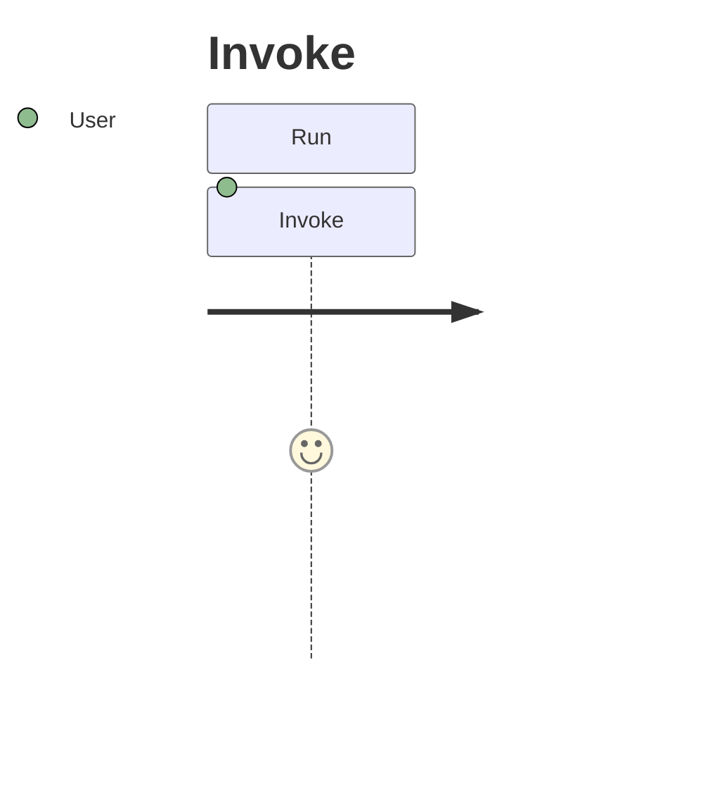

## Overview

Surface type, users, workflows, success criteria and metrics.

## Information Architecture

User-facing data model and navigation.

## Layout & Structure

Command tree for the CLI surface.

## Interaction Design

User flows with error branches and a keyboard map.

## Visual & Sensory Design

Semantic palette with text fallbacks.

## Edge Cases & Error States

Empty, error, overloaded, degraded states.

## Accessibility

Keyboard navigation and screen reader semantics.

## Internationalization / Privacy / Measurement

i18n, data minimization, instrumentation points.

## Handoff Notes

Component breakdown, MVP cutline, resolved decisions.

