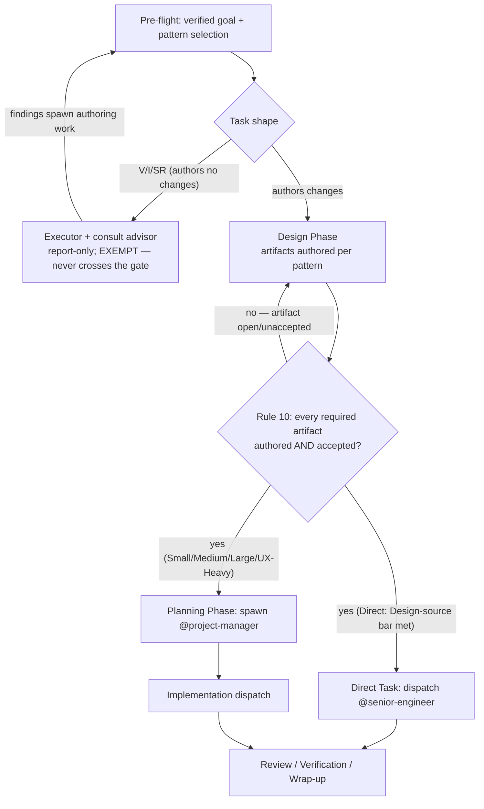

# Design-Complete Gate — Maintained Master

**LOCAL-copy consumers:** `team-lead.md` ONLY (Rule 10 + choke-point hooks — pointer-only, NO
LOCAL copy: Rule 10 cites this file rather than duplicating it, so a `CANONICAL:DESIGN-GATE-LOCAL`
marker would register a false drift pair). No worker agent cites this master — the gate binds
solely the actor holding spawn authority (team-lead is the only agent that spawns
`@project-manager`/`planner*` or dispatches implementation ephemerals). Distilled from the TDD
accepted via vote DKT-V5 (full normative content folded in below). Deployed at
`~/.claude/skills/team-doctrine/references/design-gate.md` — repo:
`src/user/claude-code/skills/team-doctrine/references/design-gate.md`. Read on demand only —
never `Skill(team-doctrine)`.

---

## 1. The gate, stated

> **Design-Complete Gate (Rule 10).** Planning and implementation are LOCKED until every design/research artifact the cycle requires is authored AND accepted via its EXISTING acceptance machinery. Spawning @project-manager/`planner*` or dispatching ANY implementation ephemeral (including the Direct-Task @senior-engineer) before the gate passes is a rule violation of the same class as Rule 7.

The gate boundary is also the TDD consumption boundary: docs/tdd/ artifacts are inputs to Design and Planning only — post-gate phases receive their content via the Distillation Gate (docs-paths.md §Persistence & lifecycle) and never read the files.

**Why now (handoff-readiness motivation).** Work is routinely handed off to
implementation-only coding harnesses and models (Codex, OpenCode, etc.). A dispatch that
carries open research or design questions forces those harnesses to do non-implementation
work — un-reviewed, outside the team's design/acceptance machinery. The gate guarantees every
implementation dispatch is design-frozen: zero open research/design questions at handoff.

**Flow.** The gate governs exactly one boundary — Design→Planning/dispatch — reached by every
pattern that authors changes:



**Violation handling.** A gate breach surfaces exactly like a Rule 7 breach — no separate
enforcement mechanism exists: operator report, Docket mirror (Rule 2), a pitfalls-memory entry,
and evolve-agents historical-audit pickup.

## 2. Per-pattern required artifacts and acceptance (normative table)

| Pattern | Required before Planning / dispatch | "Accepted" means (existing machinery only) |
|---|---|---|
| Direct | The dispatch brief IS the artifact: fully Closed (exact file, old string, new string, done-state — already mandated) + a `Design-source:` line (§3 grammar) | Operator-verified goal (Pre-flight step 1) + zero Open dimensions + every embodied decision cites its settling source. No review body. Evaluated by team-lead at brief-authoring time as a FORM check (line present, citations resolve) — never a merits judgment; the no-engineering-decisions boundary is unchanged. |
| Small | Design-source inventory: every decision KNOWN at pre-flight cites its settling source (accepted TDD (distilled per P5)/ADR, logged advisor consult, verbatim operator instruction) | Citable sources exist for all known decisions; an unsettled known decision → `advisor` consult first (logged as a Docket comment when issues exist, else carried verbatim in the plan brief) or graduate to Medium. |
| Medium | TDD (plus security TDD / co-authored security sections when flagged) | The **merged acceptance panel** (author recuses; `high`=3 general TDD seats @staff-engineer/@senior-engineer/@sdet, `critical`=4 security TDD adds @security-engineer) IS the review-and-acceptance body — vote-commit per Consensus Integration criticality; security sections cross-reviewed before vote (existing Security Track text). |
| Large | ALL TDDs (lead + every parallel `tdd-author-` sibling); PRD first when product-defined | Each TDD as Medium; PRD accepted by operator approval. Planning may not start until EVERY sibling is accepted (strict — accepted-but-waiting sibling TDDs idle by design while any sibling is in review; relaxing this is a future operator-approved doctrine change). |
| UX-Heavy | UX spec + TDD | Spec: `Skill(design-review)` by a non-author reviewer (when `ux-advisor` authored it, the reviewer is a `design-review-{N}` ephemeral — the existing author-recusal principle applied); TDD as Medium. |
| V/I/SR | EXEMPT | Deliverable IS research (report/verdict); the shape never spawns a PM or an impl ephemeral, so it never crosses the gated boundary. Findings that spawn authoring work start a successor cycle, which re-enters Pre-flight and meets the gate there. |

**V/I/SR exemption rationale (element 8, continued).** The exemption is structural, not a
carve-out of convenience: Verification/Investigation/Standalone-Review shapes author no
changes and dispatch no implementation ephemeral, so there is no Planning/implementation
boundary for them to cross. This also serves handoff-readiness directly — implementation-only
harnesses (Codex, OpenCode) never receive a V/I/SR deliverable to execute; they only ever
receive a gate-passed implementation brief, which is the property this whole gate exists to
guarantee.

## 3. Design-source grammar (API contract)

The gate's interchange contract is the **Design-source line** carried in Direct-Task dispatch
briefs (and, for Small, per known decision in the planning brief):

```
Design-source: <exactly one of>
  - distilled TDD decision     verbatim decision text + inert provenance, e.g.
                               "phases serialize on file collisions" — provenance:
                               TDD 'foo' §4 (accepted, vote V-12; provenance-only, not a file reference)
  - accepted ADR citation      e.g. "docs/adr/0004-bar.md (accepted, vote V-9)" (durable, dereferenceable)
  - verbatim operator instruction   e.g. "operator, this cycle: 'rename X to Y everywhere'"
  - mechanical — no decision embodied   (typo/dep-bump/log-tweak class)
```

**Gate-pass predicate (Direct):** brief fully Closed AND `Design-source:` present AND no Open
dimension AND no embodied decision left uncited. Any failure → run the design work first
(advisor consult / TDD / ADR per size) or graduate the pattern. The `mechanical` arm is what
keeps the bar proportionate for trivial edits: a typo fix pays one literal line, not a review
cycle.

## 4. Direct-Task acceptance semantics (explicit)

"Accepted" for Direct = the operator's Pre-flight step-1 verified-goal confirmation covering
the edit, PLUS the §3 gate-pass predicate evaluated by team-lead at brief-authoring time as a
FORM check (Design-source line present, zero Open dimensions, citations resolve). This is
NEVER a merits judgment — the no-engineering-decisions boundary is unchanged. Team-lead checks
that the line exists and its citation resolves; team-lead does not evaluate whether the cited
decision was the RIGHT decision.

## 5. Security Track composition (orthogonal to the gate arm)

The Q7 security flag binds ORTHOGONALLY to the gate arm: Rule 10's "no new review body" refers
to the gate's acceptance side ONLY and never waives the Security Track. Small +
security-sensitive keeps the non-negotiable `security-advisor` review. A Direct task whose edit
touches an enumerated security surface graduates per the Direct template's existing
surfacing-decision trigger — a security-touching one-liner cannot ride the Design-source bar
past the security consult.

## 6. `mechanical` arm inheritance (form classification, not a merits call)

Classifying an edit as `mechanical — no decision embodied` inherits the pattern-selection
boundary and is a FORM classification, not a fresh merits call: any doubt about whether a
decision is embodied graduates (or routes to `advisor`) — it is never resolved by team-lead's
own engineering judgment.

## 7. Mid-cycle interaction (governs ENTRY, not a mid-cycle re-lock)

The gate governs crossing INTO Planning/implementation. Decisions that genuinely surface
mid-implementation keep their existing paths (advisor consults, `Discovered:` comments, step 13
re-plan). **A step-13 re-plan that requires NEW design artifacts re-enters the gate for those
artifacts before the revised plan dispatches** — the "never retro-blocks a resume" property
covers RESUMING already-planned work only; it is not the complete statement of how re-plans
interact with the gate. The gate never retro-blocks in-flight work otherwise.
